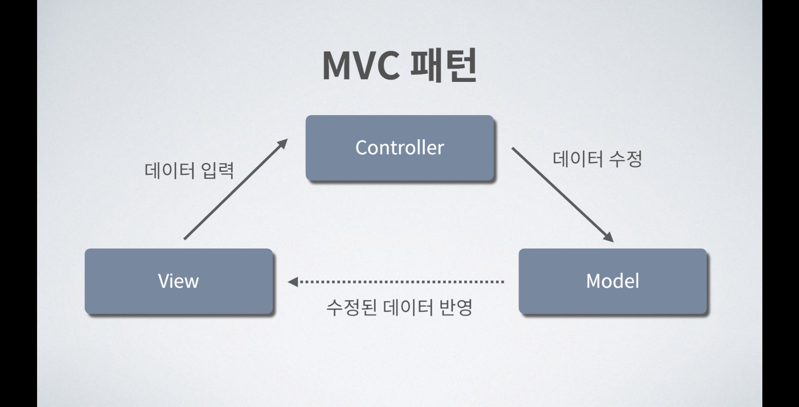
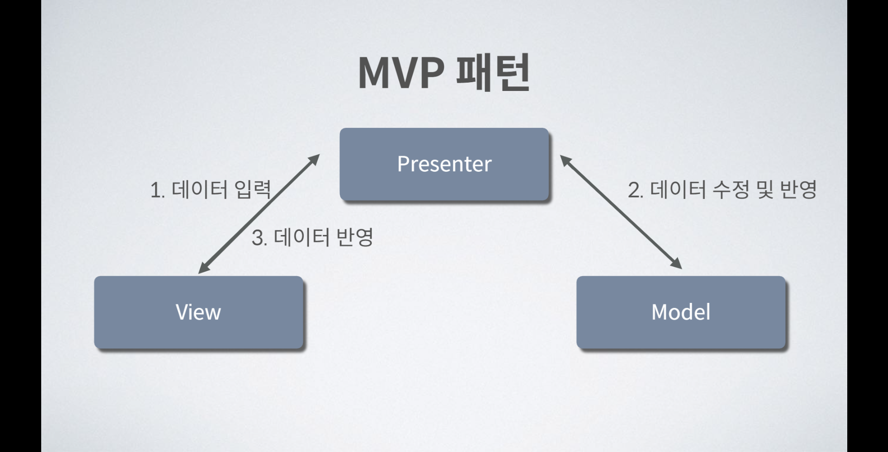
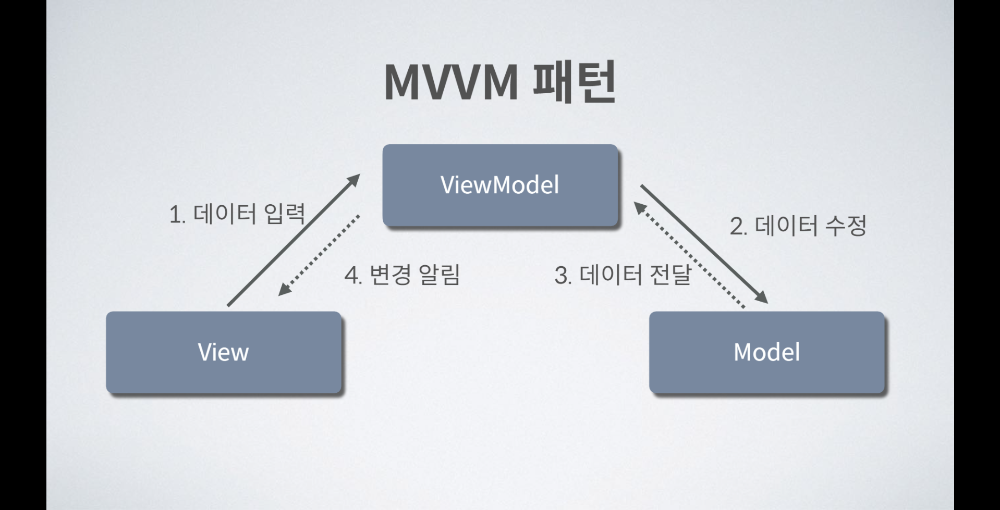

## 디자인 패턴을 주제로 다룬 이유
최근 앱 개발을 진행하고 있다.

과제로 앱 프로젝트를 진행해보며 오랜만에 이전에 잘 이해하지 못했던 MVVM 패턴에 대해 정리하던 도중, 다른 디자인 패턴들은 어떤 게 있는지 알아보게 되었다.

그래서 지금부터 애플리케이션을 개발할 때 고민해야 할 MVC, MVP, MVVM 패턴에 대해 제가 정리한 부분을 공유하고자 한다.

# MVC
  
웹 애플리케이션에서 가장 많이 쓰이는 디자인 패턴 중 하나이다. MVC 패턴은 개발자들이 애플리케이션을 관심사에 따라 계층 분리를 하도록 지향한다. 이는 애플리케이션을 확장하고, 테스트하고 유지하는 데 필요한 노력의 크기를 줄여준다.

사용자가 컨트롤러를 통해 모델을 변화시키면 뷰가 업데이트된다. 비즈니스 로직의 경우 모델에 있어야 하지만, 컨트롤러에 있을 수도 있고 뷰에 있을 수도 있다.

- Model : 모델은 비즈니스 로직을 나타내고 클래스의 집합으로 특징된다. 이 부분은 데이터가 바뀌고 조작되는지에 대한 비즈니스 규칙을 디자인하는데 동작한다.
- View: 뷰는 UI 컴포넌트를 나타낸다. 뷰는 컨트롤러가 폼 형태로 되돌려준 결과를 보여준다. 모델은 또한 UI에 뷰로 변환될 수 있다.
- Controller : 들어오는 요청들을 처리하기 위해, 컨트롤러는 아주 반응적이다. 모델에서 뷰로 가는 과정을 통해, 컨트롤러는 사용자의 데이터를 가져온다. 모델과 뷰 사이에 컨트롤러는 협력자 역할을 한다.

MVC 패턴의 장점은 다음과 같다.

1. 개발 속도를 병렬적으로 가속화할 수 있다.
2. 여러 개의 뷰를 모델에 빌드할 수 있다. 
3. 비즈니스 로직과 데이터가 분리되어 있어서 코드 복제가 제한된다.
4. 변경사항이 전체 모델에게 영향을 주지 않는다.
5. 데이터를 어떠한 형태의 가공 없이 반환한다.

## MVP
  
페이지 조절과 전시가 뷰에 의해서 이루어진다. 뷰를 대신하여 프레젠터는 모든 UI 이벤트를 알려줘야 할 책임을 지고 있다. 프레젠터는 사용자로부터 받는 모든 입력값을 수집하며 이것들을 모델에 바로바로 보내고, 결과를 뷰로 전달한다.

MVP에서는 컨트롤러가 사라졌다. 그 기능은 프레젠터가 대신한다. 프레젠터의 영역은 컨트롤러의 영역을 포함하고 여기에 뷰의 인터페이스를 포함한다고 생각하면 이해가 쉽다.

MVC에서는 컨트롤러가 모델과 뷰를 선택하면 뷰가 해당 모델을 바탕으로 UI를 그렸다고 볼 수 있는데, 이는 컨트롤러가 뷰를 정확히 인지할 수 있다는 의미이다. MVP에서는 뷰와 컨트롤러의 이 밀접한 관계를 끊고 서로 인지할 수 없게 만드는 것이 목표라고 생각하면 된다.

- Model : MVC와 비슷하게 모델은 비즈니스 로직을 나타내고 클래스의 집합으로 특징된다. 이 부분은 데이터가 바뀌고 조작되는지에 대한 비즈니스 규칙을 디자인하는데 동작한다.
- View : 마찬가지로 MVC와 비슷하게 뷰는 UI 컴포넌트를 나타낸다. 뷰는 컨트롤러가 폼 형태로 되돌려준 결과를 보여준다. 모델은 또한 UI에 뷰로 변환될 수 있다.
- Presenter : 뷰를 대신하여 모든 UI 이벤트를 알려주기 위해, 프레젠터는 온전한 책임을 진다. 뷰는 사용자로부터 입력을 제공하고 데이터는 모델의 도움으로 필터 되며, 결과는 뷰로 전달된다. 프레젠터와 뷰는 완전히 다른 것들이지만, 서로 통신하기 위해 인터페이스를 사용한다.

MVP 패턴의 장점은 다음과 같다.

1. 애플리케이션의 디버깅을 더 쉽게 만든다.
2. 코드 재사용성이 높아진다.
3. 더 나은 관심사 분리를 실행할 수 있다. 비즈니스 로직과 영속성 로직을 Activity와 Fragment 클래스에서 분리할 수 있다.

## MVVM
  
뷰와 뷰모델 사이의 양방향 데이터 바인딩을 발견할 수 있다. 뷰 모델 안에서 그리고 뷰에게 수정사항들을 자동으로 이동시킨다. 뷰모델에서 변화를 주기 위해서, 뷰모델은 옵저버 패턴을 사용한다.

1. Model : MVC, MVP와 비슷하게 모델은 비즈니스 로직을 나타내고 클래스의 집합으로 특징된다. 이 부분은 데이터가 바뀌고 조작되는지에 대한 비즈니스 규칙을 디자인하는데 동작한다.
2. View : 마찬가지로 MVC, MVP와 비슷하게 뷰는 UI 컴포넌트를 나타낸다. 뷰는 컨트롤러가 폼 형태로 되돌려준 결과를 보여준다. 모델은 또한 UI에 뷰로 변환될 수 있다.
3. View Model : 뷰모델의 책임 중 하나는 메서드와 함수들을 나타내는 것이다. 모델을 작동하기 위한 명령을 나타내고, 뷰의 상태를 유지하고 뷰의 이벤트를 활성화 시킨다.

MVVM 패턴의 장점은 다음과 같다.

1. 테스트 용이성 : 적절한 방법으로 구현되었다는 전제하에, 모든 내부적, 외부적 의존성을 코어 로직을 포함한 코드로부터 유지한다.
2. 어설픈 UI 자동화 도구 없이 테스트할 수 있다.

## 블로그를 마치며..
디자인 패턴은 문제 해결방법의 최선책이다. 비슷한 문제에 대해 해결한 방법들을 보니 공통된 방식이 사용되었다는 것이다.  
대부분의 소프트웨어 문제는 이미 예전에 누군가는 겪은 문제이고, 이를 해결하기 위해 여러 방법을 사용해 보았을 것이다.  
그 방법들 중 이런 카테고리의 문제에는 어떤 방식이 좋은지 개발자들이 후기를 남겼고, 그 후기에서 자주 사용되는 공통된 패턴이 나타났다.  
이 패턴을 모은 것이 디자인 패턴이다. 오늘은 여러 디자인 패턴 중, MVC, MVP, 그리고 MVVM 패턴에 대해 알아보았다.  
독자들도 자신이 관심 있는 디자인 패턴을 더욱 학습하며 다양한 패턴을 자신의 프로젝트에 적용해보기를 바란다.