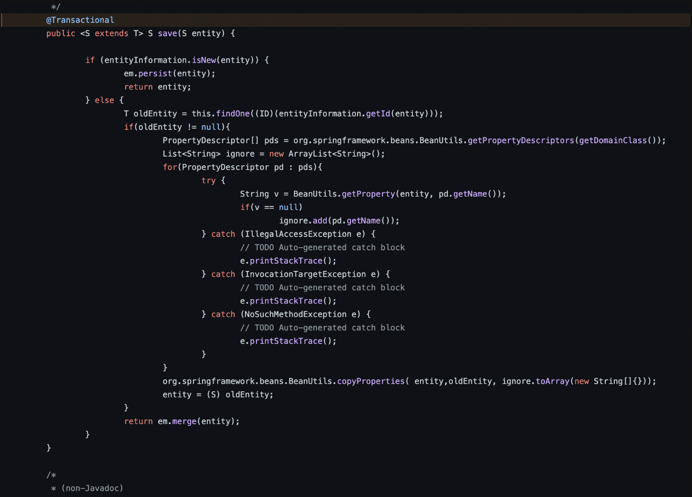
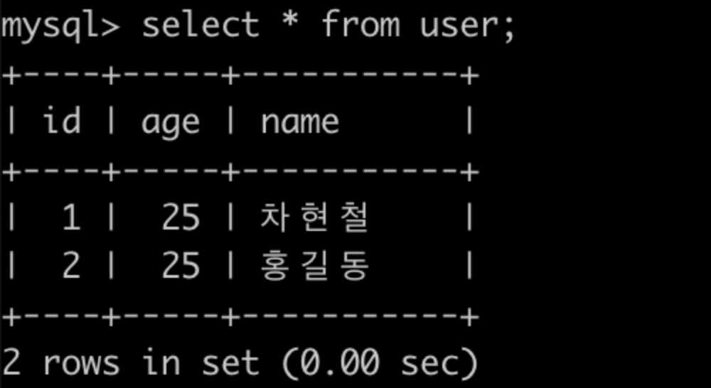
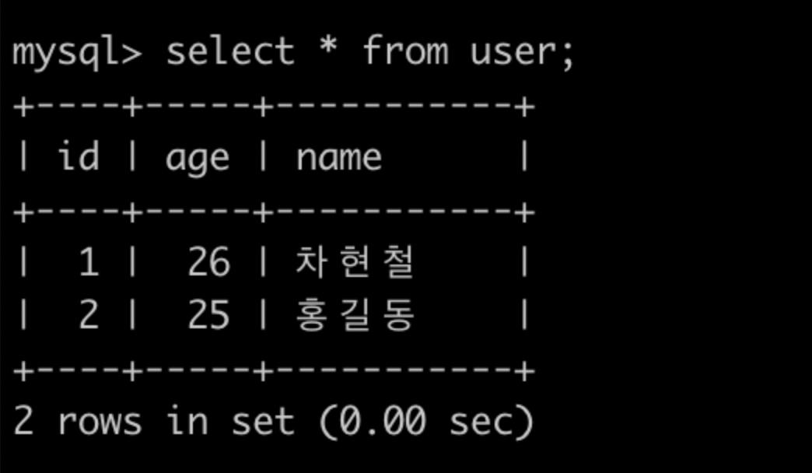
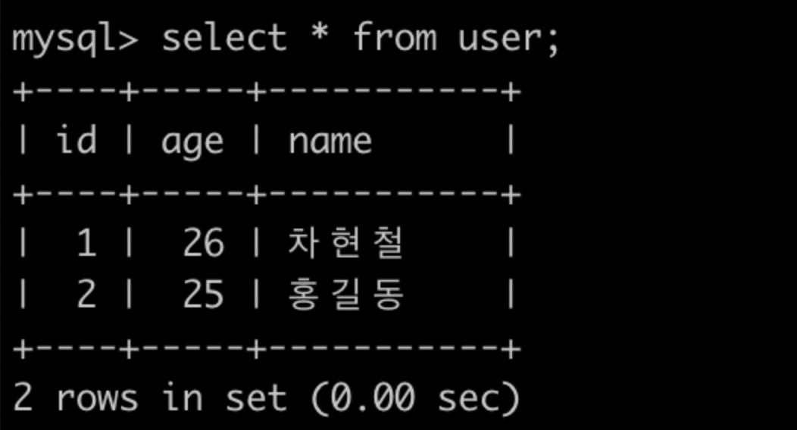

## 🖐 서론

서버를 만들다 보면 데이터를 DB에서 조회하여 수정하고, 변경된 데이터를 다시 DB에 저장하는 일련의 과정을 작성하게 됩니다.
코드에서 에러를 처리하고, 서비스가 잘 동작하도록 작성하는 것은 중요한 문제입니다. 물론, 우리가 완벽히 코드를 작성했다고 해도, 동작하던 서버의 하드웨어 문제, 네트워크 문제 등으로 에러가 발생할 수 있고, 이를 위한 별도의 조치가 필요할 수 있습니다.

위에서 얘기한 부분에서 에러와 관련된 얘기를 했는데, 오늘 얘기할 주제는 에러와 어느 정도 관련이 있습니다. 바로 **트랜잭션**입니다.

## 📚 정의

> 트랜잭션이란?
답: 사전적인 의미로 "쪼갤 수 없는 최소 업무 단위"로 해석이 되며, 흔히 atomic 하게 수행되어야 하는 일련의 과정을 얘기합니다.

이 단어를 JPA나 JDBC 같은 Java library를 사용하면서 접했을 수도 있고, DB를 공부하면서 트랜잭션에 대해 배웠을 수 있습니다. 물론, 의미하는 바는 거의 유사합니다.

실행되어야 하는 작업이 하나의 작업으로 실행되어야 한다는 의미가 있으며, 서비스 로직에 맞춰 접근하게 된다면 한 번에 이뤄줘야 하는 서비스 흐름으로 이해할 수 있습니다.

ex) 은행에서 돈을 보내는 작업, 두 개 이상의 Entity를 변경해야 하는 작업...

이를 spring에서는 어떻게 제공하고 있을까요?

## 📄 Spring의 Transaction

Spring에서 Transaction을 처음 만나게 되면 JPA, JDBC를 통해 알게 될 것입니다. 어떻게 제공되고 있는지 확인해보겠습니다.

### 1. Spring Data JPA의 기본 제공

Spring Data JPA를 사용하였다면, 기본적으로 Transaction이 제공되고 있습니다.

[SimpleJpaRepository.java Github](https://github.com/sbj156/-/blob/master/src/main/java/org/springframework/data/jpa/repository/support/SimpleJpaRepository.java#L392)



즉, `JpaRepository`를 구현한 Repository가 있다면, save, update.. 같은 명령어는 기본적으로 Transaction이 붙어있습니다. 그러므로 간단한 DB 명령어는 우리도 모르는 사이에 트랜잭션이 걸려있었습니다.

여기서 문제가 발생할 수 있습니다.

```
fun setUser(): String {
    val user = userRepository.findById(1).orElseThrow { IllegalArgumentException("잘못된 id 입니다.") }
    val user2 = userRepository.findById(2).orElseThrow { IllegalArgumentException("잘못된 id 입니다.") }

    user.age = 26
    userRepository.save(user)
	
    // Error 발생. (network, OOM ...)
    TODO("Error Occurred")
        
    user2.age = 26
    userRepository.save(user2)

    return "success"
}
```
위와 같이 두 Entity를 수정하는 상황에서 중간에 에러가 발생하면 어떻게 될까요?

1. 코드 실행 전 DB


2. 코드 실행 후 DB


간단한 Entity 수정이었지만, 은행의 송금이나 정합성이 필요한 상황에서는 매우 위험한 상황입니다. 그럼 어떻게 고쳐야 할까요?

정답이 나와 있지만, 우리가 구현한 코드에 `@Transactional`을 붙이면 됩니다.

### 2. @Transactional

Transaction을 처리하는 방법을 검색하면 가장 많이 나오는 방법이라 생각합니다. 실행하고자 하는 Method 위에 `@Transactional`만 붙이면 트랜잭션을 수행하기 때문에 매우 간단하다는 장점이 있습니다.

```
ex)

@Transactional
fun setUser(): String {
	...
}
```

위 방법으로 `@Transcational`을 붙이면 원자적으로 처리되도록 선언하였기 때문에, 중간에 에러가 발생하면 모두 `rollback`이 되는 것을 확인할 수 있습니다.

어떻게 내부적으로 트랜잭션을 처리할까요?

Spring에서는 AOP를 통해 Transaction을 제공하고 있습니다. 간단히 말하면 주요 관심사(Transaction이 수행될 코드)의 앞, 뒤로 부가적인 기능을 추가하는 방법입니다. (tx.begin, tx.commit, tx.rollback ...)

그러면 모든 곳에서 `@Transactional`을 통해 트랜잭션을 제공할 수 있을까요?
그렇다면 좋겠지만, AOP의 특성상 private 함수와 특정 상황(함수가 함수를 호출하는 경우)에서는 잘 동작하지 않습니다.

AOP는 그 자체로 복잡한 기술이며, 얘기할 내용이 많으므로 해당 글과 어느 정도 관련이 있는 글의 링크만 걸어두겠습니다.

> AOP 관련 글 읽어보기
> 1. https://www.baeldung.com/spring-aop
> 2. https://gmoon92.github.io/spring/aop/2019/04/01/spring-aop-mechanism-with-self-invocation.html
> 3. https://gmoon92.github.io/spring/aop/2019/04/20/jdk-dynamic-proxy-and-cglib.html

추가)
- 내부 함수를 호출하는 경우

```
fun setUser(): String {
    return internalSetUser()
}

@Transactional
fun internalSetUser(): String {
    val user = userRepository.findById(1).orElseThrow { IllegalArgumentException("잘못된 id 입니다.") }
    val user2 = userRepository.findById(2).orElseThrow { IllegalArgumentException("잘못된 id 입니다.") }

    user.age = 26
    userRepository.save(user)

    // Error 발생. (network, OOM ...)
    TODO("Error Occurred")
    
    user2.age = 26
    userRepository.save(user2)

    return "success"
}
```

- 트랜잭션이 동작하지 않음



### 3. @PersistenceContext, EntityManager

그럼, 우리가 특정 서비스 단위로 트랜잭션을 수행하고 싶거나, 내부 함수, private 함수에도 트랜잭션을 적용하기 위해서는 어떻게 할까요?

이때, `EntityManager` 를 이용할 수 있습니다. `EntityManagerFactory`에서 얻을 수 있으며, Spring Data JPA를 사용한다면 `@PersisteneContext`를 통해 Bean에서 쉽게 받을 수 있습니다.

```
class UserService{
    
    @PersistenceContext
    lateinit var entityManager: EntityManager

    fun setUser(): String {
        return internalSetUser()
    }

    fun internalSetUser(): String {
        val emf = entityManager.entityManagerFactory
        val em = emf.createEntityManager()
        val tx = em.transaction

        try {
            tx.begin()
            val user = em.find(User::class.java, 1L)
            val user2 = em.find(User::class.java, 2L)

            user.age = 26
            em.persist(user)

            user2.age = 26
            em.persist(user2)

            tx.commit()
        } catch (e: Error) {
            tx.rollback()
        }
        em.close()
        return "complete"
    }
}
```

위와 같이 직접 `EntityManager`를 선언하여 트랜잭션을 다룬다면, 내부 함수에서도 트랜잭션을 보장받을 수 있습니다. 이제 우리가 원하는 만큼, 어디서든 트랜잭션을 수행할 수 있습니다.

> `em.find`와 `em.persist`로 변경한 이유는, 우리가 선언한 EntityManager와 Transaction을 사용하기 위해서입니다. JPA에서 제공하는 findById와 save를 사용하게 되면 다른 EntityManager를 사용하기 때문에 트랜잭션이 동작하지 않습니다.

### 4. TransactionTemplate

위의 방법은 javax에서 제공하는 기본적인 트랜잭션으로 spring에서 제공하는 트랜잭션 기능이 추가로 있습니다. TranscationTemplate를 사용하면, Spring에서도 원하는 곳에 편하게 선언할 수 있습니다.

예시)

```
@Component
class CustomTransactionTemplate {

    @PersistenceContext
    lateinit var entityManager: EntityManager

    fun <T> transaction(
        transactionManager: PlatformTransactionManager = JpaTransactionManager(entityManager.entityManagerFactory),
        definition: DefaultTransactionDefinition = DefaultTransactionDefinition(),
        action: TransactionStatus.() -> T
    ): T {
        return TransactionTemplate(transactionManager, definition).execute(action) as T
    }
}
```

```
class UserService(
    val userRepository: UserRepository,
    val customTransactionTemplate: CustomTransactionTemplate
){

    fun setUser(): String {
        return internalSetUser()
    }

    fun internalSetUser(): String {
        customTransactionTemplate.transaction {
            val user = userRepository.findById(1).orElseThrow { IllegalArgumentException("잘못된 id 입니다.") }
            val user2 = userRepository.findById(2).orElseThrow { IllegalArgumentException("잘못된 id 입니다.") }

            user.age = 26
            userRepository.save(user)

            // Error 발생. (network, OOM ...)
            TODO("Error Occurred")

            user2.age = 26
            userRepository.save(user2)
        }
        return "complete"
    }
}
```

## 마무리하며

트랜잭션의 정의와 애플리케이션에서 트랜잭션을 제공하는 방법까지 알아보았습니다. `@Transactional`의 전파 레벨, Event Driven 환경에서 메시지의 트랜잭션 보장(outbox 패턴...) 등등 다루지 못한 부분도 많지만, 추가적인 부분은 제가 잘 이해하고 있는지도 모르기 때문에 더 공부해야 하는 영역입니다..! 😅

한 번쯤은 마주치고 고민하게 되는 트랜잭션에 대해 쉽게 정리해보고 싶었습니다.
긴 글 읽어주셔서 감사합니다.