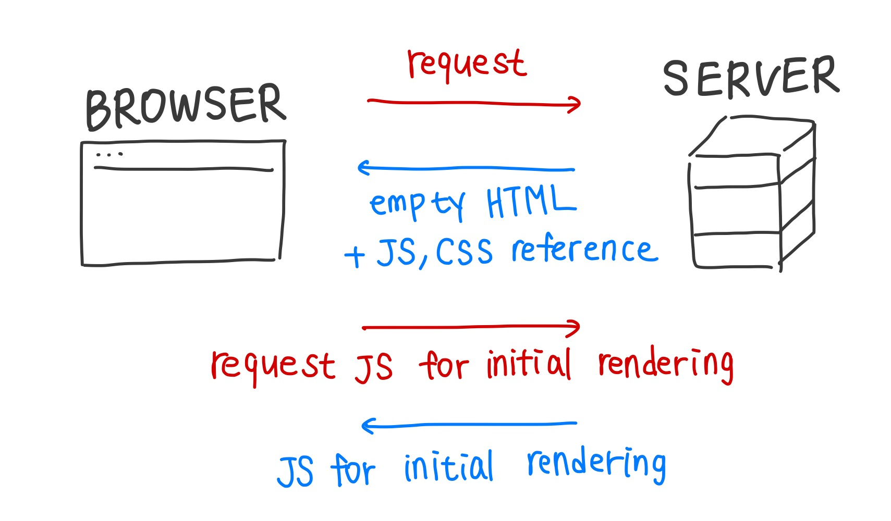
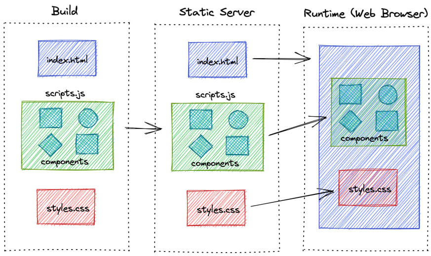
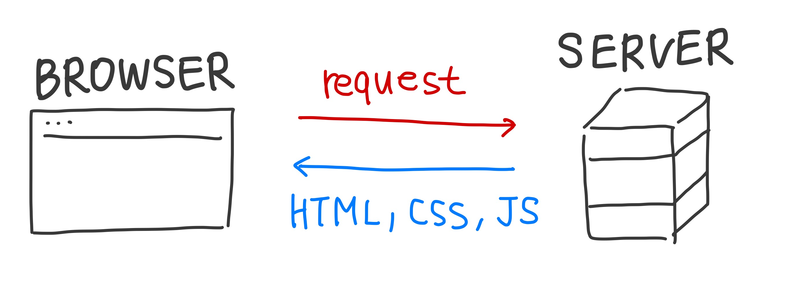
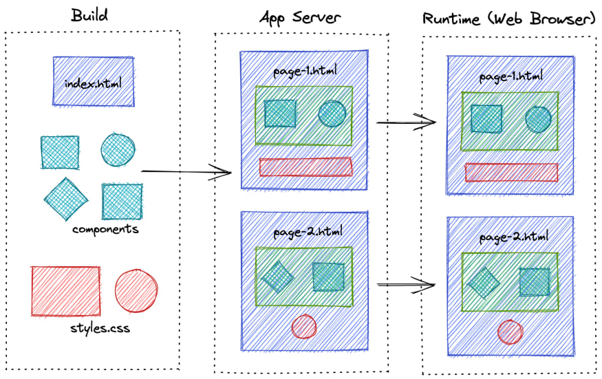

## 웹 렌더링 방식에 대해 알아보자

웹 개발자라면 분명 들어봤을 용어인 CSR과 SSR에 대해 알아보고자 합니다. 웹 렌더링 방식인 CSR과 SSR은 특정 웹 사이트에 접속했을 때 해당 페이지의 내용을 어디서 만들어서 어떻게 보여줄지 정의한 기술입니다.

클라이언트가 서버에 요청을 보내면 서버는 사용자 브라우저에게 표시할 정보를 보내주게 되는데 해당 정보를 화면에 그리는 과정을 **렌더링(Rendering)** 이라고 합니다. 화면에 그려지는 것은 결국 HTML인데 이 과정을 어디에서 처리하는지에 따라 CSR과 SSR로 나뉘게 됩니다.

### 초기 웹 렌더링

초기에는 모든 웹 페이지가 정적 페이지였고 대부분의 로직이 서버에서 수행됐습니다. 우리가 웹 사이트에 접속하면 브라우저는 서버에 HTTP 요청을 보내고 서버로부터 전달받은 HTML을 단순히 렌더링하는 방식입니다. 이 방식은 화면에서 발생하는 모든 인터랙션마다 서버로부터 새로운 HTML을 받아서 다시 렌더링을 해야 합니다. 예상할 수 있듯이 서버에 부하가 증가하는 성능적인 문제와 화면이 전환될 때마다 전체 페이지를 모두 다시 렌더링하므로 화면이 깜박이는 문제가 존재했습니다. 이것이 바로 전통적인 렌더링 방식인 **SSR(Server Side Rendering)** 입니다.

### AJAX의 등장

AJAX가 등장하기 이전에 웹 브라우저는 이처럼 서버로부터 받은 HTML을 브라우저 창에 렌더링하는 역할을 수행했습니다. 이렇게 SSR이 지배적이던 와중에 서버와 브라우저가 데이터를 비동기적으로 주고 받을 수 있는 **AJAX(Asynchronous JavaScript And XMLHttpRequest)** 가 등장하며 SSR의 문제점을 해결하게 됩니다. 전체 페이지에 대한 데이터를 매번 가져올 필요없이 AJAX를 통해 필요한 부분의 데이터만 불러와서 웹 페이지의 일부분만을 동적으로 변경하는 것이 가능해졌습니다. 이에 따라 깜박임 없이 부드러운 화면 전환이 가능해졌고 동시에 사용자의 경험도 향상되었습니다. 원래는 서버 쪽에서만 이루어졌던 다양한 로직 처리와 HTML 생성을 클라이언트에서도 수행할 수 있게 되었습니다.

이러한 흐름 속에서 클라이언트 쪽에서 화면 처리를 쉽게 할 수 있도록 도와주는 여러 라이브러리와 프레임워크가 만들어지기 시작했습니다. jQuery가 등장하여 어려운 DOM 조작을 컨트롤 할 수 있게 되었고 최근에는 웹 어플리케이션을 보다 쉽게 구축할 수 있도록 도와주는 React, Vue, Angular 등의 프레임워크가 활발하게 사용되고 있습니다.

## CSR(Client Side Rendering)

React와 같은 다양한 프론트엔드 프레임워크들이 활발하게 사용됨에 따라 웹 렌더링을 클라이언트 쪽에서 전적으로 책임지는 방식이 보편화됐습니다. 해당 방식의 동작 과정을 간단하게 살펴보자면 다음과 같습니다.



1. 유저가 웹 사이트에 방문합니다.
2. 브라우저는 유저에게 해당 웹 사이트 화면을 보여주기 위해 서버에게 콘텐츠를 요청합니다.
3. 서버는 빈 뼈대만 있는 HTML을 응답으로 보냅니다.

   ```html
   <html>
     <head>
       <title>Title</title>
     </head>
     <body>
       <div id="app"></div>
     </body>
   </html>
   ```

4. 브라우저는 HTML을 받고 연결된 JS 링크를 통해 서버로부터 다시 JS 파일을 다운로드 받습니다.
5. 브라우저는 JS를 이용하여 동적으로 페이지를 만들어서 유저에게 보여줍니다.

이러한 과정을 통해 알 수 있듯이 클라이언트와 서버는 최초의 HTML을 주고 받는 것 외에는 별도의 HTTP 통신을 할 필요가 없으며 이후에 필요한 데이터는 AJAX를 통해 주고 받습니다. 이처럼 클라이언트 측에서 렌더링하는 방식을 **CSR(Client Side Rendering)** 이라고 하며 서버 측에서 렌더링하는 방식인 SSR과 렌더링하는 주체에 차이가 존재합니다.



보편화된 CSR 방식에도 문제점은 존재합니다. 브라우저가 가지고 있는 웹 크롤러는 웹 사이트의 HTML을 읽어서 검색 가능한 색인을 만듭니다. 이때 웹 크롤러 봇은 CSR을 채택한 페이지를 빈 페이지처럼 인식하게 되고 결국 색인을 할 만한 콘텐츠를 만들 수 없게 되므로 검색엔진 최적화인 **SEO(Search Engine Optimization)** 에 취약하다는 문제가 있습니다. 다만 구글의 크롤러 봇은 예외로 자바스크립트를 실행할 수 있어서 CSR 웹 크롤링도 가능하다고 하지만 아직 완벽한 단계가 아니고, 또한 자바스크립트를 실행하지 못하는 웹 크롤러도 존재하다 보니 SEO를 원한다면 SSR을 고려해야 할 것입니다.

또한 CSR은 첫 페이지 로딩 속도가 느리다는 단점이 있습니다. 브라우저가 서버에서 최초로 받은 빈 HTML은 페이지 로드에 필요한 자바스크립트를 참조하고 있는데 렌더링할 때 전체 페이지를 구성하기 위해 필요한 모든 코드를 불러와야 하기 때문입니다. 즉, CSR은 초기 전송되는 페이지의 속도는 빠르지만 서비스에서 필요한 데이터를 브라우저가 추가로 요청하여 재구성해야 하므로 전체 페이지의 렌더링 완료 시점은 느려지게 됩니다.

## SSR(Server Side Rendering)

SSR은 앞에서도 설명했듯이 서버로부터 완전하게 만들어진 HTML 파일을 받아와 전체 페이지를 렌더링하는 방식을 의미합니다. SSR의 동작은 다음과 같이 진행됩니다.



1. 유저가 웹 사이트에 방문합니다.
2. 브라우저는 유저에게 해당 웹 사이트 화면을 보여주기 위해 서버에게 콘텐츠를 요청합니다.
3. 요청을 받은 서버는 페이지에 필요한 데이터를 얻어와서 구성한 뒤에 CSS까지 모두 적용하여 렌더링 준비를 마친 HTML과 자바스크립트 코드를 브라우저에 응답으로 전달합니다.
4. 응답을 받은 브라우저는 서버로부터 전달받은 페이지를 그대로 화면에 보여줍니다.



SSR은 CSR과 달리 서버로부터 필요한 데이터가 모두 담긴 HTML을 전달 받았기 때문에 SEO에 유리하다는 장점이 있습니다. 또한 이미 서버에서 페이지에 필요한 데이터를 미리 불러왔기 때문에 클라이언트 측에서 별도의 자바스크립트 코드를 더 불러올 필요가 없으므로 첫 페이지 로딩 속도가 빠릅니다.

초기 로딩 속도가 빠르다는 특징은 단점으로 작용하기도 합니다. SSR은 자바스크립트 코드를 다운로드 받기 전에 사용자가 화면을 미리 볼 수 있습니다. 그러나 아직 HTML과 JS 로직이 완전히 연결되지 않았다면 사용자가 버튼을 클릭하거나 이동하려고 해도 아무런 반응이 없을 수 있습니다. 즉, TTV(Time to View)와 TTI(Time To Interact) 사이에 시간 간격에 존재한다는 문제가 존재합니다.

화면 구성 로직을 모두 서버에서 처리하므로 서버에 부하가 발생하고 비용도 많이 듭니다. 또한 페이지를 전환할 때마다 새로고침을 통해 매번 서버로부터 페이지를 새로 전달받기 때문에 사용자 경험이 떨어집니다.

## SSG(Static Site Generation)

CSR과 SSR과 함께 종종 소개되는 렌더링 방식인 SSG에 대해서도 알아봅시다. 웹 페이지 중 유저의 데이터에 따라 다르게 보여주는 페이지는 서버에서 매번 동적으로 생성해야 하지만, 모든 유저에게 언제나 같은 내용을 보여주는 페이지는 매번 동적으로 생성할 필요가 없습니다. 바로 이러한 경우에 SSG 방식을 적용할 수 있습니다.

**SSG(Static Site Generation)** 는 서버에서 브라우저로 HTML를 보낸다는 점에서는 SSR과 비슷하지만 그 HTML을 언제 만드느냐에 차이가 존재합니다. SSR은 브라우저에서 요청이 왔을 때 서버가 즉시 HTML을 만들어서 응답하므로 데이터가 자주 바뀌고 달라져서 미리 만들어두기 어려운 페이지에 적합합니다. 반면에 SSG는 페이지들을 서버에 모두 만들어둔 뒤에 브라우저의 요청 시 해당 페이지를 응답하는 것이므로 바뀔 일이 거의 없는 페이지에 사용하면 적절합니다. 즉, 한 번만 생성한 뒤로는 서버에 저장해두고 필요할 때마다 로드하면 됩니다. 웹 개발에 React 프레임워크를 사용하고 있다면 Next.js 또는 Gatsby.js 등의 도움을 받아 SSG 또는 SSR 렌더링을 구현할 수 있습니다.

## 그렇다면 어떤 렌더링 방식을 채택해야 할까?

지금까지 렌더링 방식 두 가지 CSR와 SSR, 그리고 부가적으로 SSG까지 알아보았습니다. 어느 렌더링 방식을 사용하는 것이 가장 좋을지 의문이 들 수도 있는데 각 방식이 서로 대조적인 장단점을 가지고 있어서 무엇이 가장 좋고 나쁘다고는 할 수 없습니다. 따라서 많은 개발자들은 이 질문에 대해 개발하고자 하는 서비스가 무엇인지에 따라 적절한 렌더링 방식을 선택하는 것을 제안합니다.

만약 개발하려는 사이트가 회사 홈페이지와 같이 검색엔진에 반드시 상위 노출되어야 하고 누구에게나 동일한 내용을 노출한다면 CSR보다 SSR 방식이 적합합니다. 반대로 SNS처럼 사용자의 개인정보 데이터를 기반으로 구성되는 사이트라면 SEO에 유리한 것보다는 고객의 데이터 보호가 더 중요할 수도 있습니다. 이러한 경우에는 SSR보다는 CSR가 더 좋은 선택지일 것입니다.

## Reference

- [[10분 테코톡] 🎨 신세한탄의 CSR&SSR](https://www.youtube.com/watch?v=YuqB8D6eCKE)
- [Server-Side Rendering vs. Static Site Generation](https://betterprogramming.pub/server-side-rendering-vs-static-site-generation-53a34872728c)
- [Gray Area on When to use Different Rendering Modes CSR, SSR, SSG](https://kirillibrahim.medium.com/gray-area-on-when-to-use-different-rendering-modes-csr-ssr-ssg-214a636a24a4)
- [CSR/SSR, SPA/MPA, PWA](https://tech.weperson.com/wedev/frontend/csr-ssr-spa-mpa-pwa/#csr-client-side-rendering-vs-ssr-server-side-rendering)
