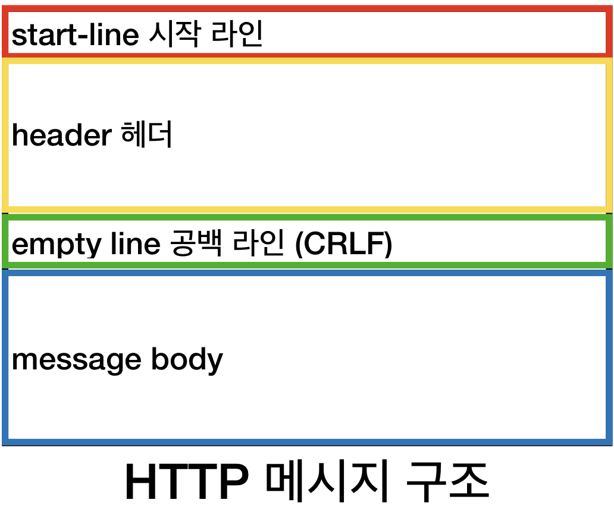
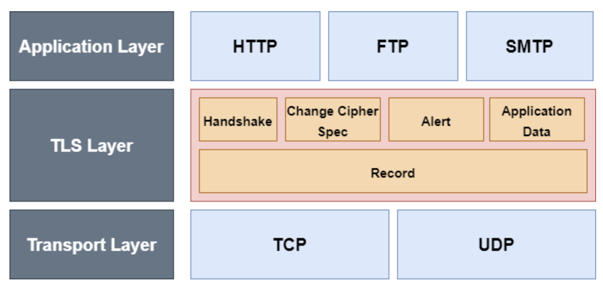
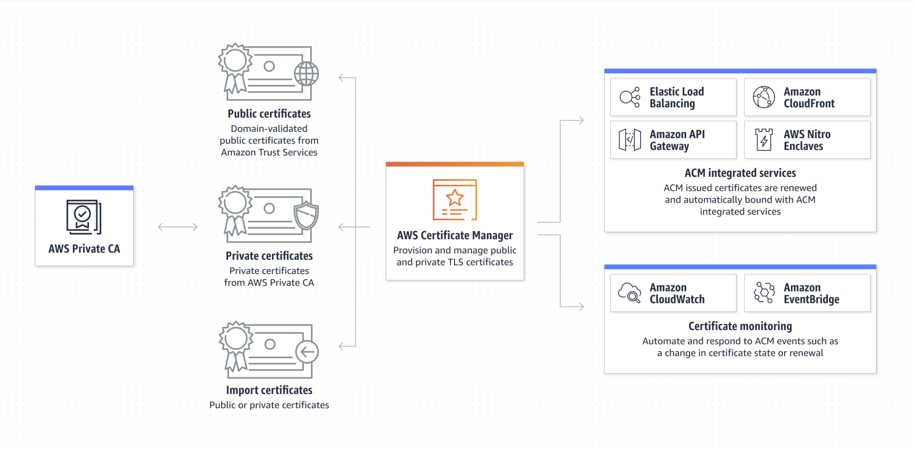
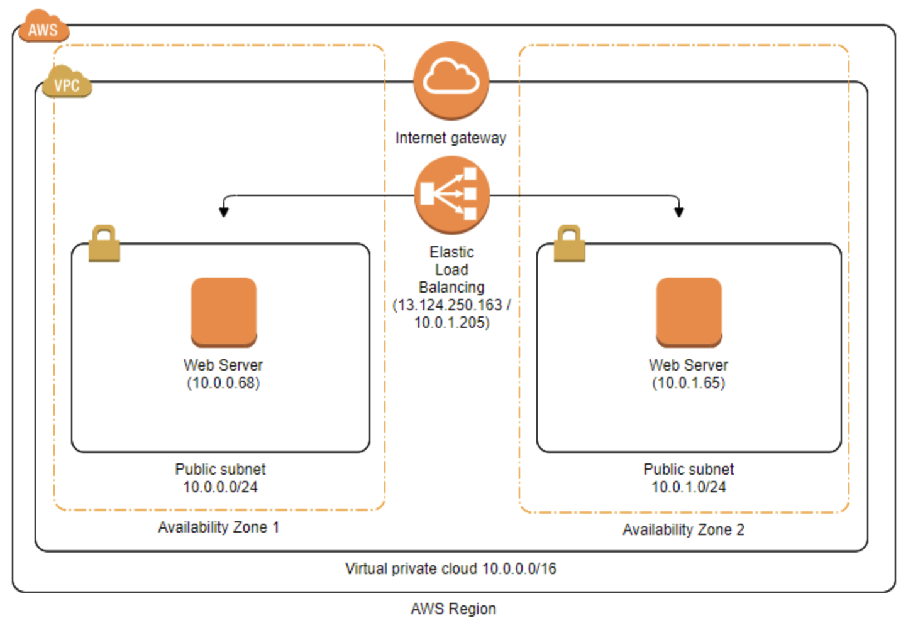

## 한 번쯤은 들어봤을 HTTPS

인터넷을 사용한다면 한 번쯤은 HTTPS란 것을 마주쳤을 것입니다.
게임을 좋아하시는 분들은 포트 포워딩을 하면서 HTTP가 80번, HTTPS가 443번 포트를 사용한다는 정도만 들어보셨을 수도 있겠습니다.
그리고 우리가 접속하는 주소창 맨 앞을 들여다보면 다 "https://"로 시작하는 것을 볼 수 있습니다.  
HTTPS가 뭐고 왜 쓸까요??  
무심코 지나쳤던 부분을 이번 기회를 통해 알아보겠습니다.

## HTTP란?

HTTPS에 앞서 알아야 할 것이 HTTP입니다.
하지만 HTTP에 대한 글이 아니니 간단하게 짚고만 넘어가겠습니다.
HTTP는 HTML, 이미지, 음성, JSON 등 웹에서 이루어지는 **모든 데이터 교환의 기초이며 규약**입니다.
HTTP 형식에 맞춰서 클라이언트와 서버가 데이터를 주고받는 것입니다.

근데 이 주고받는 데이터를 누군가 탈취해갈 수도 있겠죠?? 탈취해도 의미 없게 만들어 주는 것이 HTTPS입니다.
즉, HTTP에 암호화 기능을 추가해 보안 문제를 해결한 것입니다.

## HTTPS란?

HTTPS는 HTTP over SSL의 약자입니다.
SSL은 현재 TLS로 대체됐지만, SSL이 일반적인 용어기에 아직 자리매김하지 못한 것 같습니다.

그럼 TLS란 무엇일까요?  
TLS는 전송계층(transport layer)의 보안 서비스로 두 당사자가 개인정보 보호 및 데이터 무결성으로 통신하도록 하여 안전한 연결을 제공합니다.

또한 아래 사진을 보시면 TLS Layer가 따로 있는 것을 볼 수 있는데요, 여러가지 기능을 제공하기에 OSI 7계층 중 정확히 어떤 계층에 속한다고는 할 순 없고 단지 Trasnport Layer와 Application Layer를 포함한 그 사이라고 할 수 있습니다.

TCP 위에 있는 두 층의 프로토콜로 보안을 제공합니다.
핸드셰이크 프로토콜을 통해 서버와 클라이언트가 상호 인증하고, 암호 알고리즘, MAC 알고리즘, 암호키를 협상해서 나누게 됩니다.
내용을 암호화해서 보내는 건 좋은데, 내가 통신하는 서버가 믿을 만 한지를 검증하기 위해 서버 인증을 진행하는 것입니다.

또한 UDP는 reliable하지 않기 때문에 직접적으로 HTTPS 통신을 할 수 없습니다. UDP위에서 동작하는 TLS는 DTLS라고합니다.  TLS와 DTLS가 다른 점은 암호화 방식 등이 있는 걸로 아는데 널리 쓰이는 것 같지 않고 지식이 얕아서 이 글에서는 TCP만 다루고 있습니다.

이를 위해서 인증서를 발급받고 저장해놓는데요, 인증서는 CA가 발급합니다.
그리고 클라이언트들은 CA의 리스트를 OS를 설치할 때 갖게 되거나, 브라우저가 포함하고 있습니다.
CA와의 인증 과정은 컴퓨터 보안 내용인 비대칭 키 내용이 들어가니 이와 관련한 내용은 찾아보시면 좋을 것 같습니다.

가볍게 이해하기 위해서는 단지 신뢰할 수 있는 제3자가 믿을만한 인증서를 사이트에 등록해준다는 것이고, 나도 제3자의 존재를 안다는 것만 알아도 될 것 같습니다.

## HTTPS가 보호하는 것

HTTPS가 HTTP 아래층에(TCP 위층에) TLS 프로토콜을 덧붙여서 보안에 신경 쓴다는 것은 알겠는데, 그래서 뭘 보호하는 것일까요??

바로 **요청 문서 URL, 문서의 내용, 쿼리 매개변수, 헤더, 쿠키 등을 보호**합니다.
즉, 중간에서 메시지를 탈취한다고 하더라도 무슨 URL에서 무슨 내용을 입력했는지 해독할 수 없다는 것입니다.
이제 믿을만한 사이트들이 왜 다 http가 아닌 https를 사용하여 통신하는지 알 수 있습니다.
주소창 앞에 자물쇠가 걸려있다면 https로 통신하는 페이지고 정보를 암호화한다는 것입니다.
개인정보나 민감한 정보를 입력하는 페이지에서 https가 아니라고 경고창을 띄우면 믿을만한 곳인지 다시 한 번 확인해보시기 바랍니다.

## HTTPS로 배포하는 과정

이번엔 AWS EC2 환경에서 HTTPS로 배포하는 법에서 위에서 살펴본 개념이 적용되는 것을 보려고합니다.  
위에서 HTTPS를 사용하기 위해서 CA로부터 인증서를 발급받는다고 했습니다.
AWS는 이를 위해 서비스를 제공하는데, **AWS Certificate Manager(ACM)** 가 TLS 인증서를 발급해줍니다.

이제 발급받은 인증서를 등록해줘야되는데요, 이를 위해서 ALB를 사용해야 됩니다.
ALB는 Application Load Balancer로 HTTP의 헤더, 요청 Method 등을 이용해 Target Group으로 라우팅해주는 역할을 합니다.
이때 EC2의 부담을 줄이기위해 **ALB가 대신해서 클라이언트와 SSL인증(handshake)을 진행**합니다.
즉, 클라이언트에게 서버가 서비스를 제공하지만 중간에 ALB를 거쳐서 클라이언트와 통신하게 됩니다.

클라이언트가 ALB와 handshake를 통해 보안 연결을 설정하고, ALB와 EC2는 평문 통신을 하게 되는 겁니다.  

## 정리

HTTP, HTTPS의 개념을 알아보았고, 이 개념을 AWS를 통해 실제로 배포할 때 어떤 식으로 사용하는지 알아보았습니다.
물론 'HTTPS로 배포하는 과정' 부분에서 언급하지 않은 ACM에서 인증서 발급받기 전에 도메인과 Route53을 연결하는 법과
리스너, 규칙, 타겟그룹과 같이 ALB를 구성하는 부분은 HTTPS라는 주제와는 조금 벗어난 네트워크 통신 느낌이라 생략하였습니다.
관심 있으신 분들은 EC2 HTTPS 연결 관련 키워드를 찾아보시면 좋을 것 같습니다.

## 마치며

이번에 웹페이지를 만들 때 'HTTPS를 적용해보자!' 하며 블로그를 찾아봤습니다. 근데 문득 HTTPS가 무엇인가요? 라는 질문을 받았을 때 대답할 수 없겠다는 것을 느껴서 HTTPS 개념부터 정리해 봤습니다. 그리고 AWS를 통해 배포를 진행하려고 찾아봤을 때, 대부분 차례대로 설정하는 법만 나와 있고 왜 이런 식으로 설정하는지, 내부적으로 어떤 식으로 진행되는지는 잘 나와있지 않다고 느꼈습니다. 어떤 식으로 돌아가길래 저렇게 설정할까 궁금해서 찾아보게 된 것 같습니다. 부족한 글이지만 저와 같은 궁금증을 가지신 분들께 조금이나마 도움이 됐으면 하는 바람입니다. 역시 글로 표현하는 건 쉽지 않네요. 글 잘 쓰시는 분들 존경합니다.

## 참고자료

[암호화 보안 프로토콜: TLS](https://www.ibm.com/docs/ko/ibm-mq/9.1?topic=mechanisms-cryptographic-security-protocols-tls)

[인증서, CA, SSL 인증서를 통해 서버를 인증하는 방법](https://babbab2.tistory.com/5)

[인프런 http](https://www.inflearn.com/course/http-웹-네트워크/dashboard)

[ALB 쉽게 이해하기#1](https://aws-hyoh.tistory.com/entry/AWS-Application-Load-Balancer-쉽게-이해하기)

[TLS protocol stack 사진](https://reakwon.tistory.com/106)
