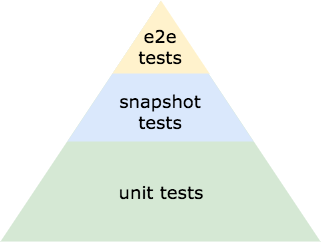
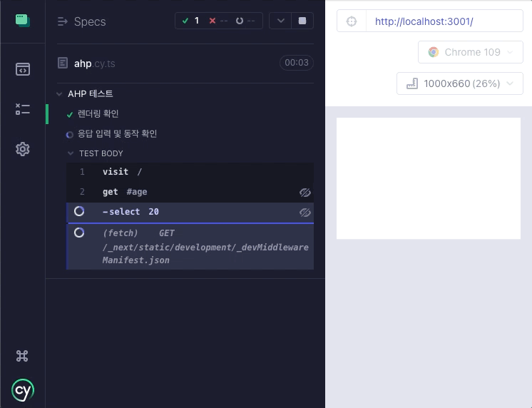
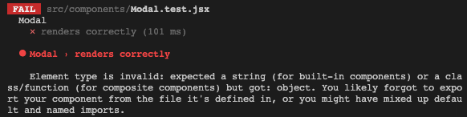
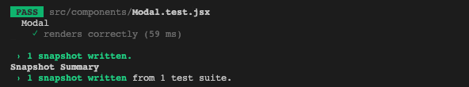
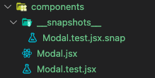
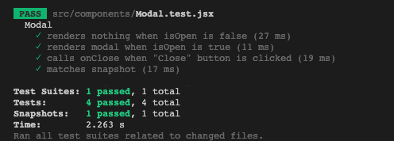

# TDD

> TDD, Test Driven Development

TDD는 작성하고자 하는 코드가 **어떤 일을 할 것인지를 묘사하고 동작을 검증할 테스트 코드를 먼저 작성**하고 빠르게 테스트를 진행하며 개발하는 방법인데요, 순서를 도식으로 표현하면 다음과 같습니다.


이번 포스팅에서는 어떻게 하면 TDD를 프론트엔드에서 적용할 수 있는지, React와 Jest를 중심으로 소개해보고자 합니다.

## Why TDD?

그 전에, 왜 TDD를 도입해야 할까요? TDD를 사용하면 아래의 장점들을 얻을 수 있습니다.

1. **코드 퀄리티를 높일 수 있습니다.**
   코드의 결함을 수정하기 어렵고 비용이 많이 들어가기 전에 개발 주기의 초기에 발견하는 데 도움이 됩니다. 또한, 테스트를 먼저 작성해 코드가 잘 디자인됐고, 요구사항을 충족하고 있다는 점을 확실히 할 수 있습니다.
2. **더 빠른 피드백을 받을 수 있습니다.**
   코드의 품질과 관련된 피드백을 빠르게 제공하므로 결함을 쉽게 식별하고 수정할 수 있습니다. 거기에 더해, 수동으로 테스트하는 데 들어가는 비용을 줄일 수 있습니다.
3. **개발 시간을 단축할 수 있습니다.**
   앞선 장점들 덕분에 프로젝트의 전체 개발 시간을 단축시킬 수 있습니다.
4. **더 좋은 문서화가 가능합니다.**
   시스템이 어떻게 동작해야 하는지에 대한 문서를 자동으로, 최신 상태로 작성할 수 있습니다. 잘 짜인 테스트 코드는 그 자체가 문서입니다.
5. **팀 내의 커뮤니케이션을 촉진시킬 수 있습니다.**
   TDD는 팀이 작성 중인 코드에 대해 같은 시야로 바라볼 수 있도록 도와주며, 잘못된 의사소통으로 인한 오해나 오류를 방지하는 데 도움이 됩니다.

## 프론트엔드 테스트의 종류

프론트엔드 어플리케이션을 테스트하는 방법은 여러가지가 있습니다. 대표적으로는 아래와 같이 분류됩니다.



> 아래 나올 설명들은 프론트엔드 관점에서 적었다는 점을 명심해주세요!

### Unit Test

Unit test는 코드베이스의 테스트 유닛을 말합니다.

어떤 함수(컴포넌트)를 직접 호출해 리턴값이 제대로 나왔는지를 확인하는 방법입니다. 후술할 TDD 프레임워크에서 제공하는 기능인 얕은 렌더링이 이때 자주 쓰입니다.

> 얕은 렌더링([Shallow Render](https://reactjs.org/docs/shallow-renderer.html))이란 한 단계의 깊이만 렌더링하는 것으로, 자식 컴포넌트는 렌더링 하지 않고 테스트 하고자 하는 컴포넌트 자체만 렌더링하고자 할 때 유용합니다.

몇백개의 Unit test를 진행해도 수 초밖에 걸리지 않아, 빠른 개발에 큰 도움이 됩니다. 또한 테스트 하는 단위가 작아서 테스트에 통과하지 못했을 경우 정확히 어느 부분이 문제인지 알기 편합니다.

그러나 Unit test는 정확한 스타일을 렌더링하고 있는지 알기 어려워 이것만으로는 부족합니다. 이럴때 필요한게 바로 다음 나올 테스트 방법입니다.

### Snapshot Test

Snapshot test는 렌더링된 컴포넌트의 *사진*을 찍어 진행되는 테스트입니다.

> 대표적인 React Testing 프레임워크인 Jest에서는 렌더링된 컴포넌트 마크업의 snapshot을 찍습니다.

컴포넌트의 스타일과 마크업을 검사하는 테스트로, 코드를 수정했는데 이 테스트를 통과했다면 컴포넌트의 모습은 바뀌지 않았다는 뜻이 됩니다. 반면 이 테스트를 통과하지 못한다면, 로직을 변경할 때 컴포넌트의 외관에 의도치 않은 영향을 주었다는 의미가 됩니다.

따라서 컴포넌트마다 최소 하나 이상의 Snapshot test를 작성해주는 것이 좋습니다.

> snapshot 자체의 유지보수가 어려워질 수 있으므로 남발해선 안됩니다!

### E2E Test

E2E(End to end) test는 최상위에서 진행되는 테스트로, 실제 어플리케이션을 사용하듯 진행되는 테스트입니다.

크롤링과 비슷한 방법으로, 브라우저에 보여지고 있는 컴포넌트들을 사용자가 사용하듯 상호작용하는 방식입니다.

때문에 굉장히 속도가 느리고 디버깅이 어려우나, 각 컴포넌트들이 어우러져서 일어날 수 있는 문제를 확인할 수 있습니다.

아래는 실제로 제가 개발한 프로젝트에서 Cypress를 활용해 E2E test를 진행하는 모습입니다.



## TDD로 React 컴포넌트 개발하기

TDD로 Modal 컴포넌트를 개발하는 예시를 함께 보겠습니다.

앞서 말씀드린것처럼, 본 포스팅에서는 React와 Jest를 사용해 설명드리겠습니다. (전체 어플리케이션을 개발하지는 않으므로 E2E test는 생략합니다.)

### 필요 패키지 설치

먼저, React 개발 환경은 갖추어져 있다고 가정하겠습니다. 아래의 명령어로 필요한 패키지를 설치합니다.

```shell
npm install -D jest @testing-library/react @testing-library/jest-dom
```

- `@testing-library/react`: React 컴포넌트 테스트에 사용할 수 있는 유틸리티들을 제공합니다.
- `@testing-library/jest-dom`: DOM과 관련된 테스트를 진행할 수 있도록 추가적인 유틸리티들을 제공합니다.

Jest를 실행하기 위해 아래와 같은 script를 추가해주겠습니다. Jest를 watch mode로 실행합니다.

```json
// package.json
{
  "scripts": {
    "test": "jest --watchAll"
  }
}
```

### Snapshot test

먼저 간단한 Snapshot test를 작성해서 테스트를 맛보겠습니다.

> 원래는 Unit test부터 작성하는 것이 맞으나, 여기에서는 Snapshot test에 대한 설명을 위해 먼저 해보겠습니다. (지금 작성하는 코드는 아래 Unit test 단계에서 모두 지우고 다시 작성합니다.)

```jsx
// Modal.test.jsx

import { render } from "@testing-library/react";
import Modal from "./Modal";

describe("Modal", () => {
  test("renders correctly", () => {
    const { container } = render(<Modal />);
    expect(container.firstChild).toMatchSnapshot();
  });
});
```

테스트 코드의 파일명은 일반적으로 `**.test.(js|jsx|ts|tsx)`의 형태를 띄며, Jest가 이를 인식합니다.

`@testing-library/react`에서 제공하는 `render` 함수를 활용해 `Modal` 컴포넌트를 렌더링하고, `toMatchSnapshot` 메서드로 이전에 찍힌 snapshot과 비교합니다.

`describe`는 테스트의 묶음(suite)을, `test`는 각 테스트 케이스를 의미합니다.

`npm test` 명령어를 입력해 테스트를 진행해보겠습니다.



당연히 아직 컴포넌트 자체가 없으므로 테스트를 통과하지 못합니다. 이제 이 테스트를 통과하기 위한 **최소한의 코드**를 작성해보겠습니다.

```jsx
// Modal.jsx

const Modal = () => {
  return <div className="modal">This is Modal</div>;
};

export default Modal;
```



*1 snapshot written*이라는 문구와 함께 테스트를 통과하고 있습니다. `Modal.test.jsx`가 위치하는 경로에 `__snapshots__`이라는 폴더 내 `Modal.test.jsx.snap`이라는 파일 명으로 snapshot이 생성됐음을 확인할 수 있습니다.



이제 이 snapshot을 기준으로 Snapshot test가 진행되게 됩니다. snapshot을 갱신하고 싶다면 `-u` 옵션을 줘서 Jest를 실행하면 됩니다.

### Unit test

본격적으로 TDD 방법론으로 컴포넌트를 개발해보겠습니다. 이전에 작성한 테스트 코드와 snapshot을 삭제합니다.

이제 아래의 Unit test를 작성하며 컴포넌트를 설계합니다.

```jsx
// Modal.test.jsx

import { render, fireEvent } from "@testing-library/react";

// expect 함수에 DOM 관련 테스트 메서드를 추가합니다.
import "@testing-library/jest-dom/extend-expect";

import Modal from "./Modal";

describe("Modal", () => {
  test("renders nothing when isOpen is false", () => {
    const { queryByTestId } = render(
      <Modal isOpen={false} onClose={() => {}}>
        Test Content
      </Modal>
    );
    expect(queryByTestId("modal")).toBeNull();
  });

  test("renders modal when isOpen is true", () => {
    const { getByTestId } = render(
      <Modal isOpen={true} onClose={() => {}}>
        Test Content
      </Modal>
    );
    expect(getByTestId("modal")).toBeInTheDocument();
  });

  test('calls onClose when "Close" button is clicked', () => {
    const onClose = jest.fn();
    const { getByText } = render(
      <Modal isOpen={true} onClose={onClose}>
        Test Content
      </Modal>
    );
    fireEvent.click(getByText("Close"));
    expect(onClose).toHaveBeenCalled();
  });

  // Snapshot Test
  test("matches snapshot", () => {
    const { asFragment } = render(
      <Modal isOpen={true} onClose={() => {}}>
        Test Content
      </Modal>
    );
    expect(asFragment()).toMatchSnapshot();
  });
});
```

각 테스트들이 독립적으로 진행된다는 점을 염두하고 코드를 읽어주세요. `Modal` 컴포넌트의 구조나 사용 방법이 한 눈에 들어옵니다.

이제 이 테스트들을 통과할 수 있도록 컴포넌트를 개발합니다.

```jsx
const Modal = ({ isOpen, onClose, children }) => {
  if (!isOpen) return null;

  return (
    <div className="modal" data-testid="modal">
      <div className="modal-content">
        {children}
        <button className="modal-close" onClick={onClose}>
          Close
        </button>
      </div>
    </div>
  );
};

export default Modal;
```



모든 테스트를 통과하고 있습니다.

컴포넌트를 한번도 브라우저로 렌더링해보지 않고도 잘 동작되는 `Modal` 컴포넌트를 개발했습니다!

## Reference

- [What is Test-Driven Development?](https://testdriven.io/test-driven-development/)
- [The Front-End Test Pyramid: How to Rethink Your Testing](https://www.freecodecamp.org/news/the-front-end-test-pyramid-rethink-your-testing-3b343c2bca51/)
- [Jest로 스냅샷(snapshot) 테스트하기](https://www.daleseo.com/jest-snapshot/)
