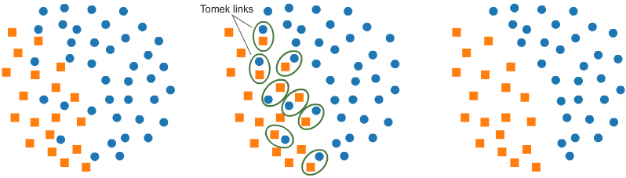
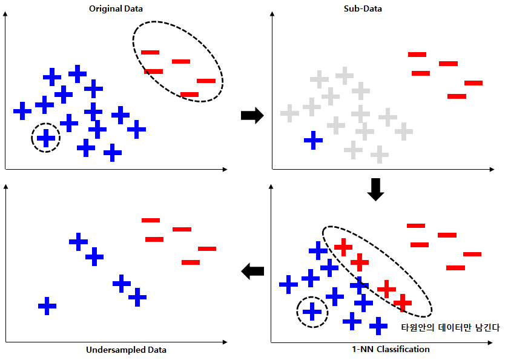
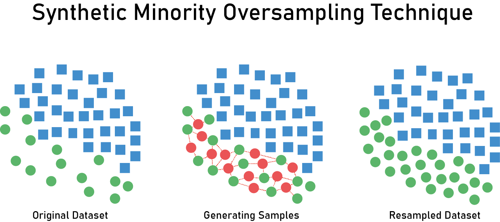

## 들어가며
프로젝트를 진행하다보면 불균형 데이터를 자주 마주치게 됩니다. 불균형 데이터(imbalanced data)란 학습 데이터의 클래스 변수가 균일하게 분포하지 않고 하나의 값에 치우친 데이터를 말합니다. 이는 하나의 값에 편향된 모델을 학습하는 클래스 불균형 문제를 야기할 수 있습니다.

대부분의 기계 학습 알고리즘은 각 클래스의 샘플 수가 균등할 때 잘 작동합니다. 하지만 데이터 셋이 불균형하다면 다수 클래스(majority class)를 잘 예측할지는 몰라도 소수 클래스(minority class)를 잘 포착하기는 힘듭니다. 

> 불균형 데이터가 모델 성능에 미치는 영향을 확인하고 싶다면 "[데이터 불균형이 머신러닝 모델 성능에 미치는 영향](http://www.riss.kr/search/detail/DetailView.do?p_mat_type=be54d9b8bc7cdb09&control_no=be7a4b032830feaeffe0bdc3ef48d419&outLink=K)" 을 참고해주세요.

## 클래스 불균형 문제를 해결해야하는 이유
**(1) 소수 클래스에 관심이 있다**

만약 소수 클래스에 관심을 가지고 있는 경우 문제가 발생할 수 있습니다. 예를 들여, 암 환자를 분류해내는 경우 일반적으로 암 환자는 정상인보다 소수입니다. 이러한 경우 불균형 데이터 상태 그대로 예측하게 되면 위에서 말했던 것처럼 다수 클래스에 편향되어 정확히 분류해낼 수 없을 가능성이 높습니다.

**(2) 재현율이 낮다**

데이터가 불균형하다면 분포도가 높은 클래스에 모델이 가중치를 많이 두기 때문에 불균형 문제를 해결하지 않으면 모델 자체의 정확도는 높을 수 있습니다. 하지만 분포가 작은 데이터에 대한 재현율이 낮아질 가능성이 높습니다. 예를 들어, 100개 데이터(1: 95개, 2: 5개)가 있다고 가정해봅니다. 그리고 모델이 96개 데이터를 1로 분류했다면(1: 95개, 2: 1개) 정확도는 99%가 됩니다. 하지만 클래스 2 데이터의 경우 5개 중 1개가 잘못 분류되었기 때문에 좋은 예측 성능을 가지고 있다고 말하기는 힘듭니다.

이런 문제 때문에 불균형 문제를 해결하는 것이 굉장히 중요합니다.

## 불균형 문제 처리 방법

불균형 데이터를 다룰 때 시도해보아야 하는 방법은 여러 가지가 있지만 이번 포스팅에서는 불균형 데이터를 처리하는 방법들 중 하나인 샘플링에 대해서 다뤄보고자 합니다.

### Sampling

> <p style = 'font-size: 15px;'>https://www.kaggle.com/rafjaa/resampling-strategies-for-imbalanced-datasets</p>

우리가 예측하고자 하는 데이터가 불균형하다면 가장 기본적으로 Target을 균형있게 맞춰줄 수 있습니다. 그 방법으로는 크게 2가지가 있습니다.

- Under Sampling: 분포가 높은 클래스의 데이터 수를 줄임으로써 데이터 불균형을 해소하는 방법
- Over Sampling: 분포가 낮은 클래스의 데이터 수를 늘림으로써 데이터 불균형을 해소하는 방법

### Under Sampling
Under Sampling은 비중이 높은 클래스의 데이터 수를 줄여 target값의 균형을 맞춰주는 방법입니다. 대표적으로 Random Under Sampling이 있습니다.

Random Under Sampling이란 더 많은 비중을 차지하는 클래스 데이터를 랜덤으로 제거하는 방법입니다. 코드는 다음과 같습니다.

```python
from imblearn.under_sampling import RandomUnderSampler

X_train, y_train = RandomUnderSampler(random_state = 25).fit_resample(X_train, y_train)
```

이는 손쉽게 균형을 맞출 수 있다는 장점이 있지만 데이터의 총 양을 줄이는 것이기 때문에 데이터가 부족해질 수 있습니다.

#### Tomek Links
두 클래스에서 하나씩 추출한 데이터를 각각 $x_i, x_j$라고 할 때, $d(x_i, x_k) < d(x_i, x_j)$ or $d(x_i, x_k) > d(x_i, x_j)$ 를 만족하는 $x_k$ 가 없는 경우 두 샘플 $x_i, x_j$ 가 Tomek Link를 형성한다고 합니다.



- Tomek link를 형성하는 두 샘플 중 하나는 노이즈거나 둘 다 경계선 근처에 있음을 의미합니다.

Tomek link를 형성한 샘플 중 비중이 높은 클래스에 속한 샘플을 제거하면 두 클래스의 구분이 보다 명확하게 됨을 알 수 있습니다. 이는 다수 클래스의 데이터 중심 분포는 거의 유지하면서 분류 경계를 조정하기 때문에 Random Under Sampling 방법에 비해 정보의 손실을 막을 수 있다는 장점이 있습니다. 하지만, 제거되는 샘플의 수가 적기 때문에 데이터 불균형이 매우 심하다면 큰 효과를 얻을 수는 없습니다.

#### Condensed Nearest Neighbor (CNN)


> https://velog.io/@cleansky/

KNN(K-Nearest Neighbor)방식으로 under sampling하는 방법입니다. 다수 클래스의 데이터를 밀집된 부분이 없을 때까지 제거하여 분류 경계면을 학습할 수 있습니다.

- 다수 클래스의 데이터 하나를 무작위로 선택한 뒤 소수 클래스와 합쳐 하나의 서브 데이터를 구성합니다.
- 기존 데이터를 서브 데이터를 기준으로 1-NN(Nearest Neighbor) 분류합니다.
- 다수 클래스에서 소수 클래스로 분류된 샘플과 서브 데이터만을 남기고 나머지 샘플은 삭제합니다.
  
위 단계를 거치면 다수 클래스의 데이터는 다운 샘플링되며 분류 경계면을 학습할 수 있습니다.

### Over Sampling
#### SMOTE(Synthetic Minority Over-sampling Technique)


Over sampling 기법 중 가장 대표적인 방법은 SMOTE(Synthetic Minority Over-sampling Technique)입니다. 이는 소수 클래스의 데이터를 기반으로 새로운 소수 클래스 데이터를 만들어 내는 방법입니다.

과정은 다음과 같습니다.
1. 소수 클래스의 데이터($X_1$)를 무작위로 하나 선택합니다.
2. 선택된 데이터를 기준으로 KNN(K > 1)을 실시합니다.
3. KNN으로 선택된 Neighbors 중 하나($X_2$)를 선택합니다.
4. $X_1$과 $X_2$ 사이에 가상의 선을 그은 뒤 가상의 선 상의 데이터를 하나 생성합니다.
    > $X_{new} = X_1 + u(X_2 - X)$ // **$u$ 는 uniform distribution**

> 참고 자료: https://bmcbioinformatics.biomedcentral.com/articles/10.1186/1471-2105-14-106

#### ADASYN(ADAptive SYNthetic sampling approach)

기존의 SMOTE 기법은 모든 Minority 클래스로부터 동일한 개수의 샘플을 생성했지만, ADASYN은 각 관측치마다 생성하는 샘플의 수가 다르다는 점이 특징입니다. Weight를 활용하여 생성하는 샘플의 수를 결정하고 이 weight는 KNN 범위 내로 들어오는 majority 클래스의 개수에 비례합니다.

> 쉽게 설명하자면, minority 클래스 주변에 majority 클래스 샘플이 많다면 분류할 때 이 minority 클래스 샘플은 majority 클래스로 분류될 가능성이 높아집니다. 이를 방지하기 위해 이런 minority 클래스 샘플 주변에 더 많은 샘플을 생성함으로써 majority 클래스로 분류되지 않도록 합니다. 
