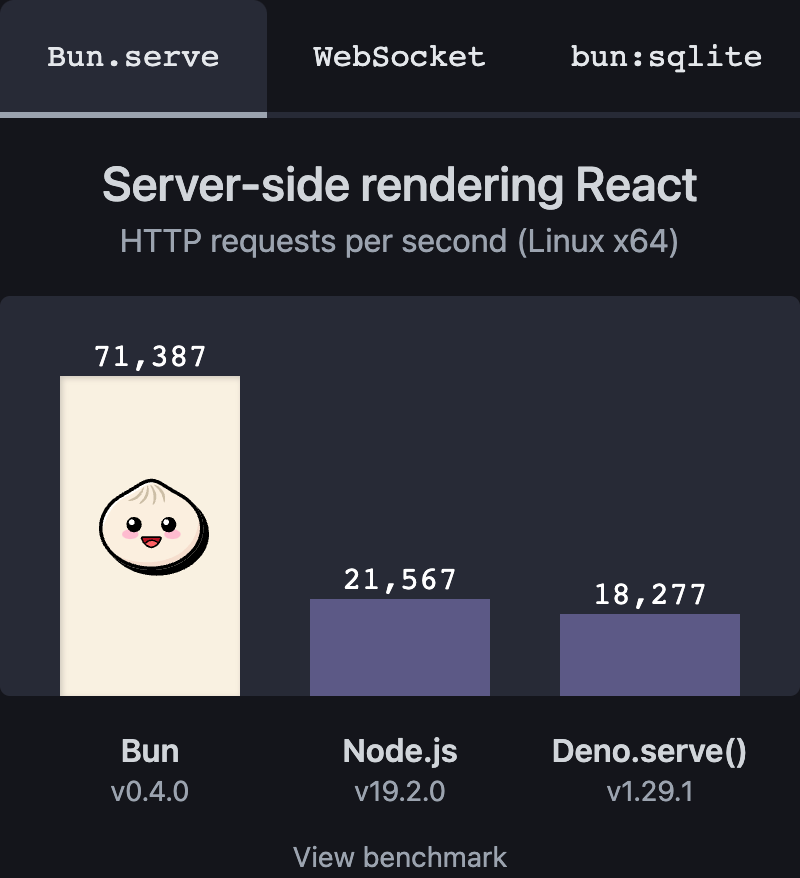
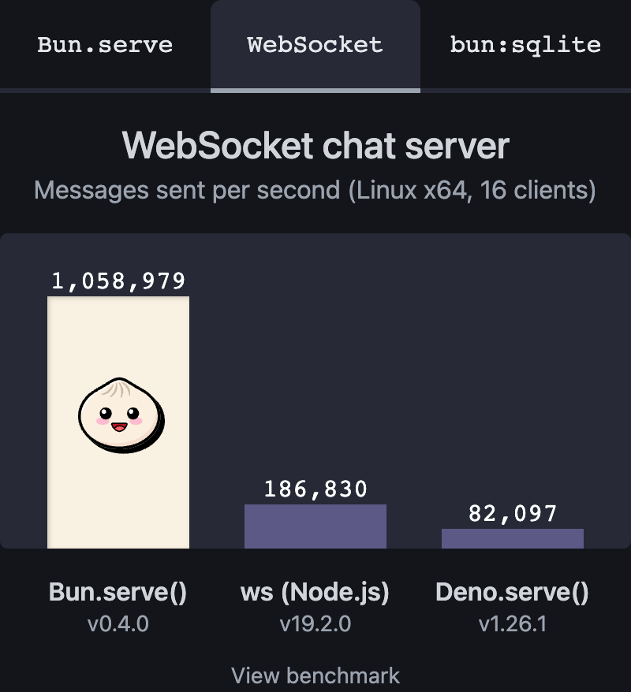
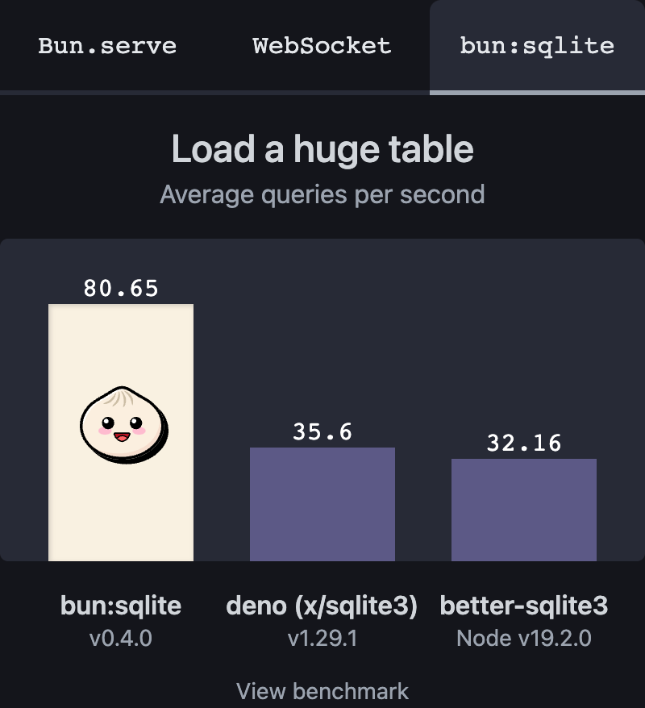
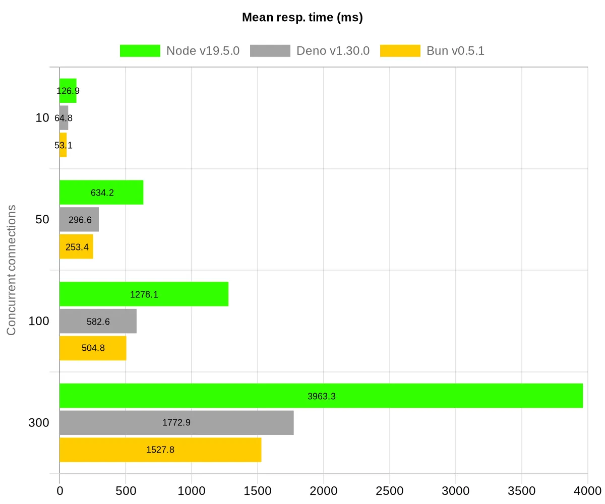
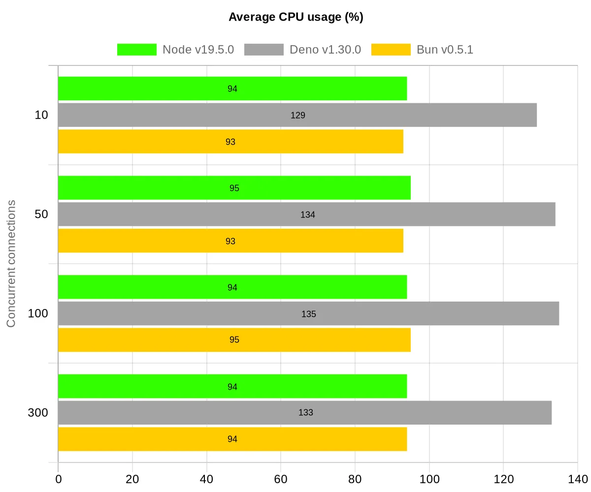
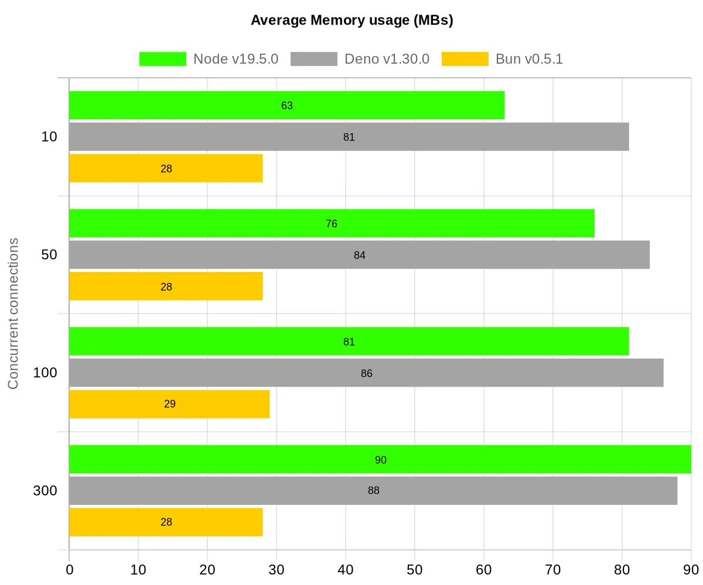

## Bun?

Bun은 Node.js와 같은 JavaScript의 런타임으로, **빠른 시작**, **빠른 실행 성능**, **응집적인 DX**라는 세 가지 사항에 초점을 맞추어 만들어졌습니다.

## Bun의 특징

> **Batteries included**: 제공하는 것만으로도 모든 작업을 수행하는데 문제가 없다

-   `fetch`, `WebSocket`, `ReadableStream`와 같은 Web API를 구현합니다.
-   **Node.js**의 `node_modules` resolution 알고리즘을 구현하여, Bun에서 npm 패키지를 사용할 수 있습니다.
-   ESM 및 CommonJS를 모두 지원합니다(내부적으로는 ESM을 사용).
-   모든 파일들을 번역하므로, `TypeScript`와 `JSX`가 문제없이 동작합니다.
-   `"paths"`, `"jsxImportSource"`와 같은 `tsconfig.json` 파일의 설정들을 지원합니다.
-   `Bun.Transpiler`(Bun의 JSX & TypeScript 번역기)를 API 형태로 사용가능합니다.
-   system call이 빠릅니다.
-   `.env` 파일로부터 자동적으로 환경변수를 받아오기 때문에 `require("dotenv").config()`이 필요하지 않습니다.
-   빠른 SQLite3 client built-in인`bun:sqlite`을 포함하고 있습니다.
-   대부분의 `Node-API`를 구현하여, 많은 native Node.js modules이 동작합니다.
-   JavaScript에서 native 코드를 호출하기 위한 오버헤드가 낮은 외부 함수 인터페이스 `bun:ffi`를 제공합니다.
-   `Buffer` 및 `process`와 같은 전역 항목과 함께 `node:fs` 및 `node:path`와 같은 점점 늘어나는 Node.js 핵심 모듈 목록을 지원합니다.

## Bun은 왜 빠를까?

Bun은 V8과 같은 기존의 방식보다 좀 더 빠르게 시작하고 수행하는 **JavaScriptCore 엔진**을 사용합니다. 그리고 Bun은 Bun의 모든 부분을 최적화하는데 사용되는 저수준 프로그래밍 언어인 **Zig**로 작성되어 더 빠르게 동작한다고 합니다.

## Bun으로 시작하기

터미널에서 스크립트를 실행하여 Bun을 install합니다.

```
curl -fsSL https://bun.sh/install | bash
```

Bun의 HTTP server는 `Request`나 `Response`와 같은 표준 객체를 내장하고 있습니다.

```js
// http.js
export default {
    port: 3000,
    fetch(request) {
        return new Response("Welcome to Bun!");
    },
};
```

Bun을 실행하고

```
bun run http.js
```

브라우저에서 http://localhost:3000으로 접속하여 확인합니다.

## Bun Benchmark

[Bun 공식 사이트](https://bun.sh/)에서는 다음과 같은 benchmark를 확인할 수 있습니다.





이 benchmark들을 보았을 때, Bun은 Node.js와 Deno보다 몇 배는 더 빠른 것으로 보여집니다. 실제로 테스트를 해보면서 시간을 비교해보고 싶었지만 시간상의 이유로 실제 테스트를 해보지는 못한 바, [Node.js vs Deno vs Bun: Hello World performance comparison](https://medium.com/deno-the-complete-reference/node-js-vs-deno-vs-bun-vs-go-a-re-look-at-the-hello-world-performance-d90b76ad61a5)의 테스트 결과를 들고 와 보았습니다.

### vs Node.js 비교

native API만을 사용한 'hello world' 코드로 비교합니다.

```js
//Bun
export default {
    port: 3000,
    fetch(request) {
        return new Response("Hello world!");
    },
};
```

```js
//Node.js
const http = require("http");
http.createServer((_, resp) => {
    resp.writeHead(200, {
        "content-type": "text/plain",
    });
    resp.end("Hello world");
}).listen(3000);
```

테스트는 다음과 같은 동시성 환경에서 실행합니다.

-   동시 연결 10개
-   동시 연결 50개
-   100개의 동시 연결
-   300 동시 연결

측정 목록

-   대기 시간 하위 25%
-   평균 대기 시간
-   대기 시간 중앙값
-   대기 시간 하위 75%
-   대기 시간 하위 90%
-   최대 대기 시간
-   평균 CPU 사용량
-   평균 메모리 사용량

측정 목록 중 **평균 대기 시간**, **최대 대기 시간**, **CPU 사용량**, **메모리 사용량** 측정에 대한 결과를 가져와 보았습니다.

-   평균 대기 시간

    

-   최대 대기 시간

    

-   평균 CPU 사용량

    

-   평균 메모리 사용량

    

### 분석

**응답 대기시간의 경우, 전반적으로 Node.js는 Bun과 Deno에 비해 느리고, 그 차이는 동시성이 높아질수록 현저하게 늘어나고 있습니다.** Deno는 하위 25%의 대기시간, 즉 응답이 빠르게 도착하는 표본에서는 Bun보다 약간 빠른 모습을 보이지만, 다른 대부분의 표본에서는 Bun이 좀 더 좋은 모습을 보이고 있습니다.

CPU 사용량에서는 Node.js와 Bun이 비슷하고, Deno가 나머지에 비해 많은 사용량을 보입니다. 메모리 사용량에서는 **Bun이 다른 둘에 비해 크게 앞서는 모습**을 보이는데, 특히 Node.js와 Deno는 동시성이 높아질수록 메모리 사용량이 점점 높아지지만 Bun은 영향을 거의 받지 않습니다.

## 마무리하며

Bun을 직접 사용하여 테스트해보지는 못했지만, 이 글을 쓰면서 Bun에 대해서 알아갈수록 굉장히 큰 메리트를 가지고 있다는 생각이 들었습니다. 실제로 우스갯소리로 'Node.js는 죽었다'라는 말이 나올 정도로 커뮤니티에서 '**노드 킬러**'라 불리며 많은 관심을 받고 있습니다. Node.js에 비하면 아직 생태계가 부족하기에 현업에서의 적용은 시간이 걸리겠지만, 속도면이나 CPU 사용량 등 대부분의 영역에서 좋은 모습을 보여주는 만큼 저도 다음에 개인적인 프로젝트 하게 된다면 적극적으로 사용을 시도해보지 않을까 싶습니다.

## 참고

-   [Bun — A fast all-in-one JavaScript runtime](https://bun.sh/)
-   [Node.js vs Deno vs Bun: Hello World performance comparison](https://medium.com/deno-the-complete-reference/node-js-vs-deno-vs-bun-vs-go-a-re-look-at-the-hello-world-performance-d90b76ad61a5)
-   [bunjs 살펴보기 - Gseok Blog](https://gseok.github.io/tech-talk-2022/2022-08-15-Bunjs/)
