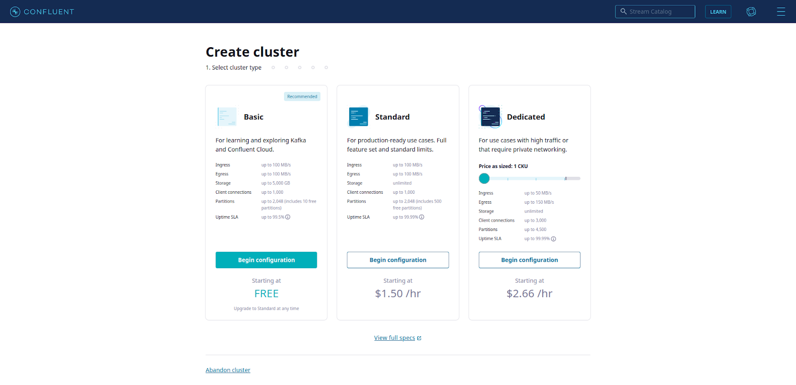
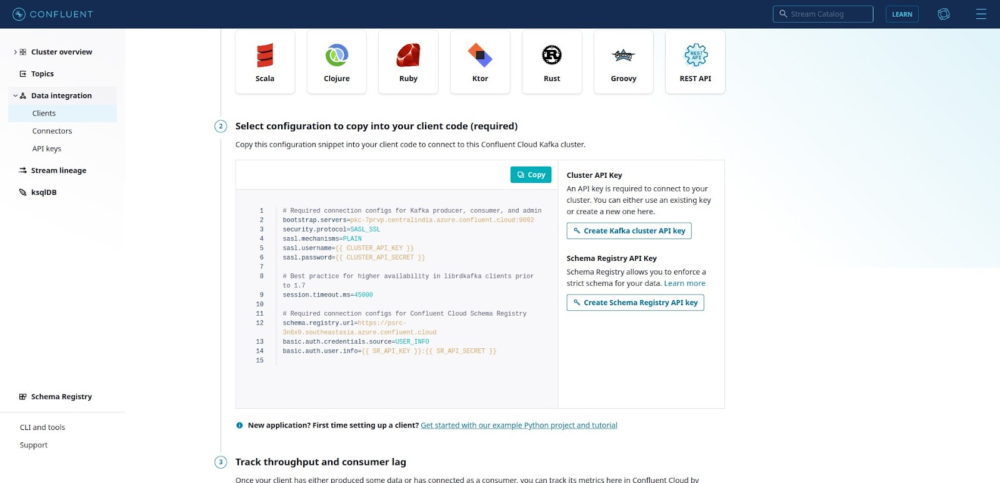

## Introduction

Stream processing is a data processing technique to analyze, aggregate, filter or enhance a continuously ingested data as they come. Stream processing is used synonymously with real time data processing as the input data is processed as they are ingested with minimal latency. Some of its applications include fraud detection, IoT device data streaming, event streaming etc. Stream processing involves a publisher / source which generates data to a stream processing application where the data is processed, and the results sent to a subscriber / sink. 

Kafka Streams is one of the best streaming applications to do distributed real time stream processing. Although it's a great tool to do real time stream processing, actually setting up a production level stream processing pipeline is not an easy task. There is a learning curve associated with designing effective Kafka Streams Applications. Kafka Streams API is mainly written in Java and Scala but there are python implementations like Faust which can also be used.

## What is Faust?

Faust is a stream processing library written in Python which uses the capabilities of Kafka Streams underneath.  It is used at [Robinhood](http://robinhood.com/) to build high performance distributed systems and real-time data pipelines that process billions of events every day. The original [repo](https://github.com/robinhood/faust) which has around 6.5k stars is currently deprecated but it has been [forked](https://github.com/faust-streaming/faust) and actively maintained by community.


For reliability Faust uses a Kafka topic as "write-ahead-log”. Popular libraries like Pandas, NumPy, SQL Alchemy etc. can be used in conjunction with Faust. It uses a superfast embedded database (written in C++) called RocksDB to store states during stream processing. 

Following are the concepts used by Faust,

- App - an instance of the Faust application.
- Agent - an asynchronous, distributed processor to process continuous data.
- Table - sharded dictionaries to enable stateful stream processing.
- Channel - a buffer/queue used to send and receive messages.
- Sensors - To monitor and record events in the Faust application.

Faust stores internal data like application configurations, table data etc. in Kafka topics to facilitate distributed, fault-tolerant and durable data processing across machines. In general, Faust inputs data from topics, process it and write output to topic again. Faust supports all the operations like group by, map, filter, joins etc. which are supported by Kafka Streams.

## Faust vs Kafka Streams

Some of the key differences between Faust and Kafka Streams are as follows:

- Faust is written in Python, while Kafka Streams is written in Java. 
- Python has better support for data engineering and machine learning libraries like Pandas, Scikit-learn etc. which can be effectively utilized by Faust. 
- Kafka Streams uses a Domain Specific Language(DSL) whereas Faust is just Python.
- Faust provides a simpler, higher-level API that is easier to use than Kafka Streams' lower-level API. If you are new to stream processing or prefer a simpler API, Faust may be a better choice.
- The concept of “agents” comes from the actor model, and means the stream processor can execute concurrently on many CPU cores, and on hundreds of machines at the same time.
- Thanks to Faust and asyncio you can now embed your stream processing topology into your existing asyncio/ eventlet/Twisted/Tornado applications. No need for complex topologies as it can be simplified with just python.

Both Kafka Streams and Faust are tightly integrated with Kafka and can leverage Kafka's features such as availability, concurrency and fault tolerance.

In essence, Faust is a good starting point for anyone who wants to learn how Kafka stream processing systems work. It is a better option for data analytics or data science use cases.

## Prerequisites

Our objective here is to write a simple Kafka streams application in python using the Faust package. We will leverage the Confluent cloud infrastructure to create some topics. Confluent provides a fully managed cloud service for Apache Kafka which is super easy to deploy and use. You can sign up for Confluent cloud [here](https://www.confluent.io/confluent-cloud/tryfree/) and earn free credits worth $400 for the first 60 days.

For this tutorial purposes, we will be using an open-source time-series based [power consumption dataset](https://www.kaggle.com/datasets/uciml/electric-power-consumption-data-set) which is available in Kaggle. Measurements in the dataset are of electric power consumption in one household with a one-minute sampling rate over a period of almost 4 years. We will look at only the voltage parameter and find its average for every 1-hour windows. These windowed averages can tell us if there is a power spike which needs to be looked at.

## Step 1: Create a topic in Confluent Cloud

Once you have signed up for a confluent cloud account, you can create a basic cluster with default configuration at the region of your liking.



Navigate to topics and create a topic with default configurations called `voltage_input`.

## Step 2: Downloading and installing requirements

Let’s create a python client to produce data to the topic. Navigate to ‘Clients’ under the ‘Data integration’ option on the cluster dashboard and create a new python client.



Generate api key and copy the configuration snippet. Save it in the following path,

```bash
$HOME/.confluent/python.config
```

We will use the `confluent-kafka` python package to produce data to the input topic from local. Create a virtual environment with the following packages,

```plain-text
requestscertifi
confluent-kafka[avro,json,protobuf]>=1.4.2
faust[fast]
```

Let’s download the python file which will read the config file and parse it for the application to use. 

```bash
wget https://raw.githubusercontent.com/confluentinc/examples/6.1.1-post/clients/cloud/python/ccloud_lib.py
```

Download the dataset file `household_power_consumption.txt` from the Kaggle [link](https://www.kaggle.com/datasets/uciml/electric-power-consumption-data-set) and save it in our working directory.

## Step 3: Produce to the input topic

We will use the `ccloud_lib` python module to parse the config file and also the input arguments for the producer module.

`producer.py`

```python
#!/usr/bin/env python

import json
import ccloud_lib

delivered_records = 0

# Callback function when a message has been successfully delivered
def acked(err, msg):
    	global delivered_records
    	"""Delivery report handler called on
    	successful or failed delivery of message
    	"""
    	if err is not None:
        	print("Failed to deliver message: {}".format(err))
    	else:
        	delivered_records += 1
        	print("Produced record to topic {} partition [{}] @ offset {}"
              	.format(msg.topic(), msg.partition(), msg.offset()))

def fetch_time_series_data(count=1):
    	data_split = data[count].split(";")
    	try:
        	new_message = {"datetime": datetime.strptime(data_split[0] + " " + data_split[1], "%d/%m/%Y %H:%M:%S"), "voltage": float(data_split[4])}
    	except ValueError:
        	new_message = {"datetime": datetime.strptime(data_split[0] + " " + data_split[1], "%d/%m/%Y %H:%M:%S"), "voltage": 0.0}
    	return count+1,new_message

if __name__ == '__main__':

	# Read arguments and configurations and initialize
	args = ccloud_lib.parse_args()
	config_file = args.config_file
	topic = args.topic
	conf = ccloud_lib.read_ccloud_config(config_file)

	# Create topic if needed
	# ccloud_lib.create_topic(conf, topic)

	# Initialize the producer configuration
	producer_conf = ccloud_lib.pop_schema_registry_params_from_config(conf)
	producer_conf['key.serializer'] = StringSerializer('utf-8')
	producer_conf['value.serializer'] = StringSerializer('utf-8')
	p = SerializingProducer(producer_conf)

	with open("./household_power_consumption.txt", "r") as f:
    	data = f.readlines()

	no_of_records = 10000
	start_index = 0
	while no_of_records:
    	# Call poll to send any queued record
    	p.poll(0)
    	start_index,base_message = fetch_time_series_data(start_index)
    	no_of_records -= 1
   	 
    	value = base_message
   	 
    	record_key = "power"
    	record_value = json.dumps(value)

    	p.produce(topic, key=record_key, value=record_value, on_delivery=acked)
    
	# Call flush to send any queued record at the end
	p.flush()
```

We are producing the voltage data with a datetime column to the input topic.

`poll()` or `flush()` needs to be called to send the queued data to the Kafka broker.

## Step 4: Creating a Faust app

Let’s create a simple Faust app which will read from the `voltage_input` topic and do a windowed aggregation of the voltage values. 

First, we need to define the input and output data models for the Faust app.

```python
# Input model 
class PowerModel(faust.Record, coerce=True, date_parser=parse_date):
	datetime: datetime
	voltage: float

#Output model
class AverageVoltage(faust.Record):
	start_time: datetime
	count: int
	mean: float
```

Let’s initialize the faust app with the kafka broker connection details. We need to pass in the SASL credentials which were created previously and stored in the config file.

```python
ssl_context = ssl.create_default_context()
ssl_context.load_verify_locations(cafile=certifi.where())

app = faust.App('myapp', broker='kafka://BROKER_HOST_NAME:9092', broker_credentials=faust.SASLCredentials(username=SASL_USERNAME, password=SASL_PASSWORD, ssl_context=ssl_context), topic_replication_factor=3, topic_partitions=3)
```

Define the input topic stream and output sink topic for the aggregated average voltages.

```python
voltage_stream = app.topic('voltage_input', key_type=str, value_type=PowerModel)
sink = app.topic('voltage_avg', value_type=AverageVoltage)
```

Next, we need to define the aggregation logic for calculating the hourly average voltage.

```python
def hourly_window_processor(key, events):
	timestamp = key[1][0]
	timestamp = datetime.fromtimestamp(timestamp)
	values = [event.voltage for event in events]
	count = len(values)
	mean = sum(values) / count

	logger.info(
    	f'processing window:'
    	f'{len(values)} events,'
    	f'mean: {mean:.2f},'
    	f'timestamp {timestamp}',
	)

	sink.send_soon(key='avg_voltage_hourly', value=AverageVoltage(start_time=timestamp, count=count, mean=mean))

hourly_window_voltage = app.Table('hourly_average_voltage', default=list, partitions=3, on_window_close=hourly_window_processor)\
	.tumbling(timedelta(hours=1), expires=30)\
    	.relative_to_field(PowerModel.datetime)
```

We are using a tumbling window here as we need to calculate the average every hour. Values are stored in the transition table `hourly_average_voltage` as it comes. Once the time window closes, the callback function calculates the average for the values in that window and sinks it to the output topic.

Now, we need to define an app agent to append the input data stream to the hourly window voltage table.

```python
@app.agent(voltage_stream)
async def processor(records):
	async for record in records:
    	value_list_hour = hourly_window_voltage['events'].value()
    	value_list_hour.append(record)
    	hourly_window_voltage['events'] = value_list_hour
```

Following is the final aggregate code of the faust app,

`app.py`

```python
import faust
from datetime import datetime, timedelta
from dateutil.parser import parse as parse_date
import ssl
import certifi
import logging

logger = logging.getLogger(__name__)

ssl_context = ssl.create_default_context()
ssl_context.load_verify_locations(cafile=certifi.where())

class AverageVoltage(faust.Record):
	start_time: datetime
	count: int
	mean: float

class PowerModel(faust.Record, coerce=True, date_parser=parse_date):
	datetime: datetime
	voltage: float

app = faust.App('myapp', broker='kafka://pkc-7prvp.centralindia.azure.confluent.cloud:9092', broker_credentials=faust.SASLCredentials(username="3TCIKXFSRGTFZCMV", password="7OUQQoTN6zIA2gS5LK/hrAxQjpRjIhw+w9+/gdoUJZT+8vlPxEtKkJ+n+X1cPkpm", ssl_context=ssl_context), topic_replication_factor=3, topic_partitions=3)
app.conf.table_cleanup_interval = 1.0

voltage_stream = app.topic('test3', key_type=str, value_type=PowerModel)
sink = app.topic('voltage_avg', value_type=AverageVoltage)

def hourly_window_processor(key, events):
	timestamp = key[1][0]
	timestamp = datetime.fromtimestamp(timestamp)
	values = [event.voltage for event in events]
	count = len(values)
	mean = sum(values) / count

	logger.info(
    	f'processing window:'
    	f'{len(values)} events,'
    	f'mean: {mean:.2f},'
    	f'timestamp {timestamp}',
	)

	sink.send_soon(key='avg_voltage_hourly', value=AverageVoltage(start_time=timestamp, count=count, mean=mean))

hourly_window_voltage = app.Table('hourly_average_voltage', default=list, partitions=3, on_window_close=hourly_window_processor)\
	.tumbling(timedelta(hours=1), expires=30)\
    	.relative_to_field(PowerModel.datetime)

@app.agent(voltage_stream)
async def processor(records):
	async for record in records:
    	value_list_hour = hourly_window_voltage['events'].value()
    	value_list_hour.append(record)
    	hourly_window_voltage['events'] = value_list_hour

if __name__ == '__main__':
	app.main()
```

## Step 5: Running the app and viewing the results

We can start the Faust worker in a terminal by executing the following command,

```bash
python app.py worker -l info
```

Let’s open another terminal and start producing records to the `voltage_input` topic by executing the following command.

```bash
./producer.py -f ~/.confluent/python.config -t test1
```

Let’s write a simple `consumer.py` code to consume the aggregated results from our output topic `voltage_avg`.

`consumer.py`

```python
from confluent_kafka import Consumer
import json
import ccloud_lib
import sys
import datetime

if __name__ == '__main__':

	# Read arguments and configurations and initialize
	args = ccloud_lib.parse_args()
	config_file = args.config_file
	topic = args.topic
	conf = ccloud_lib.read_ccloud_config(config_file)

	# Create Consumer instance with a unique group id
	# 'auto.offset.reset=earliest' to start reading from the beginning of the
	#   topic if no committed offsets exist
	consumer_conf = ccloud_lib.pop_schema_registry_params_from_config(conf)
	consumer_conf['group.id'] = 'python_example_group_1'
	consumer_conf['auto.offset.reset'] = 'earliest'
	consumer = Consumer(consumer_conf)

	# Subscribe to topic
	consumer.subscribe([topic])

	# Process messages
	total_count = 0
	try:
    	while True:
        	msg = consumer.poll(1.0)
        	if msg is None:
            	print("Waiting for message or event/error in poll()")
            	continue
        	elif msg.error():
            	print('error: {}'.format(msg.error()))
        	else:
            	# Check for Kafka message
            	record_key = msg.key()
            	record_value = msg.value()
            	data = json.loads(record_value)
            	total_count += 1
            	print(data)
	except KeyboardInterrupt:
    	pass
	finally:
    	# Leave group and commit final offsets
    	consumer.close()
```

Run the following command to start the consumer in terminal,

```bash
./consumer.py -f ~/.confluent/python.config -t voltage_avg
```

Now, you can view the magic by opening three terminals and running the producer, Faust app worker and consumer simultaneously in them.

## Conclusion

In this tutorial, we were able to accomplish the following,

1. Create a simple Faust application to calculate hourly windowed average of voltages from our input dataset.
2. Create a simple python producer and consumer to interact with a Confluent cloud topic.

Faust is great way to leverage the capabilities of Kafka Streams in conjunction with popular python libraries like Pandas, NumPy, Scikit-learn etc. to write distributed, fault-tolerant streaming applications. Faust is simple and can be used to build real-time applications involving machine learning, deep learning etc.

Some of the other python coded stream processing library include,
- https://github.com/wintoncode/winton-kafka-streams
- https://github.com/bytewax/bytewax
- https://github.com/rh-marketingops/fluvii

## References

1. [https://faust.readthedocs.io/en/latest/userguide/tables.html](https://faust.readthedocs.io/en/latest/userguide/tables.html)
2. [https://github.com/robinhood/faust/blob/master/examples/windowed_aggregation.py](https://github.com/robinhood/faust/blob/master/examples/windowed_aggregation.py)
3. [https://github.com/confluentinc/examples/tree/7.1.0-post/clients/cloud/python](https://github.com/confluentinc/examples/tree/7.1.0-post/clients/cloud/python)
