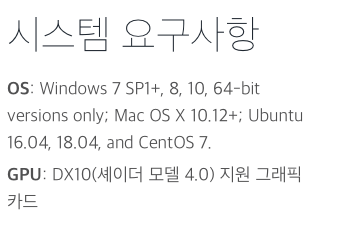
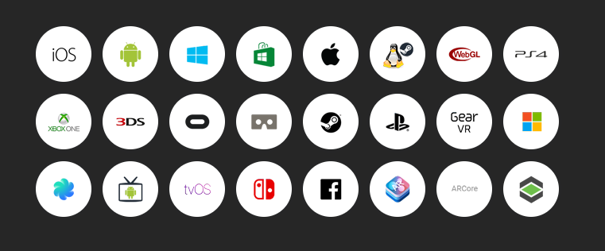

## INTRO

지금까지 작성했던 어떤 글들보다 가장 새로울 주제를 가져왔습니다.
바로 게임엔진 `Unity`에 대한 글을 가져왔습니다.
`Unity`에 대해 전혀 모르는 사람들을 위해 `Unity`가 개념을 중심으로 글을 작성하였습니다.

## [유니티](https://unity.com)란?

- 3D 및 2D 비디오 게임의 개발 환경을 제공하는 **게임 엔진**이자, 3D 애니메이션과 건축 시각화, 가상현실(VR) 등 인터랙티브 콘텐츠 제작을 위한 **통합 제작 도구**입니다.

>  **게임 엔진** :  게임 개발을 위해 여러 기능을 제공하여 게임을 쉽게 제작할 수 있도록 하는 프로그램입니다. 게임 엔진을 사용하면 작업 효율을 높일 수 있습니다. 대표적으로 유니티(`C#` 기반)와 언리얼 엔진(`C++` 기반)이 있습니다.
 
- 윈도우, 맥 OS, IOS, Android 등 27개의 플랫폼에서 사용 가능한 콘텐츠를 만들 수 있고 제작 도구인 유니티 에디터는 윈도우와 맥 OS를 지원합니다.
 
- `C#`(**객체 지향 언어**)를 사용하여 개발을 할 수 있도록 지원합니다. 스크립트 작성의 경우 유니티와 함께 설치되는 Visual Studio를 이용하며, 다른 편집기와 연동하는 것도 가능합니다.
 
> **객체 지향 언어** : 컴퓨터 프로그램을 명령어의 목록으로 보는 시각에서 벗어나 독립된 객체라는 기본 단위로 이들이 상호작용하는 방식입니다. 

- 초기에는 3D 웹 미디어 제작 툴에 주력했으나, 스마트폰을 이용한 게임이 확장되던 시기에는 아예 게임 엔진으로 방향을 선회해 모바일 게임 개발 분야에서 입지를 굳혔다고 합니다. 

- 현재는 게임 산업에서 더 나아가 여러 분야의 기술들을 확장 지원하고, 시각효과 기업들을 인수하면서 다양한 영역에서 활용되고 있습니다.

- 그 예시로는 게임 엔진 속의 오브젝트에 머신러닝을 시키는 기능을 통합하는 툴을 제공하기도 했으며, 자동차 및 제조 산업 분야에 AR/VR을 제공하는 역할도 하고 있다고 합니다.

## 유니티의 장점

**1. 쉬운 제작 및 교육 환경**

- 내부 에셋들의 위치를 바꾸거나 임포트 하는 것이 매우 쉽습니다.

- 많은 소규모/인디 게임 개발자들이 쉽게 접근하여 게임과 콘텐츠를 제작할 수 있습니다.

- 유니티의 다양한 개발자들이 많아 구글링을 이용하여 한글로 된 관련 자료를 쉽게 습득할 수 있습니다.

- `Unity`에서 자체적으로 제작자의 수준별로 750시간이 넘는 [학습 콘텐츠](https://learn.unity.com/)를 제공하고 있습니다.

**2. 낮은 요구사항**

- 다른 게임 엔진에 비하여 비교적 가벼운 편이라 저사양 PC에서도 동작합니다.

**3. [Asset Store](https://assetstore.unity.com/)**

- 게임의 품질을 높이기 위한 리소스, 스크립트, 플러그인 등을 무료 또는 유료로 구매하여 사용할 수 있으며 판매할 수도 있습니다.

- 인디, 초보 개발자들을 지원하는 프로모션 행사를 통해 저렴하게 구입할 수 있습니다.

> 에셋이란, 게임에 적용되는 이미지(배경, 캐릭터 특수효과 등)와 게임을 제작하는 데에 있어 필요한 기능(도구)을 말합니다. 게임의 품질을 높이기 위한 렌더링 효과, 명암조절, 지형 생산 등의 기능들이 탑재되어 있습니다.

**4. 다양한 서비스**

- 유니티는 자체적으로 다양한 기능들의 기술 자료를 쉽고 편리하게 한 번에 Manual에서 확인할 수 있도록 해주며 서버 호스팅, 음성 및 채팅, Unity Ads, 인앱 구매 등 많은 기능들을 개발자에게 쉽고 빠르게 제공합니다.

**5. 멀티플랫폼 빌드를 지원**

- 윈도우, 맥 OS, iOS, 안드로이드, 플레이스테이션, 엑스박스, 닌텐도 스위치, 웹브라우저 등 27개의 플랫폼에서 사용 가능한 콘텐츠를 만들 수 있습니다.

*유니티 지원 플랫폼*

**6. [활성화된 커뮤니티](https://unity.com/kr/community)**

- 유니티는 커뮤니티가 활성화되어있어 게임 개발에 대한 정보를 공유하기 매우 유용합니다. 

## 마치며
좀 더 다양한 이야기를 담고 싶었지만 그렇게 되면 글이 감당할 수 없을 정도로 길어질 것 같아 여기서 마칩니다!
혹시 또 `Unity` 관련 글을 작성할 일이 생긴다면 설치와 간단한 구현에 대해서 작성해 보도록 하겠습니다.

끝!

## Reference

[[Unity 입문 강좌 - 1] Unity 란?](https://ctkim.tistory.com/195)  
[[Unity] 유니티란? 게임개발을 위한 엔진 유니티를 소개합니다](https://blcan.tistory.com/8)  
[유니티와 협업으로 진행된 <가상현실 프로그래밍 교육>, 생생한 후기 밀착 취재!](https://liberaledu.snu.ac.kr/board/blog/view/862)
