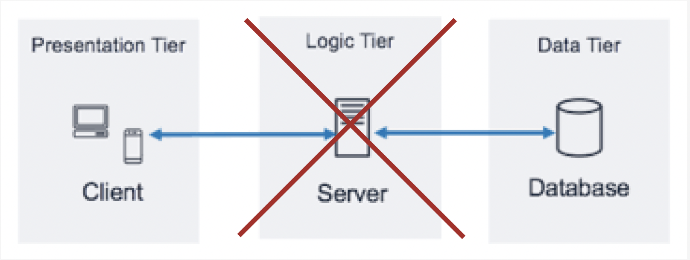

# 차례

[문제상황](#문제상황)  
[내장 데이터베이스 사용상황](#언제-내장형-데이터베이스를-쓸-수-있을까)  
[SQLite란](#sqlite란)  
[Realm이란](#realm이란)  
[SQLite vs Realm](#sqlite-vs-realm)  
[정리하며](#정리하며)  


<br>

# 문제상황

개발 활동을 하다 보면 아래와 같은 상황에 직면할 수 있습니다.

- 저장할 데이터는 있지만 그 양이 많지 않은 상황
- 한 사용자의 데이터를 다른 사용자에게 공유할 필요가 없어서 공용 데이터베이스가 필요 없는 상황

예를 들어서 PVP 기능이 없는 간단한 모바일 게임을 만들고 싶을 때 등의 상황이 있습니다.



일반적인 클라이언트-서버-데이터베이스 3티어 계층을 이용하기엔 불필요하게 서버를 구축해야 하고, 서버와 통신하기 위한 비용과 통신으로 인한 지연시간을 감수해야 합니다.

이럴 때 외부의 데이터베이스를 사용하는 대신에 모바일기기 내부에 **내재된 데이터베이스**를 사용하는 방식이 있습니다. 내재된 데이터베이스를 사용하면 클라이언트에서 데이터가 필요할 때, 클라이언트 기기 내부의 데이터베이스에서 해당 데이터를 조회합니다.

쉽게 얘기하면 데이터베이스에 접근할 때 서버 대신 응용프로그램(클라이언트단)을 사용하는 것입니다.

내장형 데이터베이스에는 대표적으로 `SQLite`와 `Realm`이 있습니다.

<br>

# 언제 내장형 데이터베이스를 쓸 수 있을까?

`SQLite`와 `Realm`는 Android 및 iOS 모바일 애플리케이션에서 사용되는 내부 데이터베이스, 브라우저(웹 애플리케이션)에서 사용되는 웹 데이터베이스 등 다양한 환경에서 사용할 수 있습니다.


**모바일 애플리케이션**에서는 `SQLite`/`Realm`을 내장 데이터베이스로 많이 사용합니다. Android, iOS 등 모바일 운영체제에서는 `SQLite`/`Realm`를 내장한 API를 제공하여 개발자가 데이터베이스 접근 코드를 쉽게 구현할 수 있습니다.

**웹 애플리케이션**에서는 `SQLite`/`Realm`를 사용하여 클라이언트 측 데이터베이스를 구현할 수 있습니다. `SQLite`/`Realm`는 자체적으로 서버를 제공하지 않기 때문에, `SQLite`/`Realm` 데이터베이스 파일을 서버에 업로드하고, 웹 애플리케이션에서 데이터베이스 파일을 읽어와서 데이터를 처리할 수 있습니다. 
또한 `SQLite`는 다른 관계형 데이터베이스 시스템과 연동하여 사용할 수 있기 때문에, 데이터 분석 도구 등 다양한 분야에서도 사용될 수 있습니다.

**데스크톱 애플리케이션**에서는 `SQLite`/`Realm`를 사용하여 내부 데이터베이스를 구현하거나, 데스크톱 애플리케이션에서 사용되는 데이터베이스 도구에 사용됩니다.

<br>

# SQLite란?


`SQLite`는 오픈 소스 관계형 데이터베이스 관리 시스템(RDBMS) 중 하나로, SQL 데이터베이스 엔진이 내장된 데이터베이스입니다.

`SQLite`는 성능이 좋고 사용이 용이하다는 점에서 널리 사용됩니다.

<br>

# SQLite의 특성

- **성능**  
`SQLite`는 데이터베이스가 디바이스에 내장되어있으므로 http 통신 없이 컴퓨터 내에서 데이터 접근을 요청하고 받아오기 때문에 **시간비용이 적다**는 점에서 성능이 좋다고 볼 수 있습니다. 

- **개발 편의**  
Android, iOS, macOS, Windows 등 대부분의 운영체제에서 내장된 `SQLite`를 기본적으로 제공하기 때문에 최신 버전의 `SQLite`를 쓰고 싶지 않은 이상 따로 `SQLite`를 설치할 필요가 없습니다.  
또한 **API**가 비교적 잘 제공되어 있기 때문에 개발자가 사용하기 유용합니다. 

- **관계형 데이터베이스**  
`SQLite`는 다른 관계형 데이터베이스 시스템과 마찬가지로 **SQL 쿼리**를 사용하여 데이터베이스를 조작할 수 있으며, 다양한 데이터 형식을 지원합니다.  
다만 SQL의 모든 기능을 지원하진 못합니다. 네트워크에 접근할 때 동시접근이 안된다는 점, 유니코드만 인코딩이 가능하다는 점 등을 잘 고려해서 사용해야 합니다.
 
<br>

# SQLite 사용하기(in Kotlin)

``` kotlin
// SQLite 데이터베이스 만들기
val myDatabase: SQLitedatabase = openOrCreateDatabase("myDatabase.db", MODE_PRIVATE, null)

// 테이블 생성
// 'myTable'이라는 테이블 생성하기
myDatabase.execSQL("CREATE TABLE IF NOT EXISTS myTable (id INTEGER PRIMARY KEY, name TEXT, age INTEGER)")

// 데이터 추가
// 'myTable'에 새로운 row 추가하기
myDatabase.execSQL("INSERT INTO myTable (name, age) VALUES ('John Doe', 30)")

// 테이블 조회
// 쿼리문을 보내고 데이터값 받아오기
val myCursor = myDatabase.rawQuery("SELECT * FROM myTable", null)

// 레코드 조회
// 커서를 옮기며 순차적으로 데이터 레코드값에 접근하기
while (myCursor.moveToNext()) {
    val id = myCursor.getInt(0)
    val name = myCursor.getString(1)
    val age = myCursor.getInt(2)
    
    // 데이터로 처리하기
    Log.i("SQLiteExample", "id: $id, name: $name, age: $age")
}

// 사용종료
myCursor.close()
myDatabase.close()

```

<br>

# Realm이란?


`Realm`은 내장 데이터베이스 중 하나로 NoSQL 기반 데이터 관리 시스템입니다.

`Realm`은 빠른 속도와 낮은 지연 시간, 간단한 API, 쉬운 사용성 등의 장점을 가집니다.

<br>

# Realm의 특성

- **빠른 속도 / 낮은 지연시간**  
`Realm`은 `SQLite`와 마찬가지로 내장된 데이터베이스를 사용한다는 점에서 서버를 통해 데이터베이스에 접근하는 것보다 빠르게 접근할 수 있습니다.  
그뿐만 아니라 `Realm`은 디바이스의 드라이버가 아닌 메모리에 데이터베이스를 캐싱하여 사용하기 때문에 더 빠른 응답 시간을 기대할 수 있습니다.  
설정에 따라서 일부를 디바이스의 파일시스템에 저장할 수도 있습니다.

- **객체지향 패러다임**  
`Realm`은 `SQLite`와 달리 관계형 데이터베이스가 아니므로 다른 방식으로 동작합니다. `Realm`은 객체지향 프로그래밍 패러다임을 따르며, 데이터를 객체로 표현해서 저장합니다.  
 이러한 객체는 `Realm` 내에 저장되며, 필요할 때마다 쉽게 검색하고 업데이트할 수 있습니다. `Realm`은 또한 쿼리 개념을 지원하여 객체를 검색하고 필터링하는 데 도움을 줍니다.
 
- **개발 편의**  
간단한 API를 제공하고 사용하기 쉬워 개발자 편의를 가집니다. 또한 객체지향 패러다임을 따르므로 Java, Kotlin, Swift 개발자가 쉽게 이용할 수 있습니다.

- **보안**  
 데이터 동기화와 암호화를 지원하여, 모바일 애플리케이션에서 데이터 보안과 공유 문제를 해결하는 데 도움이 됩니다.

<br>

# Realm 사용하기(in Kotlin)
``` kotlin
// Realm 구현체를 만든다
val realmConfig = RealmConfiguration.Builder()
    .name("myrealm.realm")
    .schemaVersion(1)
    .build()

// 사용시작
// Realm을 사용하기 위해 Realm 인스턴스를 가져오기
val realm = Realm.getInstance(realmConfig)

// Realm에 저장할 객체 생성하기
val person = Person()
person.name = "John"
person.age = 30

// 저장
realm.executeTransaction { realm ->
    realm.copyToRealm(person)
}

// 조회
// where() 함수의 결과에 해당하는 객체에 대해서 쿼리를 요청해와서 저장한다.
val results = realm.where(Person::class.java)
    .equalTo("name", "John")
    .findAll()

// results에서 객체 1개만 반환하기
val personToUpdate = results.first()

// 업데이트
// copyToRealmOrUpdate() 메소드를 이용해서 변경된 객체를 Realm에 저장/업데이트하기
realm.executeTransaction { realm ->
    personToUpdate.age = 31
    realm.copyToRealmOrUpdate(personToUpdate)
}

// 삭제
// deleteFromRealm() 메소드를 이용해서 해당 객체를 삭제하기
realm.executeTransaction { realm ->
    val personToDelete = results.first()
    personToDelete.deleteFromRealm()
}

// 사용종료
realm.close()

```

# SQLite vs Realm

SQLite와 Realm 중 뭘 사용하는 게 좋을까요?

개발환경이나 만들고자 하는 서비스에 따라서 둘의 장단점을 비교해보고 선택하면 좋습니다.

## **Time/Performance-critical 서비스 = Realm**
애플리케이션이 동작할 때, 디바이스의 파일시스템에 데이터베이스를 저장하는 `SQLite`와 달리 `Realm`은 메모리에 데이터베이스를 적재시키기 때문에 데이터를 읽어오는 데 `Realm`이 더 빠릅니다.  
또한 NoSQL의 특성상 관계형 데이터베이스에 비해서 조회 속도가 빠른 점도 미세한 이점입니다.  
<br>
 
## **오래 사용할 수 있는 모바일 서비스 = SQLite**
`Realm`의 특성상 더 많은 메모리를 사용하게 되므로 배터리 소모량이 많습니다.
 
따라서 오래 사용해야 하는 모바일 서비스를 제공하는 경우엔 상대적으로 `SQLite`를 사용하는 게 더 이점이 있습니다.  
<br>

## **동적으로 데이터를 추가해야 하는 서비스 = Realm**
NoSQL은 스키마가 정적인 관계형 데이터베이스에 비해서 비교적 자유롭게 데이터를 추가할 수 있습니다. 
 
따라서 데이터베이스 구조를 동적으로 변경할 가능성이 있는 경우에 `Realm`을 사용하는 것이 더 좋을 수 있습니다.  
<br>
 
## **복잡한 관계성을 가진 데이터를 다루는 서비스 = SQLite**

데이터가 복잡한 관계성을 가질 때, NoSQL의 특성상 `Realm`을 사용한다면 객체에서 데이터들이 연관되어 있는 경우 중복된 데이터를 생성해야 하므로 저장 공간을 더 차지하게 됩니다. 
 
추가로 개발자 편의의 관점에서도 관계형 데이터베이스인 `SQLite`를 사용하는 게 개발에 더 좋을 수 있습니다.
<br>

이러한 상황 이외에도 앞서 설명한 `SQLite`와 `Realm`의 특성을 고려해서 개발 목적과 상황에 맞는 데이터베이스를 사용하시길 바랍니다

<br>

# 정리하며

이전에 TODO 앱 개발을 할 때 서버와의 통신이 필요 없는 서비스를 개발해야 했습니다. 그 과정에서 소량의 데이터(사용자 성취도)에 대한 정보를 직접 텍스트 파일에 써서 모바일 기기의 파일 시스템에 저장해서 사용했습니다.

그렇게 사용하다 잘못된 요청으로 1931~2022년의 모든 날짜에 대한 파일(수만 개)을 쓰게 된 경우가 있었는데, 이때 앱의 터치가 안 먹는 등의 오류가 발생하게 됐고, 오류 핸들링도 할 수 없었고, 오류 정보도 얻을 수 없었던 경험이 있습니다.

이때의 경험으로 위험성을 낮추고 데이터베이스 관리나 트랜잭션 관리를 위해서 내장 데이터베이스 시스템을 써서 데이터를 저장할 필요성을 느꼈고, 이후 리팩토링하는 과정에서 내장 데이터베이스 시스템을 적극적으로 활용해 봐야겠다고 느꼈습니다.

사용자의 성취도라는 데이터의 특성상 데이터가 관계성을 가지지 않고, 짧은 시간 동안만 사용할 TODO 앱의 특성상 배터리 소모나 메모리 사용에 크게 문제가 없을 것 같으므로 `Realm`을 써 볼 생각입니다.