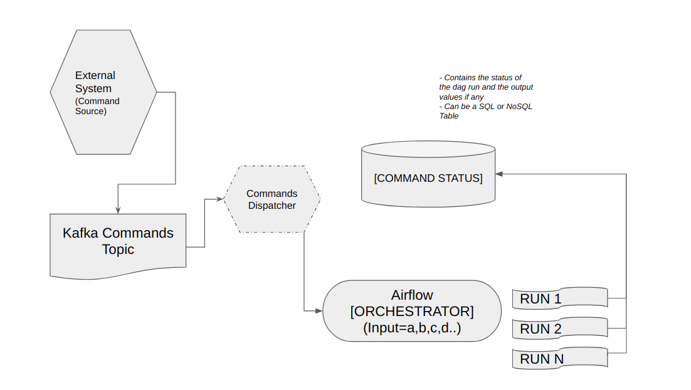
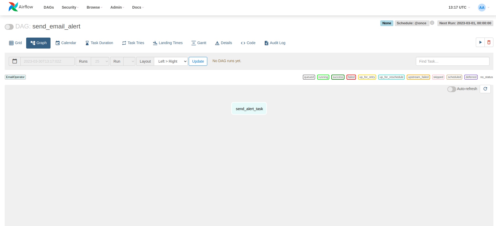

## Introduction

In today's world, data processing has become an essential part of businesses. With the rise of big data, companies are looking for efficient ways to process data quickly and accurately. Apache Kafka and Apache Airflow are two popular technologies used for this purpose.

Apache Kafka is a distributed messaging system designed to handle large amounts of data efficiently. It can be used as a real-time stream processing platform, and it is widely used for its ability to handle high throughput and low latency. Kafka is a popular choice for building event-driven architectures because of its persistence and scalability.

Apache Airflow, on the other hand, is an open-source platform used for managing and scheduling complex data pipelines. Airflow allows users to define and execute workflows, making it easier to manage and monitor data pipelines. Airflow boasts a wide range of operators for various types of operations and integration with third party applications.

## Command Processing and Event Driven Workflows

Command processing refers to a software design pattern in which an application receives and executes commands from users or other systems. In general, the application receives a command and then executes it in a synchronous manner, meaning that it waits for the command to complete before executing the next one. Command processing is simpler to implement and provides greater control over the order in which tasks are executed, making it well-suited for applications where the user is in direct control of the system.

On the other hand, event-driven workflows are based on the idea of reacting to events that occur within a system, rather than waiting for a command to be executed. This pattern is often used in complex systems, such as distributed systems, to ensure that actions are taken in response to specific events, without the need for manual intervention. Event-driven workflows are more flexible and can adapt to changing conditions in real-time, making them ideal for systems that require a high degree of automation or respond to external events.

But in reality, in most cases,the commands need to processed in real-time to quickly inform the dependent systems to effect the appropriate action derived from the command. By combining command processing with the event driven architecture, we can process commands asynchronously in real-time and trigger actions derived from the command. Let’s see how to achieve this with the help of Apache Kafka and Apache Airflow.

## Command Processing in Apache Kafka

Kafka is designed to handle high volumes of data in real-time, making it well-suited for use in complex systems where events are monitored continuously. Some of the capabilities of Kafka which makes it ideal for command processing,

1. **Persistent:** Kafka is designed to be highly persistent, ensuring that messages are not lost even if there are failures or crashes in the system.
2. **Low latency:** Kafka is optimized for low latency, enabling it to deliver real-time data streams with minimal delay. 
3. **System of record:** Kafka can be a centralised system of record for all the events occurred. This also gives us the flexibility to reprocess events in the arrived order in case of failure or requirement.
4. **Fan Out/Parallelism:** Many event-driven apps need fan out = "write once, read many"- that is, multiple applications may be interested in subscribing to and reacting to a single event

Kafka topics can act as the medium for passing commands and events between different components of the system. In this architecture, commands are sent to a specific topic by a user or external system, and then consumed by a component responsible for processing that particular command. This architecture also allows for the separation of concerns between different components, making it easier to manage and maintain the system over time.

For example, consider an e-commerce platform where customers can place orders for products. When a customer places an order, a command is sent to a specific Kafka topic, which is consumed by an order processing component. The component then executes the command by creating an order record in a database and generating an event indicating that a new order has been placed. This event is then sent to another Kafka topic, which is consumed by a shipping component responsible for initiating the shipping process.

## Orchestrating Event Workflows in Apache Airflow

Many applications process events in step-wise workflows (also known as Staged Event Driven Architecture) -- these workflows need control on the individual steps (including sequencing, dependencies on previous steps, handling failures, parallel processing etc). Airflow to this end is the best orchestration platform for performing these with a purely Python interface (something that developers love). Airflow allows users to define workflows as Directed Acyclic Graphs (DAGs), where nodes represent individual tasks and edges represent dependencies between those tasks.

Airflow provides a number of key features to support workflow management, including:

1. **Scheduling and automation:** Airflow allows users to define schedules and automate workflow execution, ensuring that tasks are executed in the correct order and at the right time. It also supports passing on variables from upstream tasks to downstream tasks making dynamic conditional execution possible. 
2. **Monitoring and logging:** Airflow provides rich monitoring and logging capabilities, allowing users to track the progress of workflows, diagnose issues, and optimize performance.
3. **Extensibility:** Airflow supports custom operators, sensors, and hooks, allowing users to interact with a wide range of systems and technologies. 
4. **Alerting:** Airflow provides built-in alerting capabilities, allowing you to track the progress of your pipeline and receive notifications if anything goes wrong.
5. **Compatibility:** Airflow supports a wide range of data processing tools and frameworks, including Apache Kafka, Apache Spark, and TensorFlow, making it a highly compatible choice for event processing use cases.  

So, Apache Airflow is not just a great tool for both classic data integration & ETL/ELT oriented processing needs (in the analytics plane) but also orchestration of event driven workflows (in the operational plane).

## Architecture

A general architecture is as follows,

1. Initially, the command stream is produced to a Kafka topic from the user or external systems.
2. A command dispatcher service (like a Kafka consumer) handles reading & committing offsets including hand off to Airflow by invoking the concerned DAG (via it's REST interface). By doing this, we therefore separate consuming from processing.
3. Airflow DAG itself is parametrized to process one command / event at a time. This therefore provides granular observability and auditable controls of what happened, thus enabling retrying/re-processing or dead-letter queue.



This pattern could thus be used for:

- Analytical data processing closely tied to events (such as CDC)
- Handle patterns such as CQRS with projections (Airflow DAG computes projections)
- Just general event workflows with chained actions (when this happens, the following chain of other events must occur)

We must note that this architecture while useful, may not suit high concurrency because of the nature of DAG processing for the following reasons,

- Each DAG run processes only one event at a time (as opposed to a batch) and thus has a large cost.
- There are also consequent impacts on the dispatcher's ability to maintain strict order in the face of DAG run failures. Therefore, processing order cannot be guaranteed in high concurrency mode.

This architecture is more suited for low-concurrency scenarios requiring granular execution level observability of command processes.

Now, lets see an example of how to implement the above defined architecture.

## Prerequisites

- Kafka cluster running remotely or locally. We will be using a Confluent cloud cluster in this demo. You can easily set up a Confluent cloud cluster by [signing up](https://confluent.cloud/signup) if you have not already.
- Python environment with following packages,
    
    ```python
    confluent-kafka[avro]
    ```
    

## Generate Command Stream

For the purposes of this demo, we will send the events to a topic using a Kafka Producer python client. A topic called `events_topic` has already been created in advance.

The client config file to connect to Kafka cluster will look like the following,

`kafka_server.config`

```
bootstrap.servers={{ CLUSTER_LISTENER_URL }}:{{ CLUSTER_LISTENER_PORT }}
security.protocol=SASL_SSL
sasl.mechanisms=PLAIN
sasl.username={{ CLUSTER_API_KEY }}
sasl.password={{ CLUSTER_SECRET_KEY }}
# Required connection configs for Confluent Cloud Schema Registry
schema.registry.url={{ SR_URL }}
basic.auth.credentials.source=USER_INFO
basic.auth.user.info={{ SR_API_KEY }}:{{ SR_API_SECRET }}
```

An example message for the `event_topic` is as follows,

```json
{
	"command" : "app.send_email_alert",
	"params": "{\"email\": \"test@email.com\"}"
}
```

where,

`command` - The command which needs to be executed. This will also help us determine the dag which needs to be called in case of multiple dags.

`params` - A JSON string which contains all the required arguments for a DAG run. This can vary based on the type of event or command.

Following is the sample producer code to produce events to the `event_topic` ,

```python
from confluent_kafka import Producer
from confluent_kafka.serialization import StringSerializer
from confluent_kafka.schema_registry import SchemaRegistryClient
from confluent_kafka.schema_registry.avro import AvroSerializer
from confluent_kafka.serialization import SerializationContext, MessageField
import json
import argparse

def read_ccloud_config(config_file):
    conf = {}
    with open(config_file) as fh:
        for line in fh:
            line = line.strip()
            if len(line) != 0 and line[0] != "#":
                parameter, value = line.strip().split('=', 1)
                conf[parameter] = value.strip()
     return conf

def pop_schema_registry_params_from_config(conf):
    """Remove potential Schema Registry related configurations from dictionary"""

    conf.pop('schema.registry.url', None)
    conf.pop('basic.auth.user.info', None)
    conf.pop('basic.auth.credentials.source', None)

    return conf

if __name__ == '__main__':

    # Read arguments and configurations and initialize
    parser = argparse.ArgumentParser(description='Kafka Producer')
    parser.add_argument('--config_file', required=True,help='Absolute path to configurations file that contains properties used to configure a Kafka producer')
    parser.add_argument('--topic', required=False, help='Kafka topic to produce messages to.')
    config_file = args.config_file
    topic = args.topic
    conf = read_ccloud_config(config_file)

    schema_registry_conf = {
        'url': conf['schema.registry.url'],
        'basic.auth.user.info': conf['basic.auth.user.info']}

    schema_registry_client = SchemaRegistryClient(schema_registry_conf)

    event_schema = {
			"type" : "record",
			"name" : "EventSchema",
			"namespace" : "event",
			"fields" : [ {
			    "name" : "command",
			    "type" : "string",
			    "doc"  : "Command to process and the DAG to trigger"
			 }, 
			 {
			    "name" : "params",
			    "type" : "string",
			    "doc"  : "Arguments for event workflow specific DAG"
			 } ],
			"doc:" : "Schema of example command"
		}

	  schema_str = json.dumps(event_schema)

    event_avro_serializer = AvroSerializer(schema_registry_client = schema_registry_client,
                                           schema_str =  schema_str)

    string_serializer = StringSerializer('utf_8')

    producer_conf = pop_schema_registry_params_from_config(conf)
    producer = Producer(producer_conf)

    delivered_records = 0

    # Optional per-message on_delivery handler (triggered by poll() or flush())
    # when a message has been successfully delivered or
    # permanently failed delivery (after retries).
    def acked(err, msg):
        global delivered_records
        """Delivery report handler called on
        successful or failed delivery of message
        """
        if err is not None:
            print("Failed to deliver message: {}".format(err))
        else:
            delivered_records += 1
            print("Produced record to topic {} partition [{}] @ offset {}"
                  .format(msg.topic(), msg.partition(), msg.offset()))

	  event_json = {
			"event" : "app.send_email_alert",
			"params": "{\"email\": \"test@email.com\"}"
		}
	  producer.produce(topic=topic,
	                   key=string_serializer("event"),
	                   value=avro_serializer(event_json, SerializationContext(topic, MessageField.VALUE)),
	                   on_delivery=acked)

    print("\nFlushing records...")
    producer.flush()
```

Run the above python code with topic and config file as arguments,

```bash
python producer.py --topic event_topic --config_file kafka_server.config
```

## Download and setup Airflow

For this tutorial purposes, we will run airflow in docker. For Production, Airflow supports helm charts for Kubernetes deployment. We will be following this [link](https://airflow.apache.org/docs/apache-airflow/stable/start/docker.html) to set up Airflow in docker.

1. Open a terminal window and navigate to the working directory.
    
    ```bash
    cd airflow_kafka
    ```
    
2. Fetch the `docker-compose.yml` file,
    
    ```bash
    curl -LfO 'https://airflow.apache.org/docs/apache-airflow/2.3.2/docker-compose.yaml'
    ```
    
3. Create the required folders for docker compose and set the airflow uid (for Linux),
    
    ```bash
    mkdir -p ./dags ./logs ./plugins
    echo -e "AIRFLOW_UID=$(id -u)" > .env
    ```
    
4. Run database migrations and create the first user account,
    
    ```bash
    docker-compose up airflow-init
    ```
    
5. Now the Airflow is set up and can be started by executing,
    
    ```bash
    docker-compose up -d
    ```
    

Airflow web UI can be accessed at [http://localhost:8080/](http://localhost:8080/)

## Define Event Workflow DAG

Event-workflow dags should be defined in the Airflow `dags` folder for the airflow to recognize it. A dag can be a sequence of tasks to be executed to process an incoming event. In this example, a DAG to send email alerts on trigger will be used. This concept can be extended to any type of DAGs with different operators.

`/opt/airflow/dags/send_email.py`

```python
from datetime import datetime, timedelta
from airflow import DAG
from airflow.operators.email_operator import EmailOperator

default_args = {
    'owner': 'airflow',
    'depends_on_past': False,
    'start_date': datetime(2023, 3, 1),
    'email_on_failure': True,
    'email_on_retry': False,
    'retries': 1,
    'retry_delay': timedelta(minutes=5),
}

dag = DAG(
    'send_email_alert',
    default_args=default_args,
    schedule_interval='@once',
)

send_email_task = EmailOperator(
    task_id='send_alert_task',
    to='{{ dag_run.conf["email"] if dag_run else "admin@email.com" }}',
    subject='Alert Email from Airflow',
    html_content='<p>This is a alert email sent from Airflow.</p>',
    dag=dag,
)

send_email_task

```

In this example, we've defined a DAG called `send_email_alert` that runs once (**`schedule_interval='@once'`**) and has a single task called **`send_email_task`**. The **`EmailOperator`** is used to send the email, and we've defined the recipient, subject, and body of the email as arguments to the operator. The recipient parameter is passed from dag run conf parameter. We've also specified some default arguments for the DAG like the number of times to retry the task if it fails etc.



To run this DAG, you'll need to have a working SMTP server set up to send the email. You can configure the SMTP server settings in your Airflow configuration file.

`/opt/airflow/ansible.cfg`

```
# If you want airflow to send emails on retries, failure, and you want to use 
# the airflow.utils.email.send_email_smtp function, you have to configure an 
# smtp server here 
smtp_host = smtp.gmail.com 
smtp_starttls = True 
smtp_ssl = False  
smtp_user = your gmail id 
# smtp_password = your gmail password 
smtp_port = 25 
smtp_mail_from = give the email, from which email id you want send the mails(your mail id )
```

## Process Command Stream and trigger DAG

Event streams need to be consumed by a Dispatcher (Kafka Consumer) which knows how to process an incoming event or action. In this case, a dispatcher decides which event workflow DAG needs to be triggered based on the incoming events. The dispatcher should be able to talk to Airflow and trigger the appropriate DAG. We will use the Airflow HTTP API to trigger the DAG run.

Following is an example python dispatcher code,

```python
from confluent_kafka import Consumer
from confluent_kafka.serialization import StringDeserializer
from confluent_kafka.schema_registry import SchemaRegistryClient
from confluent_kafka.schema_registry.avro import AvroDeserializer
import json
import argparse

def read_ccloud_config(config_file):
    conf = {}
    with open(config_file) as fh:
        for line in fh:
            line = line.strip()
            if len(line) != 0 and line[0] != "#":
                parameter, value = line.strip().split('=', 1)
                conf[parameter] = value.strip()
     return conf

def pop_schema_registry_params_from_config(conf):
    """Remove potential Schema Registry related configurations from dictionary"""

    conf.pop('schema.registry.url', None)
    conf.pop('basic.auth.user.info', None)
    conf.pop('basic.auth.credentials.source', None)

    return conf

if __name__ == '__main__':

    # Read arguments and configurations and initialize
    parser = argparse.ArgumentParser(description='Kafka Consumer')
    parser.add_argument('--config_file', required=True,help='Absolute path to configurations file that contains properties used to configure a Kafka consumer')
    parser.add_argument('--topic', required=False, help='Kafka topic to consume messages from.')
    config_file = args.config_file
    topic = args.topic
    conf = read_ccloud_config(config_file)

    schema_registry_conf = {
        'url': conf['schema.registry.url'],
        'basic.auth.user.info': conf['basic.auth.user.info']}

    schema_registry_client = SchemaRegistryClient(schema_registry_conf)

    event_schema = {
			"type" : "record",
			"name" : "EventSchema",
			"namespace" : "event",
			"fields" : [ {
			    "name" : "command",
			    "type" : "string",
			    "doc"  : "Command to process and the DAG to trigger"
			 }, 
			 {
			    "name" : "params",
			    "type" : "string",
			    "doc"  : "Arguments for event workflow specific DAG"
			 } ],
			"doc:" : "Schema of example command"
		}

	  schema_str = json.dumps(event_schema)

    event_avro_deserializer = AvroDeserializer(schema_registry_client = schema_registry_client,
                                           schema_str =  schema_str)

    string_deserializer = StringDeserializer('utf_8')

    consumer_conf = pop_schema_registry_params_from_config(conf)
    consumer = Consumer(consumer_conf)

    while True:
        try:
            # SIGINT can't be handled when polling, limit timeout to 1 second.
            msg = consumer.poll(1.0)
            if msg is None:
                continue
            key = string_deserializer(msg.key())
            event_json = avro_deserializer(msg.value(), SerializationContext(msg.topic(), MessageField.VALUE))
            if event_json is not None:
                event_type = event_json["event"]
                params = json.loads(event_json["params"])
                # DAG ID is inferred from the event type value
                dag_id = event_type.split(".")[1]
                payload = {"conf": params}
                # The Authorization is the base64 encoded value of Airflow username and password 
                headers = {
                    "Content-Type": "application/json",
                    "Authorization": "Basic YWRtaW46YWRtaW4="
                }
                dag_run = requests.post(f'http://localhost:8080/api/v1/dags/{dag_id}/dagRuns', data=json.dumps(payload), headers=headers)
                dag_response = dag_run.json()
                print(dag_response)
		    except KeyboardInterrupt:
		        pass
		    finally:
		        # Leave group and commit final offsets
		        consumer.close()
		
```

The `dag_id` should be dynamically inferred from the event message based on the schema followed to maximise the range of dags covered using a single dispatcher and automate the process. In this example, the `dag_id` is inferred from the `command` column of the event message. For example, if `command` is `app.send_email_alert`, the DAG id is assumed to be `send_email_alert` .

Run the above python code with topic and config file as arguments,

```bash
python dispatcher.py --topic event_topic --config_file kafka_server.config
```

The triggered DAG and its status can be viewed in the UI.

## Conclusion

In conclusion, we can build robust, scalable, and flexible event workflows in Apache Airflow and trigger them by processing commands from Apache Kafka in real time. Kafka allows you to stream events from various sources and distribute them to multiple consumers, while Airflow provides a flexible framework for orchestrating the processing of these events using event-specific DAGs. With Airflow's built-in monitoring and alerting capabilities, you can easily track the progress of your pipelines and receive notifications if anything goes wrong. Overall, using Kafka and Airflow together can help to streamline your event processing workflows and improve your data processing capabilities.