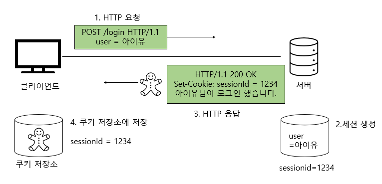
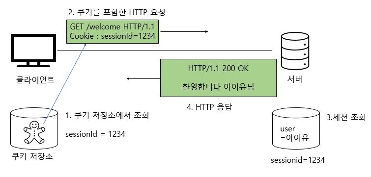
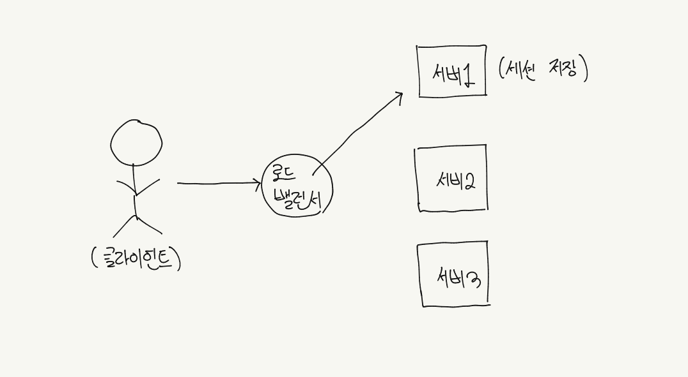
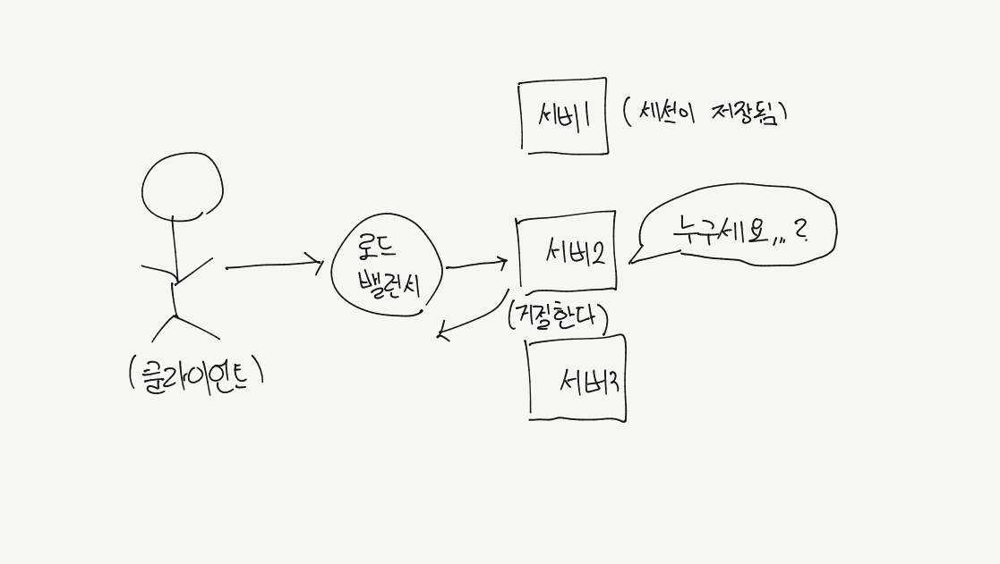
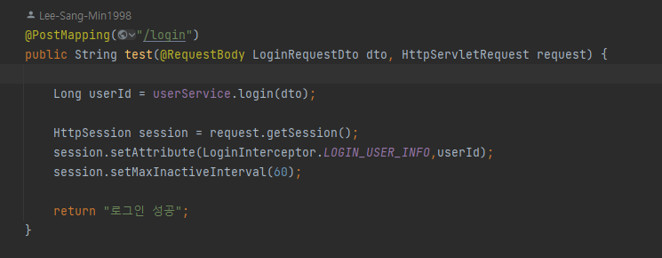
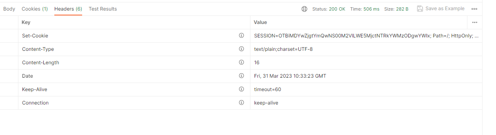
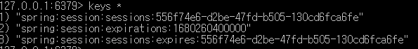
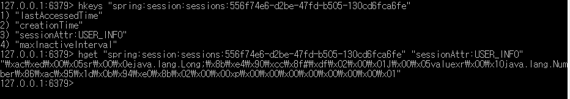

## 배경

GDSC 스크럼을 통해 Redis(Remote Dictionary Server)를 알게 되었다. 

Redis에 대해 조금 더 알고 싶던 와중에 Redis가 세션 불일치를 해결하기 위해 사용될 수도 있다는 글을 읽었다. 

세션 불일치와 이에 대한 해결책인 Redis 내용에 대해 알아보자

## 세션이란?

세션은 무엇인가? 세션에 대한 개념은 몰라도 한 번쯤 들어본 적은 있을 것이다. 세션 불일치를 설명하기 전에 세션에 대해 알아보자.

HTTP는 상태가 유지되지 않는(Stateless), 비 연결 지향(Connectionless)적인 프로토콜이다. 
따라서 서버는 클라이언트가 누구인지 매번 확인을 해야 한다. 
그런데 우리는 브라우저에서 매번 요청을 보낼 때마다 로그인을 한 적이 없을 것이다. 
이는 쿠키, 세션 등 상태를 유지시켜주는 기술이 사용되기 때문이다.

세션이란 일정 기간 동안 같은 사용자(브라우저)의 일련의 요구를 하나의 상태로 보고 그 상태를 일정하게 유지시켜주는 기술이다. 
여기서 일정 기간이란 방문자가 웹 브라우저를 통해 웹 서버에 접속한 시점부터 웹 브라우저를 종료하여 연결을 끝내는 시점을 의미한다.
쉽게 말하면 방문자가 웹 서버에 접속해 있는 상태를 하나의 단위로 보고 이것을 세션이라고 한다.
세션은 사용자의 정보를 서버의 자원을 사용하여 서버에 저장한다. 반면 쿠키는 클라이언트에 저장된다.

## 세션 동작 과정 

세션의 동작 과정에 대해 살펴보자. 동작 과정은 아래와 같다.

1. 서버는 사용자 요청 헤더의 쿠키에 세션 ID 값이 왔는지 확인한다.

2. 서버는 해당 ID 값의 세션이 있는지 확인한다. 쿠키에 세션 ID 값이 오지 않았거나 서버에 해당 ID 값에 해당하는
세션이 없을 경우 서버는 새로운 세션을 만들고 임의의 세션 ID 값을 생성한다. 이때 만들어진 세션은 기본적으로 서버의 메모리에 저장된다.

3. 세션 ID 값을 쿠키에 담아 클라이언트에게 전달한다.

4. 클라이언트는 해당 ID 값을 이후의 요청 헤더의 쿠키 안에 넣어 서버에 요청을 보낸다.

5. 서버는 해당 ID에 매핑되는 세션을 확인하여 상태를 유지하고 사용자를 구분할 수 있게 된다.

#### 우리는 세션을 직접 구현할 필요는 없다. 서블릿에서 지원해 주는 HttpSession을 사용해서 상태 유지와 사용자 인증을 하면 된다. 자동으로 쿠키를 생성해 주고 쿠키 이름은 JSESSIONID이다. JESSIONID는 이름에서 유추할 수 있듯이 세션 ID 값이다.
Cookie: JSESSIONID=5B78E23B513F50164D6FDD8C97B0AD05

## 세션 불일치

세션은 기본적으로 서버의 메모리에 저장된다. 따라서 단일 서버 환경에서는 세션의 불일치 문제를 고려할 필요가 없다.

서비스의 규모가 커짐에 따라 현재의 단일 서버 환경에서 운영이 불가능해질 경우 서버를 업그레이드 해야 하는데 2가지 방식이 존재한다.

1. Scale-Up: 서버 자체의 성능을 향상시키는 방법이다. 이 방법을 이용하면 여전히 단일 서버 환경이다. 단일 서버 환경이기 때문에 세션 불일치가 발생하지 않아 좋을 것 같지만 
모든 트래픽이 하나의 서버에 집중되고 서버 장애가 발생할 시에 서버가 복구될 때까지 모든 서비스가 중단된다.

2. Scale-Out: 서버의 대수를 늘려 트래픽을 분산 시키는 방법이다. 이때 트래픽 분산을 위해 로드밸런싱이 사용된다.

위 그림처럼 유저의 로그인 요청이 서버 1에 전달되고 서버 1에 세션이 저장되었다고 가정해 보자.

유저의 다음 요청이 로드밸런서에 의해 서버 2로 전달되었을 경우 서버 2에는 해당 유저의 세션이 저장되어 있지 않다.
따라서 서버 2는 요청을 거절하고 다시 로그인하라는 응답을 클라이언트에게 전송하게 된다. 이것이 세션의 불일치이다.

## 해결 방법은?

3가지의 방법이 존재한다.

1. Sticky Session

2. Session Clustering

3. Session Storage 

이 글에서는 3번 Session Storage 방식에 대해 설명하겠다. 

해당 방식은 각각의 서버 메모리에 세션을 보관하고 있는 것이 아닌 별도의 세션 저장소를 외부에 만들어 각 서버들이 이것을 공유하는 
방식이다. 그렇다면 세션 저장소로 어떤 것을 사용해야 할까?

우선 저장소로 사용될 수 있는 데이터베이스는 2가지가 존재한다.

1. 디스크 기반의 데이터베이스

2. In-Memory 기반의 데이터베이스

디스크 기반의 데이터베이스는 전원 공급이 없어도 정보가 유지되는 장점이 존재하지만 I/O 속도가 느리다는 단점이 존재한다. 
반면에 메모리 기반의 데이터베이스는 I/O 속도가 빠르다는 장점이 존재하지만 전원 공급이 없어지면 데이터를 잃어버리는 
단점이 존재한다. 속도 VS 정보의 영구성 중 어떤 것이 중요한지의 문제이다. 

세션은 디스크 기반의 데이터베이스에 저장되는 데이터에 비해 영구적으로 보관해야 할 필요성이 적은 데이터이다. 개인 정보는 없어지면 
서비스에 치명적이지만 세션 정보는 다시 로그인하면 그만이기 때문이다. 따라서 세션 저장소로 In-Memory 기반의 데이터베이스가 더 적절하고 대표적인
In-Memory 기반의 데이터베이스로는 Redis(Remote Dictionary Server)가 존재한다.

## Redis 적용한 세션 구현 및 테스트

다음은 서블릿에서 제공하는 HttpSession 과 Redis를 이용하여 간단한 로그인을 구현한 코드와 저장된 결과 값이다.

1. LOGIN_USER_INFO는 static 변수이고 값은 "USER_INFO"이다. 로그인 요청이 서버에 전달되었을 때 세션 객체를 생성하고 HttpSession에 key,value(여기서 value 값은 유저 id 이다.)
형태로 데이터를 저장하는 로직이다.

2. 생성된 임의의 세션 ID 값이 응답 헤더 속의 쿠키에 잘 전달된 것을 확인할 수 있다.

3. redis-cli를 통해 server에 접속하여 Redis에 저장된 key의 값들을 출력하면 아래와 같다.
key에 spring:session:sessions:를 포함하는 key의 value 타입이 hash임으로 해당 key의 value가 생성된 세션 데이터인 것을 알 수 있다.  

4. 세션에 저장된 데이터를 출력하면 아래와 같다. 이때 아까 우리가 HttpSession에 유저의 ID 값을 저장할 때 key로 사용한
   "USER_INFO"를 확인할 수 있다.

## 마무리

Redis를 공부하다 세션 불일치 개념을 알게 되었고 세션에 대해서도 깊게 공부할 수 있었던 계기였습니다. 평소에 세션을
활용해 로그인을 구현할 수 있다고 막연하게만 알고 있었지만 글을 작성하면서 세션에 대해 깊은 내용을 알게 되었고 아마 오랫동안 기억할
수 있을 것 같습니다. 소스 코드는 [소스 코드 주소](https://github.com/Lee-Sang-Min1998/Session-Redis-Login.git)에
들어가시면 자세히 확인 가능합니다. 
