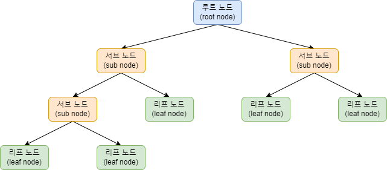
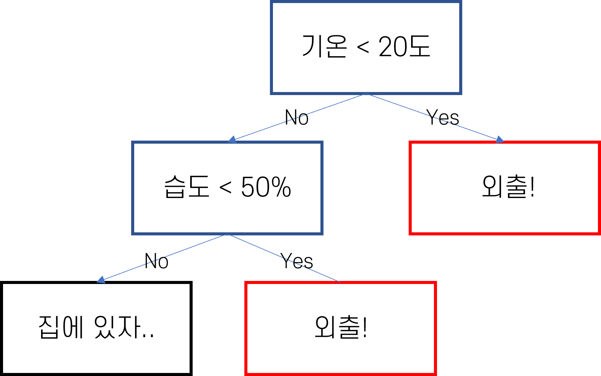
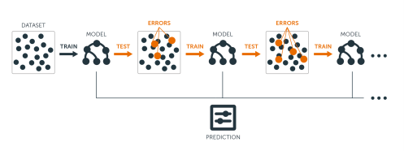

## 딥러닝이 최고 아니야?
최근 딥러닝이 큰 주목을 받으면서 인공지능 및 데이터 과학 분야에서 관심이 급속도로 높아지고 있습니다. 딥러닝은 이미지 분석, NLP 등 다양한 분야에서 뛰어난 성능을 발휘하고 있지만, 상황에 따라서는 전통적인 머신러닝 알고리즘 중 하나인 Gradient Boosting이 더 우수한 성능을 보일 수도 있습니다. 

Gradient Boosting은 약한 학습기를 결합해 강력한 예측 모델을 구축하는 알고리즘이며, 다양한 문제에 효과적으로 적용될 수 있습니다. 실제로 세계 최대 데이터 경진 대회 사이트 Kaggle에서는 우승 알고리즘으로 수차례 Gradient Boosting 알고리즘이 채택되기도 하였습니다. 그렇다면 Graident Boosting은 어떤 원리로 예측을 하며 왜 사랑받을까요??

## 의사결정트리
Gradient Boosting을 알기 전에 우선 트리 기반 모델에 대해 알아볼 필요가 있습니다. 트리 기반 모델은 머신러닝에서 널리 사용되는 알고리즘 중 하나로, 데이터의 구조와 패턴을 학습하는 데 사용됩니다. 트리 기반 모델의 기본 단위는 의사결정트리(decision tree)로, 데이터를 분석하고 예측을 수행하는데 도움이 됩니다.


의사결정트리의 구조는 위의 사진과 같으며 크게 뿌리 노드(Root Node), 분기 노드, 리프 노드로 이루어져 있습니다. 



이렇게만 봐서는 이해가 안가니 예를 들어서 설명해봅시다. 만약, 의사결정트리를 활용해 날씨에 따른 야외 활동 여부를 예측한다고 가정해봅시다

1. 우선 뿌리 노드에서 가장 중요한 특성(기온)를 선택합니다. 그 후 특성(기온)을 기준으로 첫 분기를 생성합니다.

2. 그룹이 생성된 후 다시 분기 노드의 특성을 기준으로 데이터를 세분화합니다. 여기에서는 습도가 기준이 됩니다.

3. 이 과정을 반복하며 더 이상 나눌 수 없을 때 리프노드를 생성합니다.

4. 리프 노드에서는 각 그룹의 대표 결과를 결정합니다. 예를 들어, 해당 그룹의 대다수가 야외 활동을 하는 경우 그 노드에서는 ‘야외 활동을 한다’라고 예측합니다.

이렇게 생성된 의사결정트리는 노드들을 따라가며 새로운 데이터에 대한 예측을 수행할 수 있습니다.

## Gradient Boosting
Gradient Boosting은 Gradient(잔차)를 사용하여 이전 모형의 약점을 보완하는 알고리즘입니다. 한마디로 이 알고리즘은 약한 의사결정트리를 결합하여 강한 예측 모델을 만든다고 할 수 있습니다. 이를 단계별로 나타내면 다음과 같습니다.



1. 우선, 간단한 의사결정트리를 만들어 데이터를 예측합니다. 이 때 트리는 데이터를 완벽하게 예측하지 못합니다.

2. 첫 번째 트리의 예측 결과와 실제 값 사이의 차이(잔차)를 계산합니다. 이 잔차는 첫 번째 트리가 학습하지 못한 패턴을 나타냅니다.

3. 두 번째 의사결정트리는 이 잔차를 학습하여 첫 번째 트리의 오류를 보완합니다. 이렇게 새로운 트리가 만들어지면, 이 트리의 예측 결과를 첫 번째 트리의 결과와 합칩니다.

4. 이 과정을 반복하면서 각 트리가 이전 트리의 오류를 줄이도록 학습하며 최종적으로, 모든 트리의 결과를 합하여 최종 예측 결과를 얻습니다.

이처럼 Gradient Boosting 모델은 데이터의 패턴을 더 정확하게 학습하여 강력한 예측 모델을 만들어 냅니다. 

## 왜 Gradient Boosting?
그렇다면 각종 데이터 대회에서 Gradient Boosting 알고리즘이 사랑받는 이유는 무엇일까요?

첫 번째는 학습 시간입니다. 딥러닝 모델은 복잡한 구조와 많은 파라미터로 학습에 상당한 시간이 소요되지만 Gradient Boosting은 상대적으로 짧은 시간 안에 결과를 얻을 수 있습니다.

두 번째는 해석의 가능성입니다. 딥러닝 모델은 흔히 Black Box라고 불리며 결과를 해석하기 어렵습니다. 하지만 트리기반모델은 결과에 대해서 직관적이기 때문에 이해하기 쉽습니다.

마지막으로는 데이터의 크기입니다. 딥러닝은 대규모 데이터에서 복잡한 패턴을 학습하는데 강점이 있지만 데이터가 충분하지 않은 경우 현저히 떨어지는 성능을 보이는 경우가 많습니다. 하지만 Gradient Boosting 모델은 적은 데이터로도 훌륭한 성능을 보입니다.

## Code
마지막으로는 Gradient Boosting 알고리즘의 대표적인 라이브러리 중 하나인 Xgboost의 적용 코드 예시를 작성하면서 마무리하겠습니다. Gradient Boosting을 실제 코드에 적용하려면 수많은 파라미터를 조절하는 과정이 필요합니다. 오늘은 Gradient Boosting에 대해 이론적으로 설명하는 시간이라 기회가 된다면 파라미터 조절과 코드 작성에 대해서도 포스팅하겠습니다.


```python
-----------------------------------------------------------
# 라이브러리 로드
from xgboost import XGBClassifier
from sklearn.model_selection import train_test_split
from sklearn.metrics import accuracy_score

# 테스트, 트레인 데이터 세트 분리
x_train, x_test, y_train, y_test = train_test_split(train_x, train_y,
test_size=0.2, random_state=42)

# XGBClassifier를 불러오고 데이터에 대해 학습
xgb= XGBClassifier(n_estimators= 500, learning_rate=0.1, max_depth=4)
xgb.fit(x_train, y_train)

# 예측 데이터와 실제 데이터 비교하여 정확도 출력
pred = xgb.predict(x_test)
accuracy_score(pred, y_test)
-----------------------------------------------------------
```

## 출처

- [AI Wiki Gradient Boosting](https://machine-learning.paperspace.com/wiki/gradient-boosting)

- [결정트리](https://www.robotstory.co.kr/raspberry/?vid=59)
