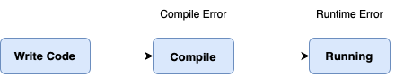
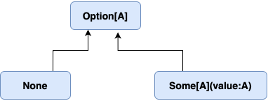
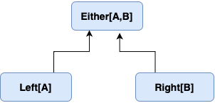

## 에러 코드보다 예외를 사용하라?

에러를 처리하는 방식에 관한 궁금증을 가지게 된 문장입니다. **『 클린코드(로버트 C.마틴)』** 의 3장에서 저자는 명령 함수에서 에러 코드를 반환하는 방식 대신 예외를 사용하여 에러를 처리하도록 권장하고 있습니다. 지금까지 의문을 가지지 않고 try-catch 구문과 Exception을 사용하여 에러를 처리하였지만 그것만으로 충분한지 알아보고자 합니다.

## 에러의 종류



에러는 발생 시점에 따라서 크게 **컴파일 에러, 런타임 에러**로 분류할 수 있습니다.  

컴파일 에러는 컴파일 과정에서 발생하며 대체로 문법적인 오류가 그 원인입니다. 예를 들어 Java 환경에서 문장의 말미에 세미콜론을 누락하거나, class path에 누락된 클래스를 사용하는 등의 실수를 할 경우 마주하게 됩니다.

런타임 에러는 프로그램의 실행 중에 발생하는 에러이며 컴파일 과정이 완료된 이후 발견되기 때문에 직접적인 에러 원인을 알기 힘든 경우가 많아서 직접 그 원인을 추적해야 합니다. 설계과정에서의 실수가 주 원인이 됩니다.

## 예외를 사용해야 하는 이유

**『 클린코드(로버트 C.마틴)』** 의 3장을 확인해보면

```java
if(deletePage(page) = E_OK) {
	if(registry.deleteReference(page.name) = E_OK) {
		if (configKeys.deleteKey(page.name.makekey()) = E_OK) {
			logger.log("page deleted");
		}else {
			logger.log("configKey not deleted");
		}
	}else {
		logger, log("deleteReference from registry failed");
	}
}else { 
	logger.log("delete failed");
	returm E_ERROR;
}
```

이와 같은 코드 블럭을 예시로 에러의 발생상황에서 리턴값에 에러를 담아서 반환하고, 호출자는 에러 코드를 곧바로 처리해야 해야 하는 나쁜 예시를 보여줍니다. 이렇게 에러 코드를 반환하는 방식을 사용하면 아래와 같은 문제점들을 동반하게 됩니다.

1. if 블럭이 중첩된다.
2. 구조가 반복된다.
3. 기능코드에 오류를 판별하는 불필요한 로직을 포함하게 된다. 

따라서 에러코드를 리턴하는 행위대신 아래의 코드블럭과 같이 Exception을 사용하고 거기에 추가로 Try / Catch 구문을 사용하면서 예외사항을 처리하는 별도의 함수를 추출하면, 코드의 가독성과 유지보수성을  높일 수 있습니다.

```java
public void delete(Page page) {
	try{
		deletePageAndAllReferences (page);
	}
	catch (Exception e) { 
		LogError(e);
	}
}

private void deletePageAndAllReferences (Page page) throws Exception {
	deletePage(page); 
	registry.deleteReference(page.name);
	configKeys.deleteKey(page.name.makeKey());
}

private void logError(Exception e) {
	logger.log(e.getMessage());
}
```

이렇게 Exception을 사용하여 에러를 처리하는 것의 장점은 아래와 같습니다.

1. 하나의 함수가 ‘한 가지’ 작업에만 몰두할 수 있다.
2. 코드 구조를 단순화 할 수 있다.
3. 에러를 처리하는 코드와 기능을 담당하는 코드를 명시적으로 분리할 수 있다.

## 항상 Exception이 정답인가?

위에서 살펴보았듯이 Exception이 에러코드를 반환하는 것보다 장점이 많아 보이는데요 그럼에도 불구하고 다른 환경과 관점에서는 Exception이 반드시 정답이 아닐 수 있습니다.

**함수형 프로그래밍** 방식에서 강조하고 있는 두 가지는 “부수 효과(Side Effect)”와 “참조 투명성” 입니다. 그리고 이러한 함수형 프로그래밍의 관점에서 Exception은 함수의 외부세계이며 곧 부수 효과이기 때문에 참조 투명성을 해치게 되어 함수형 프로그래밍의 장점을 가져오지 못하도록 방해하는 요소로 여겨질 수 있습니다.

함수형 프로그래밍의 요소를 가지고 있는 언어인 스칼라(Scala)는 프로그램이 처리 불가능한 경우이거나 예외가 발생하였을 때에 사용하기 좋은 몇 가지의 타입을 제공합니다.



- Option[A] : 값이 있는 상태, 또는 없는 상태를 표현
값이 있으면 Some, 값이 없는 경우라면 None을 반환하며 None을 null 대신 사용하여 NullPointerException을 방지하는데에 사용할 수 있습니다.



- Either[A,B] : 예외와 결과 값을 한번에 받을 수 있다.
인자에 제대로된 값이 들어오면 Either의 오른쪽에 담고 제대로된 값이 안들어온다면 Either의 왼쪽에 값을 담는다.

스칼라를 활용한 함수형 프로그래밍 방식에서는 이러한 타입들을 활용하여서 예외를 전달하는 대신에, 해당 상황을 의미하는 값을 반환하는 방법을 선택하여 참조의 투명성을 지키고 에러 상황을 명시적으로 표현해줍니다. 그리고 이것은 개발자에게 예외가 던져준 스택 트레이스를 확인하면서 문제 상황을 이해하는데에 많은 시간을 쓰지 않도록 도움을 줄 수 있습니다.

비슷한 예시로 Go 언어에서 지원하는 error 타입이 있습니다.
error는 인터페이스이며 에러 정보를 담고 있는 string을 반환합니다.

```go
type error interface {
	Error() string
}
```

그리고 error 타입의 특성을 활용하여 error를 가지는 값이 nil 인지 아닌지를 체크하는 것으로 에러의 유무를 체크하고 처리 동작을 연결할 수 있습니다. 

```go
func (err PasswordError) Error() string {
	return "암호 길이 문제"
}
func RegisterAccount(n,p string) errer{
	if ~~{
		return PasswordError
	}
}
func main() {
	err := RegisterAccount("myID","myPw")
	if err != nil{
			~~~~~~
	} else {
		~~~~~
	}
}
```

## 마치며

일반적인 상황에서, 특히 Java 언어를 사용한 개발 환경에서라면 Java가 제공하는 Exception을 잘 활용하는 것은 에러를 핸들링하기에 적합한 방법으로 보입니다. 하지만 Exception이 항상 에러를 처리하는 정답은 아니며 상황과 환경에 따라서 적절한 에러처리 기술을 잘 활용할 수 있어야 할 것 입니다.
