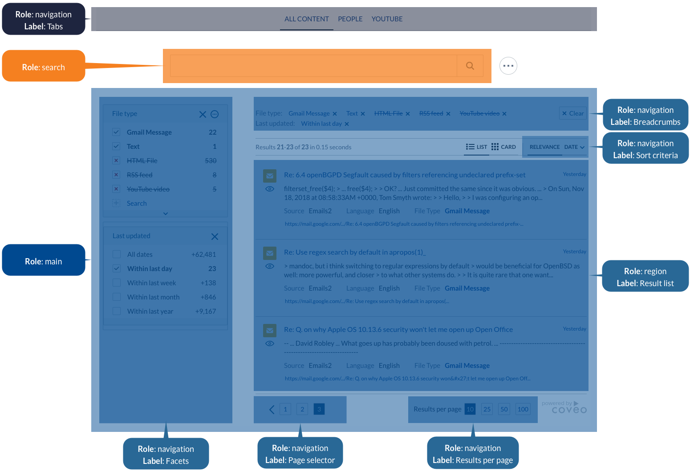

웹 개발을 하다보면, HTML 태그의 속성(attribute) 중 `aria-`로 시작하는 속성들을 많이 볼 수 있습니다. 이들은 HTML의 마크업에 대해서는 거의 영향을 미치지 않습니다. 한편, `role`과 같이 `aria-`로 시작하는 것은 아니지만, 조금 수상해보이는(?) 속성들이 있습니다.

이들의 공통점은 무엇일까요? 바로, **웹 접근성**을 위한 속성들이라는 것입니다.

이번 글에서는 바로 이 웹 접근성에 대해 간단히 알아보고, 이를 구현하는 방법 중에서 대표적인 WAI-ARIA, HTML5의 시맨틱 태그와 속성 몇 가지에 대해 알아보겠습니다. 또한, 이러한 정보를 표현하는 스크린 리더 관련한 내용도 가볍게 다루도록 하겠습니다.

## 웹 접근성

웹 접근성(Web Accessibility)은 무엇일까요? 아니, 그 전에 '접근성'이라는 말이 개발 분야에서 뜻하는 바는 무엇일까요? [위키백과에서는](https://en.wikipedia.org/wiki/Accessibility) 접근성(Accessibility)에 대해 다음과 같이 정의하고 있습니다.

> **접근성**이란 장애인이 사용할 수 있도록 제품, 장치, 서비스, 차량 또는 환경을 설계하는 것을 말합니다.

여기서는 '장애인'이라는, 다소 좁은 범위로 한정지어 설명하고 있지만, 결론적으로 '접근성'은 *모두가 사용*할 수 있는가에 대한 설계입니다. 이러한 설계를 웹에서 구현하고자 하는 것이 바로 **웹 접근성**입니다. 다음은 웹 접근성에 대한 [mdn의 정의](https://developer.mozilla.org/en-US/docs/Web/Accessibility)입니다.

> 웹 개발에서 **접근성**(흔히 A11y)이란 어떤 방식으로든 능력이 제한되어 있는 경우에도 가능한 한 많은 사람이 웹 사이트를 사용할 수 있도록 하는 것을 의미합니다.

[mdn에서는](https://developer.mozilla.org/en-US/docs/Learn/Accessibility/What_is_accessibility) 웹 접근성에 대해 아래와 같이 큰 범주를 나누어 설명하고 있습니다.

- 시각 장애(Visual impairments): 실명, 저시력, 색맹 등
- 청각 장애(Hearing impairments)
- 운동 장애(Mobility impairments)
- 인지 장애(Cognitive impairments): 저지능, 우울장애, 학습장애, ADHD 등

### 스크린 리더(Screen Reader)

시각/인지 장애를 가진 사람들을 위한 보조 프로그램 중 대표적으로 쓰이는 것이 바로 **스크린 리더**입니다. 스크린 리더는 이름에서 알 수 있듯, 이들이 화면의 정보를 올바르게 받아들일 수 있도록 시각 정보를 음성 정보로 변환해주는 소프트웨어입니다. 대표적인 스크린 리더 소프트웨어는 다음과 같습니다.

- Mobile: TalkBack(Android), VoiceOver(iOS)
- Desktop/Laptop: NVDA(Windows, 무료), JAWS(Windows, 유료)

웹 환경에서 스크린 리더는 보통 HTML의 내용과 메타데이터를 기반으로 정보를 해석합니다. 예컨대, 이미지는 일반적으로 스크린 리더가 해석할 수 없는데 HTML의 `` 태그에 `alt` 속성이 있다면 이 속성에 쓰인 글로 대체해 읽어줍니다. 따라서, 웹 개발 시 이러한 부분이 제대로 기술되어 있어야 스크린 리더 사용자에게 더 나은 경험을 제공할 수 있습니다.

> 아래 영상은 스크린 리더를 웹에서 활용하는 모습을 보여줍니다.
> 
> [](https://www.youtube.com/watch?v=dEbl5jvLKGQ)
> 
> 이미지를 클릭하면 동영상 페이지로 이동합니다.

## WAI-ARIA

웹 접근성을 구현하기 위한 구체적인 시도는 대표적으로 WAI-ARIA로 나타납니다. WAI는 Web Accessibility Initiative의 준말로, W3C에서 웹 접근성을 담당하는 기관입니다. ARIA는 Accessible Rich Internet Applications의 준말로, [RIA](https://ko.wikipedia.org/wiki/%EB%A6%AC%EC%B9%98_%EC%9D%B8%ED%84%B0%EB%84%B7_%EC%95%A0%ED%94%8C%EB%A6%AC%EC%BC%80%EC%9D%B4%EC%85%98) 환경에서 웹 접근성을 구현하는 표준 기술 규격을 의미합니다. WAI-ARIA는 시맨틱과 기타 메타데이터를 HTML 내용에 추가하는 방식을 기술합니다.

WAI-ARIA 또는 이와 관련된 꼭 알아야 할 개념들이 몇 가지 있습니다:

- WAI-ARIA `role` 속성
- WAI-ARIA에서의 상태(state)와 속성(property)
- HTML 시맨틱태그(HTML Semantic Elements)
- 랜드마크 역할(Landmark Roles)

### WAI-ARIA `role` 속성

`role` 속성은 말 그대로 해당 태그의 역할을 기술하는 속성인데, WAI-ARIA에서 이 속성을 사용합니다. WAI-ARIA에서 제시하는 `role`은 다음과 같은 정보를 담습니다:

- 역할에 대한 설명
- 관련된 역할에 대한 계층적인 정보: 예컨대, `directory`는 `list`의 한 유형이다.
- 역할의 문맥(context) 기술: 에컨대, `listitem`은 `list` 내부에 존재한다.
- 각 역할에서 지원되는 상태(state)와 속성(property): 예컨대, `checkbox`는 체크 상태와 이를 표시하는 `aria-checked` 속성을 지원하도록 한다.

### WAI-ARIA에서의 상태 및 속성

WAI-ARIA에서는 보통 `aria-`로 시작하는 명시적인 속성들을 지원합니다.

먼저, 이 속성들은 태그의 상태를 나타내기 위해 사용됩니다. 예를 들어, 다음은 체크된 상태를 표현하고 있는 리스트 아이템을 나타냅니다:

```html
<li role="menuitem checkbox" aria-checked="true">Sort by Last Modified</li>
```

CSS 스타일링에서도 사용될 수 있습니다.

```css
.menu-item[aria-checked="true"] {
    background-color: blue;
}

/* 만약 aria 속성을 이용하지 않는다면 보통 다음과 같이 할 것입니다: */
.menu-item.menu-item--checked {
    background-color: blue;
}
```

또한, 이 속성들은 태그의 의미를 보조적으로 설명하기 위해 사용됩니다. 예를 들어, 다음은 아이콘만을 가진 버튼이 어떤 버튼인지 나타내줍니다.

```html
<button class="btn-search" aria-label="Search"></button>
```

물론, 이 경우엔 `style="display: hidden"`과 같은 속성으로 보이지는 않지만 HTML에는 존재하는 태그를 추가할 수 있습니다. 하지만 대부분의 경우 `aria-label`를 활용하는 것이 더 직관적이면서 효율적인 방법입니다.

### HTML 시맨틱태그(HTML Semantic Elements)

시맨틱태그는 태그 자체로서 그 의미를 담고 있는 태그입니다. HTML5에서 추가되었습니다.

기존의 태그인 `<div>`나 `<span>`과 같은 (논-시맨틱) 태그들은 형식적인 의미만을 담고 있지만, `<section>`, `<article>`과 같은 시맨틱태그들은 그 태그 자체가 담는 내용의 의미까지 담고 있습니다.

[여기](https://www.w3schools.com/html/html5_semantic_elements.asp)서 더 자세히 알아볼 수 있습니다!

### 랜드마크 역할(Landmark Roles)

스크린 리더는 웹 페이지 내에서 큰 덩어리인 섹션들을 구분하는데, 이때 기준이 되는 것이 바로 랜드마크로 지정된 몇 가지 시맨틱태그/`role`입니다. 스크린 리더는 사용자가 이 랜드마크들을 기준으로 바로 이동할 수 있도록 합니다.

미리 지정된 시맨틱태그(`section`, `nav`, `main` 등)를 사용하거나 `landmark`의 하위 클래스를 `role`로 지정(`role="banner"` 등)하는 방식으로 랜드마크를 지정할 수 있습니다.

| 시맨틱 태그 | `role` | 설명 |
| --- | --- | --- |
| `<header>` | `"banner"` | 페이지별 내용이 아닌, 사이트 전체적으로 사용되는 영역 |
| `<aside>` | `"complementary"` | 문서의 보조 섹션으로, 보조하는 내용과 같은 DOM 수준에서 사용될 수도, 분리되어 사용될 수도 있음 |
| `<nav>` | `"navigation"` | 문서 또는 관련 문서를 탐색하기 위한 탐색 요소 모음 |
| `<main>` | `"main"` | 문서의 메인이 되는 내용 |
| `<section>` | `"region"` | 다른 랜드마크 역할로 정의될 수 없는 랜드마크 역할(제한적으로 사용할 것을 권장) |
| `<footer>` | `"contentinfo"` | 상위 문서에 대한 정보가 포함된 인식 가능한 큰 영역 |
| | `"search"` | 전체적인 범위의 검색 기능을 제공하는 영역 |
| | `"form"` | 전체적인 범위의 양식을 제공하는 영역(단, 검색 기능은 `"search"`로 지정해야 함) |

위의 시맨틱 태그들은 이미 같은 의미의 `role`을 가지고 있다고 생각할 수 있습니다. 예를 들어, 다음은 보통 같은 의미로 해석됩니다:

```html
<header>...</header>
<!-- 위의 형태는 다음 두 가지 형태와 같은 의미입니다: -->
<header role="banner">...</header>
<div role="banner">...</div>
```

위의 경우에선, 당연히 가장 간단한 `<header>`를 사용하는 것이 좋습니다.


<center><p><small>출처: https://docs.coveo.com/en/2666/javascript-search-framework/add-aria-landmarks</small></p></center>

---

여기서는 주요한 개념들만 짚어보았지만, WAI-ARIA에는 이 외에도 다양한 것들을 명세하고 있습니다. 더 자세한 내용을 알아보고 싶다면 [여기](https://www.w3.org/TR/wai-aria-1.1)를 참고하시면 됩니다.

## 덧붙이기

웹 접근성을 구현하는 것은 꼭 사람만을 위한 것도 아닙니다. 테스팅 도구에서도 활용될 수 있습니다. DOM을 탐색하는 테스팅 도구는 어떻게 보면 앞을 볼 수 없는 사람으로도 생각할 수 있습니다. 오로지 작성된 코드만을 분석해서 어떤 요소가 존재하는지 또는 반응하는지를 테스트하기 때문이죠.

node 환경에서 많이 사용되는 `@testing-library/dom`과 같은 테스팅 라이브러리는 [공식 문서](https://testing-library.com/docs/queries/about#priority)에서 어떤 요소를 질의(query)할 때 가장 높은 우선순위로 다음을 기반으로 질의하라고 제안하고 있습니다:

> 모든 사람이 접근할 수 있는 질의 - 즉, 일반적인 사용자(시각, 마우스 사용자)와 특수 사용자(보조 기술 사용자) 모두

# 참고자료

- https://www.w3schools.com/accessibility
- https://developer.mozilla.org/en-US/docs/Web/Accessibility/ARIA/Roles/landmark_role
- https://www.w3.org/TR/wai-aria-1.1