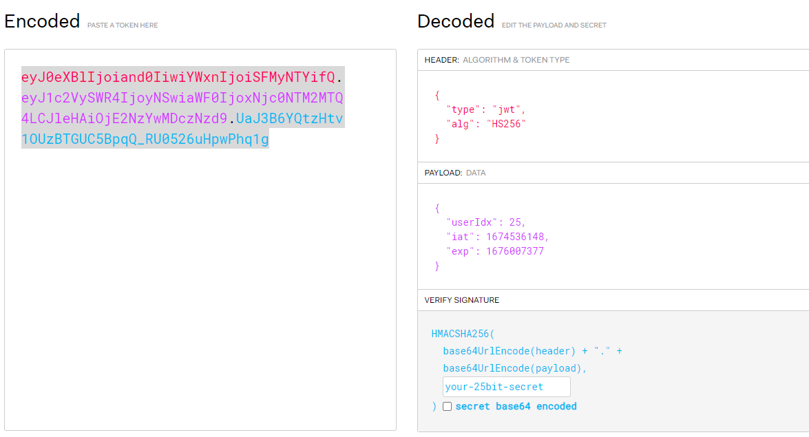
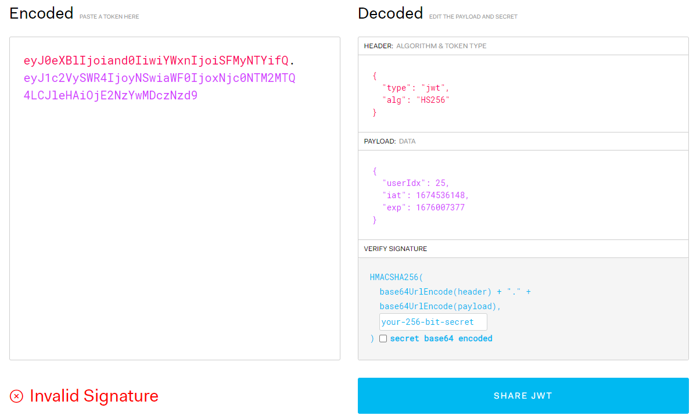

## JWT의 용도

jwt는 어디에 사용하는 것일까요?
정답을 이야기하자면 인증과 인가라고 할 수 있겠습니다.

우리가 이용하는 대부분의 서비스는 로그인(인증)을 필요로 합니다.
그렇다면 필연적으로 유저에 대한 식별(인가)이 필요합니다.

jwt는 이를 달성하기 위한 하나의 도구입니다.
이 용도로 사용되는 것에는 JWT 외에도 쿠키와 세션이 있지만 이 글에서는 우리의 관심사인 JWT 토큰에 대해서 다뤄보도록 하겠습니다.

## JWT의 구조

jwt는 위와 같이 헤더, 페이로드, 시그니쳐로 구성되어 있습니다.
빨간 부분이 헤더, 보라색 부분이 페이로드, 파란색 부분이 시그니쳐입니다.

헤더의 경우 어떤 암호화 알고리즘이 사용되었는지와 토큰의 타입에 대한 정보를 담고 있고
페이로드는 key-value의 형태로 사용자가 원하는 정보들을 담을 수 있습니다.
마지막으로 시그니쳐에 대해 살펴보기 전에 알아야 할 부분이 있습니다.
헤더와 페이로드에 담긴 정보는 누구든지 볼 수 있기에 민감한 정보를 담아서는 안된다는 것입니다.
(따라서 위의 jwt 예시에서도 페이로드에 jwt의 생성, 만료시간 외에 유저의 인덱스 정보밖에 없는걸 볼 수 있습니다.)

jwt.io 사이트에 접속하여 jwt 토큰을 입력만 해주면 시그니처의 유효성에 상관없이 정보 조회가 가능합니다.

바로 위의 사진에서 시그니처에 해당하는 부분을 모두 지웠음에도 헤더와 페이로드의 내용이 확인되는 것을 볼 수 있습니다.
따라서 jwt 토큰은 보안성이 높은 방법은 아니라고 할 수 있습니다.

바로 앞에서 시그니처의 유효성에 대해 언급하였는데 이 시그니처가 사용자를 검증해 주는 부분입니다.
시그니처는 헤더와 페이로드의 값과 헤더에서 정의한 알고리즘 그리고 자신이 정의한 비밀 키를 사용하여 암호화한 값입니다.
따라서 하나라도 정확하지 않다면 검증에 실패하게 됩니다.

예를 들어 악성 사용자가 페이로드의 값을 변경하여 서버에 요청을 한다면 변경된 시그니처로 요청을 하게 됩니다.(시그니처는 페이로드의 값을 이용하여 암호화된 값이기 때문입니다.)
이는 기존의 시그니처 값과의 비교를 통해 변조되었음이 확인됩니다.
그렇기에 시그니처를 이용해 사용자를 검증할 수 있습니다.

시그니처를 구성하는 값 중에서 핵심은 시크릿 키입니다. 나머지 정보는 외부의 사용자가 모두 확인 가능하지만 시크릿 키는 아니기 때문입니다.
그래서 서비스 제공자는 보관을 잘 할 필요가 있으며 학생 개발자들의 경우 실수로라도 시크릿 키를 깃허브 등의 오픈 플랫폼에 업로드해서는 안 됩니다.

## JWT의 인증과 인가

jwt는 인증과 인가를 위한 도구라 할 수 있습니다.
예를 들어 설명하자면 사용자가 로그인 시 서비스의 사용자가 맞다는 인증이 필요합니다.
따라서 서버에서는 로그인하는 사용자에게 jwt 토큰을 발급해서 사용자임을 인증하고 클라이언트는 이를 저장해 두고 만료되기 전까지 인가에 사용할 수 있습니다.

인가란 클라이언트가 서버로부터 어떤 기능 수행에 대한 허가를 받는 과정이라고 할 수 있습니다.
예를 들어 사용자가 저장된 개인정보를 변경하고자 한다면 발급된 jwt 토큰을 통해서 서버로부터 인가를 받아야 합니다.

jwt 토큰에는 이미 필요한 정보가 들어 있기에 서버에서 저장할 필요가 없기에 클라이언트의 저장소에 저장됩니다. 이로 인해 서버의 오버헤드가 줄어들고 확장에 유리해지는 장점이 있습니다.

## JWT의 약한 보안성 보완법

jwt는 토큰을 서버에서 관리하지 않기에 발급한 토큰을 무효화할 수 없다는 단점이 있습니다.
따라서 jwt 토큰을 탈취당하면 유효기간이 지나서 만료되기 전까지는 탈취당한 토큰에 대응할 방법이 없습니다.

이러한 문제를 토큰을 액세스 토큰(access token)과 리프레시 토큰(refresh token)으로 나누어 발급하는 것으로 보완할 수 있습니다.
액세스 토큰은 지금까지 설명되었던 jwt 토큰이라고 할 수 있습니다.
바로 직접적으로 인증과 인가를 담당하는 토큰으로 만료시간이 길지 않게 설정됩니다.
리프레시 토큰은 발급된 액세스 토큰을 재발급하기 위한 토큰으로 긴 만료시간을 가지고 액세스 토큰과는 달리 서버의 데이터베이스에 저장됩니다.

이들의 동작 방법을 설명하자면 먼저 로그인하면서 유저가 인증될 때 만료시간이 짧은 액세스 토큰과 만료시간이 긴 리프레시 토큰이 모두 발급됩니다.
그리고 액세스 토큰이 만료될 때마다 리프레시 토큰을 이용해 다시 액세스 토큰을 발급받습니다.
따라서 액세스 토큰이 탈취되어도 만료시간이 짧은 탓에 금방 무력화되어 피해를 방지하거나 줄일 수 있습니다.

## 맺음말

이번에 첫 프로젝트를 진행하면서 유저 파트를 맡고 jwt를 사용하게 되면서 많은 어려움이 있었습니다. 그래서 저와 같은 초심자들을 위해 쉽게 jwt에 대해 이해할 수 있는 글이 있으면 좋겠다고 생각하여 이 글을 쓰게 되었습니다.

그러나 jwt를 사용하는 방법 이외에도 크게 쿠키와 세션을 사용하는 방법이 더 있습니다. jwt는 리프레시 토큰을 이용하여 보완하여도 만능이 아니며 나머지 방법들 또한 단점이 존재합니다. 각자의 장단점이 있으므로 서비스의 특성에 맞게 개발자가 사용할 인증 방법을 선택하는 것이 중요할 것입니다.

개발을 처음 시작하시는 분들께서 혹시라도 제 글을 읽게 된다면 다른 방법들에 대해서도 조금이라도 찾아보시길 권합니다. 저는 지식과 글재주의 부족으로 이 정도에서 마무리 지을까 합니다. 부끄러운 글이지만 누군가에게라도 도움이 되었으면 하는 마음입니다.

모든 개발자분들과 GDSC UOS 팀원분들 항상 파이팅입니다!

## 참고자료

[jwt.io](jwt.io)

[[Web] 인가 (Authorization) : JWT (JSON Web Token), 리프레시 토큰](https://it-eldorado.tistory.com/165)