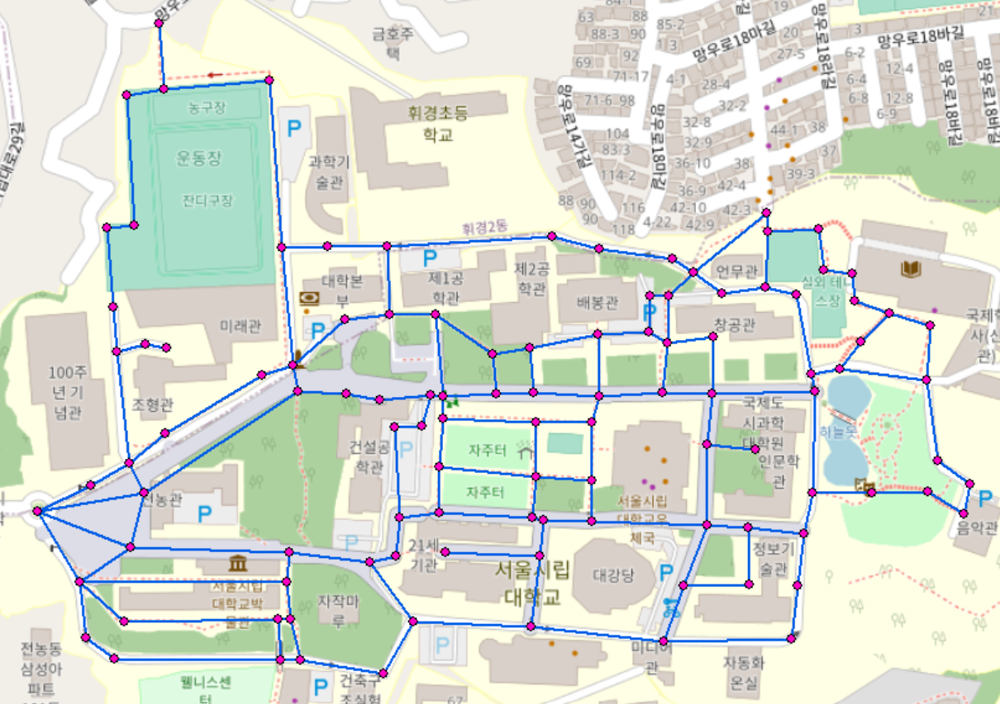
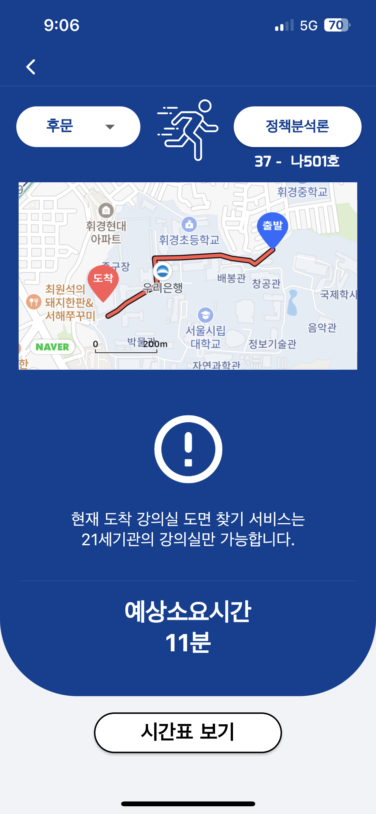
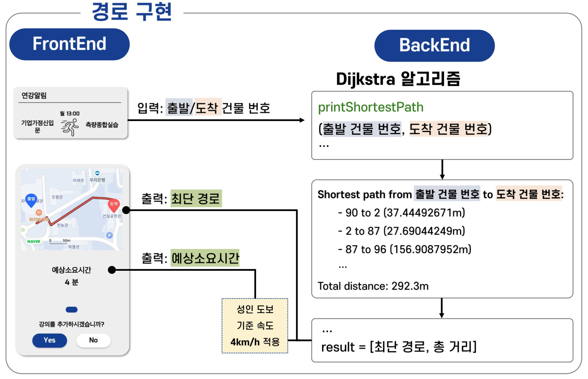

***

## INTRO

안녕하세요! 저는 공간정보공학과 18학번 한진형입니다. 이번에 저의 졸업작품 팀에서 만든 어플에 대해 글을 써보려고합니다. 그 중 문제가 생겼던 부분에서, 새롭게 구현한 부분에 대해 그 해결과정에 대해 글을 써보려합니다.

중간중간 코드들이 있는데, 실제로 어플 로직에 활용되는 코드이며, 자유로운 사용이 가능함을 미리 밝힙니다.

## UOScheduler 어플에 관하여

UOScheduler는 2023-1 공간정보종합설계2 16조 산출물로 대학 시간표 어플과 공간정보 요소를 융합한 어플입니다.

기존의 위치 정보를 고려하여 시간표를 만들지 못하였는데, 이 어플만으로 위치 정보를 고려하며 시간표를 만들 수 있는 어플입니다.

현재(23.05.26 기준) 1.0.1버젼이 배포되어 있으며, 플레이스토어, 앱스토어에서 찾아보실 수 있습니다.
> <strong>다운링크</strong>
[UOScheduler Google Play Store](https://play.google.com/store/apps/details?id=com.mycompany.uoscheduler&pli=1)
[UOScheduler App Store](https://apps.apple.com/kr/app/uoscheduler/id6448325141)

### 어플 제작 배경

어플 제작 배경은 다음과 같습니다.
기존 시간표 어플에서 위치 정보를 고려하지 못하며, 흩어져있는 학사 관련 정보들을 직접 찾아서 확인해야합니다.

이때 저희는  위치 정보를 고려한 시간표 계획과 캠퍼스 포트폴리오 관리를 동시에 할 수 있는 종합 학사관리 어플을 만들게 되었습니다.

현재는 시간표 기능만 지원하고있지만, 팀원과들의 협의를 통해 다양한 기능 추가 고려 중에 있습니다.

## 구현 중 문제 발생

문제 내용: Flutter 환경에서 지원하는 도보 경로 api가 없음

건물간 유저의 경로와 소요시간을 구하기 위해 꼭 필요한 내용인데 api로 구현할 수 없음을 확인했습니다. 그래서 다양한 방법을 고려하다가 직접 구현하기로 결정하였습니다

### Flutter 지원 지도 api 불가한 이유

> - <Strong>Google</Strong>
  유일하게 공식적으로 도보 api 지원
  한국 - 도보 길찾기 기능 비활성화
> - <Strong>Apple</Strong>
  공식적으로 지원
  도보 길찾기 구현 불가
> - <Strong>Naver, Kakao, Tmap</Strong>
  Flutter를 공식적으로 지원하지 않음
  dependency로 제한된 기능만 구현 가능

다양한 이유로 도보 경로 길찾기 api를 찾을 수 없었습니다.

### 해결 과정

다음과 같은 순서를 통해 구현하여 해결 하였습니다.
추가적으로 `Arcgis`라는 툴을 사용하였습니다.

### 0. ArcGIS에 관하여

ArcGIS는 지리 공간 정보 시스템(`GIS`) 소프트웨어로, 지리적 위치 데이터의 수집, 저장, 관리, 분석 및 시각화를 위한 도구를 제공하는 프로그램입니다.

공간정보공학과 학부생이라면 모두가 다룰 수 있는 Tool이며 IT help desk에 접속하여 교내에서 무료로 사용가능 합니다.

### 1. Arcgis를 통해 교내 노드, 링크 생성



Arcgis를 통해 교내의 노드들을 먼저 만듭니다.
노드는 갈림길, 건물 통로, 꺾이는 길을 모두 이어절 수 있는 중간 기지 역할을 합니다.
그 다음에는 모든 이웃한 노드들 사이를 링크를 연결해줍니다.
그렇게 하여 교내 길들에 대하여 노드 링크들을 완성합니다.

### 2. 교내의 노드 링크 데이터를 위경도 좌표와 함께 DB로 저장

이렇게 만든 노드, 링크 데이터들을 엑셀파일로 정리합니다.
위경도 좌표는 WGS84 좌표계로 구현하였습니다. - 네이버 api에 적용할 수 있는 좌표계

노드 DB의 속성(Attribute)은 다음과 같습니다.
  > 노드번호 (int not null)
  건물번호 (int)
  건물이름 (string)
  위도 (double not null)
  경도 (double not null)
  (건물번호, 이름 - 노드가 건물 입구에 해당하지 않는 경우 null값)

```dart
//노드 클래스 선언
class Node {
  final int nodeId; //노드 id
  final int? buildingId; //건물 id - 건물이 아닌 노드는 null
  final String? buildingName; //건물 이름 - 건물이 아닌 노드는 null
  final double latitude; //위도
  final double longitude; //경도
  Node(this.nodeId, this.buildingId, this.buildingName, 
  this.latitude, this.longitude);

  factory Node.fromCsv(List<dynamic> csv) {
    return Node(
      csv[0] as int,
      csv[1] == '' ? null : csv[1] as int,
      csv[2] == '' ? null : csv[2] as String,
      csv[3] as double,
      csv[4] as double,
    );
  }
}
```

링크 DB의 속성(Attribute)은 다음과 같습니다.
또한 양방향 링크가 필요하기 때문에 관련 함수도 같이 구현합니다.
  > 링크번호 (int not null)
  출발 노드 번호 (int not null)
  도착 노드 번호 (int not null)
  출발 위도 (double not null)
  출발 경도 (double not null)
  도착 위도 (double not null)
  도착 경도 (double not null)
  링크 길이 (double not null)

```dart
//링크 클래스 선언
class Link {
  final int linkId; //링크 id
  final int fromNode; //출발 노드 id
  final int toNode; //도착 노드 id
  final double fromLongitude; //출발 노드 경도
  final double fromLatitude; //출발 노드 위도
  final double toLongitude; //도착 노드 경도
  final double toLatitude; //도착 노드 위도
  final double distance; //링크 길이
  Link(this.linkId, this.fromNode, this.toNode, this.fromLongitude,
      this.fromLatitude, this.toLongitude, this.toLatitude, this.distance);

  factory Link.fromCsv(List<dynamic> csv) {
    return Link(
      csv[0] as int,
      csv[1] as int,
      csv[2] as int,
      csv[3] as double,
      csv[4] as double,
      csv[5] as double,
      csv[6] as double,
      csv[7] as double,
    );
  }

  List<Link> getBidirectionalLinks() {
    //양방향 링크를 만들어주는 함수
    return [
      Link(
        this.linkId,
        this.toNode,
        this.fromNode,
        this.toLongitude,
        this.toLatitude,
        this.fromLongitude,
        this.fromLatitude,
        this.distance,
      ),
      Link(
        this.linkId,
        this.fromNode,
        this.toNode,
        this.fromLongitude,
        this.fromLatitude,
        this.toLongitude,
        this.toLatitude,
        this.distance,
      ),
    ];
  }
}
```

이렇게 구성된 교내 노드, 링크가 다 합쳐서 250여개 정도 됩니다.
이제 이렇게 구성된 DB들을 가지고 길찾기 알고리즘을 구현하면 됩니다.

저는 DB의 크기가 크지 않아, 각 노드, 링크를 csv파일로 변환하여 어플 내에 내장하였습니다.

### 3. 다익스트라 알고리즘을 우선순위큐로 구현

이 글을 보시는 분이라면 우선순위큐가 무엇인지는 대부분 아실거라 생각합니다.
다음과 같이 구현하였고 코드에 대한 리뷰는 언제나 환영입니다!

```dart
//그래프 클래스 선언
class Graph {
  final List<Node> nodes;
  final List<Link> links;
  Graph(this.nodes, this.links);

  Map<int, String> dijkstra(int sourceBuildingId) {
    //초기 거리 값을 무제한으로 초기화
    final Map<int, String> distances = Map.fromIterable(
      nodes.where((node) => node.buildingId == sourceBuildingId),
      key: (node) => node.nodeId,
      value: (node) => double.infinity.toStringAsFixed(1),
    );
    distances[sourceBuildingId] = '0.0';

    // 우선순위 큐를 사용하여 가장 가까운 노드를 찾는다
    final PriorityQueue<MapEntry<int, double>> queue =
        HeapPriorityQueue((a, b) => a.value.compareTo(b.value));
    queue.add(MapEntry(sourceBuildingId, 0.0));

    while (queue.isNotEmpty) {
      //큐가 비어있지 않다면
      final int nodeId = queue.removeFirst().key; //큐에서 가장 가까운 노드를 꺼낸다
      final Node node = nodes.firstWhere(
          (node) => node.nodeId == nodeId, //노드를 찾는다
          orElse: () => throw Exception('Node $nodeId not found.')); //노드가 없다면 에러를 띄운다
      final double currentDistance =
          double.parse(distances[nodeId]!); //현재 노드까지의 거리를 저장한다

      // 이웃한 노드들에 대해 거리를 업데이트
      for (final Link link in links.where((link) => link.fromNode == nodeId)) {
        final int neighborId = link.toNode; //이웃 노드의 id를 저장한다
        final Node neighbor = nodes.firstWhere(
            (node) => node.nodeId == neighborId, //이웃 노드를 찾는다
            orElse: () => throw Exception('Node $neighborId not found.')); //이웃 노드가 없다면 에러를 띄운다
        final double newDistance =
            currentDistance + link.distance; //현재 노드까지의 거리와 링크 길이를 더한다
        final String newDistanceStr =
            newDistance.toStringAsFixed(1); //소수점 첫째자리까지만 저장한다
        if (distances[neighborId] == null ||
            double.parse(distances[neighborId]!) > newDistance) {
          //이웃 노드까지의 거리가 null이거나 현재 노드까지의 거리와 링크 길이를 더한 값이 이웃 노드까지의 거리보다 작다면
          distances[neighborId] = newDistanceStr; //이웃 노드까지의 거리를 업데이트한다
          queue.add(MapEntry(neighborId, newDistance)); //큐에 이웃 노드를 추가한다
        }
      }
      // 이거 주석 해제해서보면 어떻게 그래프가 만들어지는지 알 수 있음 - 디버그 콘솔 폭탄 주의
      // print('Distances: $distances');
    }
    return distances;
  }
}
```

자세히 보신분은 아시겠지만, 사실상 BFS알고리즘과 다를바가 없습니다.
추후 가중치 or 우선순위가 있는 구현을 위해서, 먼저 다음과 같이 구현하였습니다.

### 4. 출발, 도착 건물 번호를 입력하면 그 경로 사에 경로 노드 리스트 및 전체 거리 리턴하는 함수 구현

출발, 도착 건물 번호를 입력하면, 해당하는 노드번호를 찾아야 경로탐색을 시작할 수 있을 것 입니다.
그래서 먼저 다음과 같은 함수를 구현합니다.

```dart
//건물 id를 노드 id로 변환하는 함수
int buildingIdToNodeId(int buildingId, List<Node> nodes) {
  final Node node = nodes.firstWhere(
      (node) => node.buildingId == buildingId, //노드를 찾는다
      orElse: () => throw Exception(
          'Building number $buildingId not found.')); //해당하는 노드가 없다면 에러를 띄운다
  return node.nodeId;
}
```

그런 다음 지금까지 구성된 DB를 불러와서, 최단경로 알고리즘을 돌릴 수 있는 함수를 구현합니다.

```dart
Future<List> printShortestPath(int startBuildingId, int endBuildingId) async {
  final nodesData = await rootBundle.loadString('assets/uos_node.csv'); //노드 데이터를 불러온다
  final nodesCsv = CsvToListConverter(
    fieldDelimiter: ',',
    eol: "\n",
    shouldParseNumbers: true,
  ).convert(nodesData).sublist(1);


  final linksData = await rootBundle.loadString('assets/uos_edge.csv'); //링크 데이터를 불러온다
  final linksCsv = CsvToListConverter(
    //csv파일을 리스트로 변환
    fieldDelimiter: ',',
    eol: "\n",
    shouldParseNumbers: true,
  ).convert(linksData).sublist(1);
  final nodes = nodesCsv.map((node) => Node.fromCsv(node)).toList(); //노드 리스트를 만든다

  // 양방향 링크로 수정해준다
  final List<Link> links = [];
  for (final linkCsv in linksCsv) {
    final Link link = Link.fromCsv(linkCsv);
    links.addAll(link.getBidirectionalLinks());
  }
  final graph = Graph(nodes, links); //노드, 링크 정보를 넣어서 그래프를 만든다

  final int startNodeId =
      buildingIdToNodeId(startBuildingId, nodes); //출발 건물 id를 노드 id로 변환
  final int endNodeId =
      buildingIdToNodeId(endBuildingId, nodes); //도착 건물 id를 노드 id로 변환
  print("출발건물: $startBuildingId, 도착건물: $endBuildingId");
  print("출발node: $startNodeId, 도착node: $endNodeId");
  final distances =
      graph.dijkstra(startNodeId); //다익스트라 알고리즘을 사용하여 출발 노드에서 각 노드까지의 거리를 구한다

  //도착 노드까지의 거리가 null이거나 무한대라면 - 해당하는 경로가 없는 것 (우리의 학교 노드, 링크에서는 발생하지 않음, 모든 그래프는 연결되었으니!)
  if (!distances.containsKey(endNodeId) ||
      double.parse(distances[endNodeId]!) == double.infinity) {
    print(
        'start id: $startBuildingId - end id: $endBuildingId 경로 없음'); //경로가 없다고 출력
    return [];
  }

  List<Link> shortestPath = []; //최단 경로를 저장할 리스트
  double totalDistance = 0.0; //총 거리를 저장할 변수
  int currentNode = endNodeId; //현재 노드를 도착 노드로 초기화
  while (currentNode != startNodeId) {
    //현재 노드가 출발 노드가 될 때까지 반복
    final List<Link> linksFromCurrentNode = links
        .where((link) => link.toNode == currentNode)
        .toList(); //현재 노드에서 나가는 링크들을 찾는다
    final List<int> nodesFromCurrentNode = linksFromCurrentNode
        .map((link) => link.fromNode)
        .toList(); //현재 노드에서 나가는 링크들의 출발 노드를 찾는다
    final List<double> distancesFromCurrentNode =
        nodesFromCurrentNode //현재 노드에서 나가는 링크들의 출발 노드까지의 거리를 찾는다
            .map((nodeId) => double.parse(distances[nodeId] ?? '0.0'))
            .toList();
    if (distancesFromCurrentNode.isEmpty) {
      //현재 노드에서 나가는 링크가 없다면 에러를 띄운다
      break;
    }
    final int shortestNodeIdIndex = distancesFromCurrentNode
        .indexWhere(//현재 노드에서 나가는 링크들의 출발 노드 중에서 가장 가까운 노드를 찾는다
            (distance) => distance == distancesFromCurrentNode.reduce(min));
    final int shortestNodeId =
        nodesFromCurrentNode[shortestNodeIdIndex]; //가장 가까운 노드의 id를 저장한다
    final Link shortestLink =
        linksFromCurrentNode[shortestNodeIdIndex]; //가장 가까운 노드로 가는 링크를 저장한다

    shortestPath.add(shortestLink); //최단 경로에 링크를 추가한다
    totalDistance += shortestLink.distance; //총 거리에 링크의 거리를 더한다

    currentNode = shortestNodeId; //현재 노드를 가장 가까운 노드로 변경한다

    if (currentNode == endNodeId) break; //현재 노드가 도착 노드라면(도착점을 찾았으면!) 반복문을 빠져나간다
  }

  shortestPath = shortestPath.reversed.toList(); //최단 경로를 거꾸로 뒤집는다 - 역순이었기 때문

  for (final link in shortestPath) {
    print('pathId: ${link.linkId} / from ${link.fromNode} -> to ${link.toNode} / dis: ${link.distance}');
  }
  print('Total distance: $totalDistance');

  final List<dynamic> result = [
    totalDistance.toStringAsFixed(1), //총 거리를 소수점 첫째자리까지 문자열로 변환
    shortestPath //최단 경로를 반환
  ];
  return result; //총 거리 [0]double, 최단 경로 [1]List<Link>를 반환
}
```

최종적으로 링크들의 총 거리와, 경로 리스트들이

### 5. 프론트에 연결하여 DB로 가져오기

이 데이터들을 네이버 지도 api 코드에 전달합니다.

네이버 지도 api코드를 StatefulWidget로 선언하여 해당 지도 구현 코드에 전달해줍니다.

네이버 지도 api를 구현하기 위한 dependency는 다음의 것을 사용하였습니다.
[flutter_naver_map](https://pub.dev/packages/flutter_naver_map)

```dart
//네이버 지도 api 클래스
class NaverMapApi extends StatefulWidget {
  final NLatLng startPointPosition;
  final NLatLng endPointPosition;
  final List<Link>? naverMapPathData; //네이버 지도에 출력할 경로 데이터
  final double distance;

  const NaverMapApi({
    Key? key,
    required this.startPointPosition,
    required this.endPointPosition,
    this.naverMapPathData,
    required this.distance,
  }) : super(key: key);

  @override
  _NaverMapApiState createState() => _NaverMapApiState();
}
```

다음은 강의 사이의 경로를 구현하기 위한, 실제로 DB가 넘어가는 코드 부분입니다.

```dart
//...
Container(
  width: MediaQuery.of(context).size.width * 0.9,
  height: MediaQuery.of(context).size.height* 0.23,
  child: NaverMapApi(
    key: ValueKey(pathData),
    startPointPosition: _model.startPointPosition,
    endPointPosition:_model.endPointPosition,
    naverMapPathData: pathData,
    distance: distance,
  ),  
),
//...
```

네이버지도를 띄우기 위한 container를 만들고, 그곳에 제가 구현한 NaverMapApi 위젯을 구현하였습니다.

### 6. 두 건물 사이의 경로를 네이버 지도 api를 활용하여 표시하기

이렇게 넘어온 DB를 바탕으로 네이버 지도 위에 경로를 그려줍니다.
이때 출,도착점의 중간 지점을 지도의 초기 위치로 두었습니다.
또한 전체 링크 길이에 따라서 Zoom이 결정되도록 하였습니다.

```dart
//...
Scaffold(
  body: NaverMap(
    options: NaverMapViewOptions(
      tiltGesturesEnable: false, //지도 기울어짐 false
      rotationGesturesEnable : false, //지도 회전 false
      initialCameraPosition: NCameraPosition( // 지도 초기 위치
        target: NLatLng(midLat, midLng), //출발점과 도착점의 중간지점
        zoom: zoomNum, //경로 길이에 따라 산출된 zoomNum이 들어감
      ),
    ),
    onMapReady: (controller) async {
      // 네이버 지도가 로딩되면 마커를 추가함
      NaverMapController naverMapController = controller;
      await naverMapController.addOverlay(startMarker);
      await naverMapController.addOverlay(endMarker);
      await naverMapController.addOverlay(roads); // 경로를 지도에 추가
    },
  ),
);
//...
```

이 코드로 네이버 지도에 출,도착 마커 및 경로를 추가하였습니다

### 7. 예상 소요시간을 계산하여 표시

또한 이 코드에는 전체 링크 길이가 전달이 되는데요.
이때 예상소요시간을 계산하기 위해, 성인 도보 4km/h 기준으로 예상소요시간을 구하였습니다.

```dart
// 두 건물 사이의 경로를 구하는 함수
  Future<void> dijkstra(int startBuildingNum, int endBuildingNum) async {

    final shortestPath = await printShortestPath(startBuildingNum, endBuildingNum);
    if (shortestPath.isEmpty) {
      print('해당 건물 간에 경로가 존재하지 않습니다.');
      return;
    }
    print("shortestPath[0] (전체 경로 길이) -> ${shortestPath[0]}"); // 거리
    print("shortestPath[1] (경로 구성 개수) -> ${shortestPath[1].length}"); // 경로
    pathData = shortestPath[1];

    final double dijkstraEstimatedTime = double.parse(shortestPath[0]) / 67; // 예상 소요시간을 계산합니다.
    final int dijkstraEstimatedroundedTime = dijkstraEstimatedTime.round(); // 반올림
    print('건물 $startBuildingNum번 -> 건물 $endBuildingNum번 - 예상 소요시간: $dijkstraEstimatedroundedTime 분');

    
    setState(() {
      showEstimatedTime = dijkstraEstimatedroundedTime; // 예상 소요시간을 업데이트합니다.
      distance = double.parse(shortestPath[0]); // 거리를 표시합니다.
      pathData = shortestPath[1]; // 경로 정보를 업데이트합니다.
    }); // 경로가 업데이트됐으므로 화면을 다시 그려줍니다.
    
  }
```

위 코드로 예상 소요 시간을 계산하여, 분 단위로 표시하였습니다.

### 8. 마무리

그래서 다음과 같은 화면을 구성하였습니다.



두 건물 (또는 문) 사이의 경로가 그려지며 예상 소요시간이 정상적으로 출력됨을 확인 할 수 있습니다.

### 마치며



이렇게 Flutter에서 도보경로 구현을 완료하였습니다.
일주일만에 급하게 구현한 것이라 여러모로 부족한 점들이 있습니다.
물론 교내에서는 이상없이 모두 작동이 잘됩니다.

현재 노드, 링크의 수가 많지 않아 지역을 커버하는 해상도가 낮은 편입니다.
(쉽게 말해, 전농관 옆 횡단보도에서 미래관 횡단보도 앞까지 1개의 노드로 구성이 되어있습니다)
이 부분을 보완하기 위해 DB의 해상도를 올릴 필요가 있습니다.

교내 외로 확장이 필요할 경우 이를 대비한 효율적인 구현이 되어있지는 않습니다.
저는 데이터 수가 적어서, 어플 자체에 교내 노드, 링크 정보를 csv로 저장하여 그것을 불러오는 방식으로 구현하였습니다.

노드, 링크들이 많아지거나, 추가적인 확장이 경우 이를 필요한 지역별로 구분하는 알고리즘을 추가하여, 불필요한 패킷 통신이나, 메모리 낭비를 줄일 수 있을 것입니다.

또한 서버에 DB를 저장하여 시기에 맞춰 필요한 부분만 전송할 수 있도록 구현이 필요합니다.

적절한 DB를 고르는 로직도 구현해야해고, 개선해야할게 많지만 어플의 발전에 맞춰서 조금씩 진행해보려 합니다.

긴 글 읽어주셔서 감사합니다!

#### 관련 링크

[UOScheduler Google Play Store](https://play.google.com/store/apps/details?id=com.mycompany.uoscheduler&pli=1)
[UOScheduler App Store](https://apps.apple.com/kr/app/uoscheduler/id6448325141)
[ArcGIS 공식 홈페이지 - Esri Korea](https://www.esrikr.com/products/arcgis/)
[서울시립대학교 IT help desk](https://cis.uos.ac.kr/ithelpdesk/html/hw-sw/sw-install.do?menuid=1089003003000000000)
