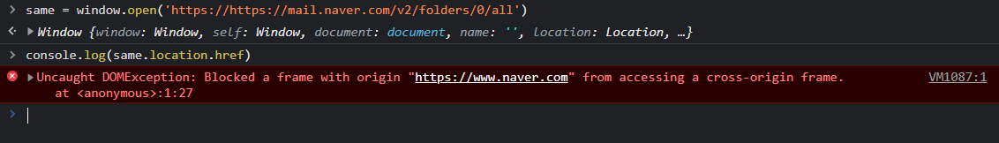
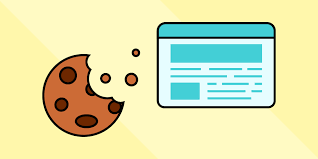
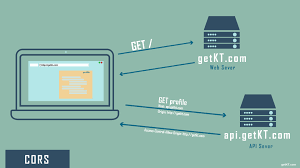
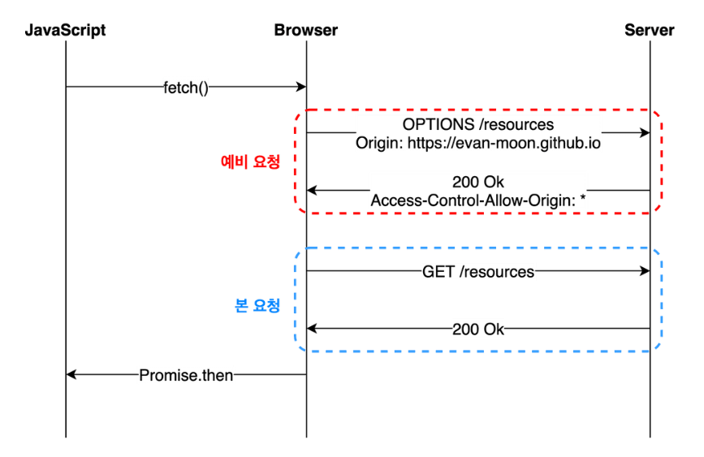

# **시작**

웹 사이트를 개발하며 외부 API를 이용하다 보면 다음과 같은 오류들을 마주하기도 합니다.

>``` Access to XMLHttpRequest at '...' from origin '..' has be blocked by CORS policy ```

이때 위의 오류코드에서 CORS는 Cross Origin Resource Sharing을 의미하는데 이 오류가 무슨 의미이고 왜 이런 오류가 발생하는 것일까요?

이 오류가 발생하게 하는 규칙인  **SOP(Same-Origin-Policy)** 에 대해 제가 공부한 내용을 간단히 적어보고자 합니다.


# **SOP(Same-Origin-Policy)**


MDN 문서에 따르면
>SOP는 한 Origin 에서 불러온 문서 또는 스크립트가 다른 Origin의 리소스와 상호작용할 수 있는 방법을 제한하는 보안 메커니즘이라고 합니다.

쉽게 풀어 말하면 웹 브라우저에서 동작하는 문서 또는 스크립트가 로딩된 위치에 있는 리소스에만 접근할 수 있음을 의미합니다.

그 전에 Origin이 무엇을 의미하는지 간단하게 알아 봅시다.

# **Origin**

오리진은 브라우저가 가져온 정보의 출처를 의미합니다. 그리고 오리진은 크게 프로토콜(Protocol, Scheme), 포트(Port), 호스트(Host)로 구성됩니다.

이 때 오리진의 구성요소가 모두 일치해야지 동일한 오리진으로 판정됩니다.

> ``` https://home.hyunsoo-uos.com:1001/homework.html ```

위의 주소를 예시로 오리진의 각각의 구성 요소들이 URL의 어떤 부분을 구성하는지 설명하겠습니다.

* ## **protocol**
  
  * 위의 예시에서 'https'에 해당함
  * protocol 또는 scheme이라고도 하며 대표적인 scheme으로 http, https, mail 등이 있다.
  
* ## **host**
  
  * 위의 예시에서 'home.hyunsoo-uos.com'에 해당함
  * 'mail.hyunsoo-uos.com'과 같이 도메인이 같더라도 다른 host일 수도 있다.
  
* ## **port**
  
  * 위의 예시에서 ':1001' 해당함
  * 같은 호스트더라도 실행중인 프로세스의 용도 또는 설정에 따라 포트번호가 다를 수 있다.

***
> ``` https://home.hyunsoo-uos.com:1001/english.html ```

위와 같은 경우에는 URL의 protocol, host, port가 모두 같고 path만 homework.html -> english.html로 다르기 때문에 Same Origin 이라고 할 수 있습니다.

> ``` http://home.hyunsoo-uos.com:1001/english.html ```

그와 반대로 위와 같은 경우에는 URL의 scheme이 각각 http와 https로 다르기 때문에 Cross Origin(Origin이 같지 않음) 이라고 할 수 있습니다. 

실제로 ``` https://www.naver.com ``` 에서 ``` https://mail.naver.com ```의 값을 참조하면 CORS 에러가 뜨는 것을 확인해 볼 수 있습니다.



# **SOP가 없다면?**
외부 API를 사용하거나 데이터들을 참조할 때 걸리적 거리기도 하는 이런 SOP를 왜 사용해야 하는지 궁금하실 수도 있습니다. 

> **만약 SOP가 적용 되지 않는다면 어떤 문제가 발생할 수 있을까요?**

많은 사이트 들에서 회원 정보 또는 상태를 인증하기 위해 쿠키 또는 Session ID를 쿠키로 만들어 브라우저 내부에 저장합니다. 그리고 브라우저가 특정 웹 사이트에 접속할 때 브라우저는 자동으로 그에 맞는 쿠키를 헤더에 포함시켜 요청을 보냅니다.



만약 이용자가 악의적인 페이지를 접속했을 때, 페이지가 자바스크립트를 사용해 SNS 웹 서비스로 요청을 보낸다면 어떻게 될까요? 브라우저는 요청을 보낼 때 해당 웹 서비스 쿠키를 포함시킬 것이기 때문에, 자바스크립트로 요청을 보낸 페이지는 로그인 된 이용자라고 생각하고 SNS의 응답을 받을 것입니다.

또한 다른 사이트에 요청을 보내는 것만이 아닌 다른 사이트의 데이터를 불러와 유출하는 피해가 일어날 수도 있습니다. 예를 들어 피해자의 메일 사이트로 데이터를 불러오는 요청을 보내면 (사용자가 이전에 쿠키로 로그인한 경우가 있는 경우) 메일 사이트로 부터 불러와진 데이터들이 공격자의 서버로 전송되는 피해가 발생할 수도 있습니다.

이러한 예시와 같이 SOP 규칙이 존재하지 않는다면, 악의적인 페이지가 클라이언트의 권한을 이용해 목표 사이트에 HTTP  요청을 보내고, HTTP 응답 정보를 획득하는 것과 같은 코드들을 실행할 수 있게 됩니다. 이러한 취약점은 정보유출과 같은 **보안 위협**으로써의 요소가 됩니다.

# **Cross Origin Resource Sharing**



하지만 웹사이트를 제작하다 보면, 같은 오리진 내의 데이터 뿐만이 아니라 **외부의 데이터**, API등을 사용해야 될 때가 있습니다. 따라서 특정 데이터에 대해서는 SOP의 예외적 처리가 필요할 것입니다. 이러한 문제는 어떻게 해결할 수 있을 까요?

위와 같이 Same Origin이 아닌 Cross Origin 끼리 데이터를 참조할 수 있도록 하는 것을 Cross Origin Resource Sharing 이라고 합니다. 예를 들어 이미지, 자바스크립트, CSS 등의 리소스를 불러오는
**``, `<style>`, `<script>`** 등의 태그는 SOP의 영향을 받지 않습니다.

위와 같은 상황외의 데이터들에 대해 CORS를 하는 경우에는 CORS와 관련된 HTTP 헤더를 추가하여 전송하는 방법을 사용합니다. 쉽게 말해 HTTP request 를 보낼 때 헤더에 추가된 origin에 대해서는 CORS를 허용한다고 미리 알리는 것입니다.

CORS를 하기 위한 방법은 HTTP 헤더를 이용하는 방법뿐만 아니라 JSON을 이용한 방법등 다양합니다. 이번 글에서는 HTTP 헤더를 이용하는 방법에 대해서 간단하게 알아봅시다.

***
CORS를 사용하기 위해서는 웹 클라이언트 어플리케이션이 다른 출처의 리소스를 요청할 때 HTTP 프로토콜의 헤더에 Origin 이라는 필드에 요청을 보내는 출처를 함께 담아 보내면 됩니다.
> ```Origin: https://hyunsoo-ds.github.io```

이후 서버가 이 요청에 대해 응답을 할 때 응답 헤더의 ***Access-Control-Allow-Origin***이라는 필드에 ***리소스가 접근할 수 있는 출처***를 알려줍니다.
이후 응답을 받은 브라우저가 자신이 보낸 요청의 Origin과 위의 필드의 응답을 비교해본 후 이 응답이 유효한 응답인지 아닌지를 결정할 수 있습니다.

이를 구현할 수 있는 대표적인 방법으로는 **Preflight Request**가 있습니다.

Preflight는 브라우저가 요청을 한번에 보내지 않고 예비 요청과 본 요청으로 나누어서 서버로 전송하는 것을 말합니다. 이때 예비 요청에 해당하는 것을 Preflight이라고 부르고 이 예비 요청에는 HTTP 메소드 중 **OPTIONS** 메소드가 사용됩니다.



> ##### 사진 출처: https://evan-moon.github.io/2020/05/21/about-cors/

Preflight 에서 Origin 헤더를 통해 해당 Origin이 허용가능한지 확인하고 그 다음 본 요청에서 Cross Origin에서 값을 참조해 올 수 있습니다.

# **마무리**

이번 글을 통해서 SOP와 Origin의 개념에 대해 알아 보았습니다. 악의적인 사용자에 의해 cross Origin의 데이터를 가져오는 것을 막기 위해 SOP는 꼭 필요한 규칙입니다. 또한 HTTP Origin Header를 통해 사전에 정의된 Origin에 대해서는 CORS를 허용하는 방법 또한 존재합니다.  

그러나 SOP가 막지 못하는 부분도 있습니다. SOP는 Cross Origin에서 데이터를 읽으려고 할 때는 오류를 발생시키지만, 읽는 것 외에 데이터를 쓰는 경우는 막지 않습니다. 이 점을 이용한 대표적인 취약점이 CSRF(Cross-Site-Request-Forgery) 입니다. 따라서 더 안전한 웹 서비스를 구현하기 위해서는 SOP 뿐만 아니라 CSRF에 대한 대비책 또한 필요할 것입니다. 또한 CORS를 구현할 때도 허용하는 Origin과 아닌 것들을 명확히 구분하여 빈틈이 생기지 않게 하는 것도 중요합니다.

***

## **참고자료**

* [CORS는 왜 이렇게 우리를 힘들게 하는걸까?](https://evan-moon.github.io/2020/05/21/about-cors/)
* [Mitigation: Same Origin Policy - Dreamhack](https://dreamhack.io/lecture/courses/186)
* [SOP(Same-Origin policy)란 무엇일까?](https://dongwooklee96.github.io/post/2021/03/23/sopsame-origin-policy-%EB%9E%80-%EB%AC%B4%EC%97%87%EC%9D%BC%EA%B9%8C.html)
* [SOP(Same Origin Policy)를 모르고 Web을 논하지 마라/SOP가 없다면 어떻게 될까?/CORS](https://www.youtube.com/watch?v=6QV_JpabO7g&t=727s)
