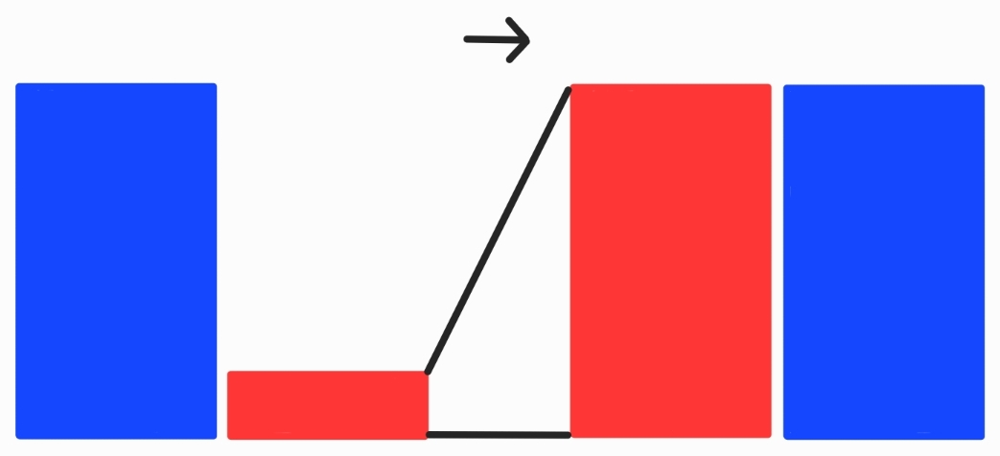
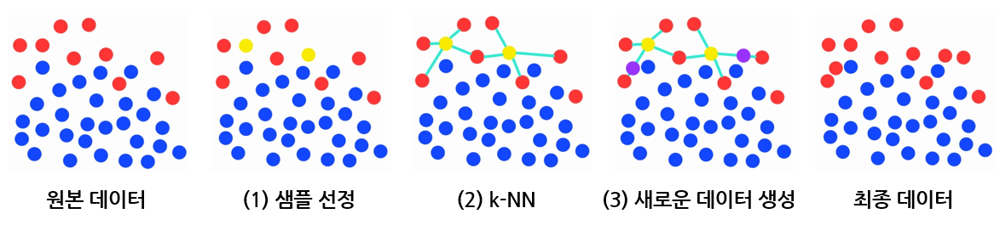
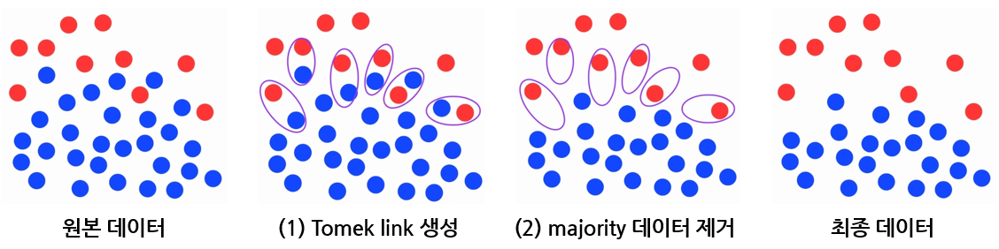

자연어 처리, 컴퓨터 비전, 추천 시스템 등 딥러닝 기법은 수많은 응용문제를 해결하는 데 활용되고 있습니다.

그중 여기서는 딥러닝 기법을 활용하여 해결할 수 있는 또 다른 응용문제 중 하나인 **이상 탐지(Anomaly Detection)**에 대해서 소개하고자 합니다.

먼저 **이상 탐지와 그 활용처**를 소개하고, 이러한 이상 탐지 문제의 **어려움**과 **주요 도전 과제**에 대해 소개하여 딥러닝 기법이 효과적인 해결 방법이 될 수 있음을 설명합니다.

그 후, 이상 탐지의 어려움 중 하나인 클래스 불균형 문제를 해결하기 위한 **Undersampling**과 **Oversampling**을 소개하고, 각각에 해당되는 기초적인 알고리즘인 **SMOTE**와 **Tomek Link**에 대해서 소개합니다.

이 글을 이해하기 위해서는 지도 학습과 비지도 학습, 학습 데이터와 라벨링의 의미 등 딥러닝 기법에 대한 기초적인 이해가 필요합니다.

- - -

## **이상 탐지 소개**

이상 탐지란, 일반적으로 대부분의 데이터에서 크게 벗어나거나 잘 정의된 정상적인 행동 양식을 따르지 않는 항목이나 사건을 식별하는 것을 의미합니다.

- - -

## **이상 탐지 응용**

이러한 이상 탐지는 위험 관리, 법률 준수, 보안, 재정, 금융 감독, 건강 및 의료 위험, AI 안전성 등 다양한 분야에서 활용됩니다.

예를 들어, 카드사들이 신용카드 사기 거래를 탐지하거나 의료 분야에서 건강 여부를 판단하는데 이러한 이상 탐지 기법이 이용될 수 있습니다.

- - -

## **이상 탐지의 어려움**

하지만 이러한 이상 탐지 문제는 그 특성으로 인해 어려움이 존재합니다.

### **1. Unknownness**

이상치는 대부분 알 수 없는 행동이나 데이터 구조, 분포 등 알 수 없는 것과 연관되어 있습니다.

해당 이상치는 그러한 이상치가 실제로 발생하기 전까지는 알 수 없는 상태로, 새로운 테러 공격이나 사기, 네트워크 보안 문제 등을 예로 들 수 있습니다.

### **2. Heterogeneous Anomaly Classes**

이상치는 불규칙적이고 다양합니다.

따라서, 어떤 한 종류의 이상치는 다른 종류의 이상치들과 전혀 다르게 나타날 수 있습니다.

예를 들어 (CCTV 등의) 영상 감시에서, 절도, 교통사고, 주거 침입 등 여러 종류의 비정상 사건들은 시각적으로 매우 다르게 나타날 것입니다.

### **3. Rarity and Class Imbalance**

데이터의 대부분을 차지하는 정상적인 경우에 비해서 이상치는 주로 매우 적은 양의 데이터입니다.
따라서 비정상인 경우의 데이터는 많이 확보하기 어렵습니다.

### **4. Diverse types of anomaly**

3가지 다른 종류의 이상치가 존재합니다.

> **a) Point Anomaly**: 대다수의 다른 개별적인 인스턴스에 대해 구별되는 인스턴스
>
> (환자의 비정상적인 건강 지표)
>
> **b) Conditional Anomaly**: 특정 조건 하에서만, 대다수의 다른 개별적인 인스턴스에 대해 구별되는 인스턴스
>
> (특정한 시간적 상황에서의 급격한 기온 하락/상승)
>
> (특정한 공간적 상황에서의 빠른 신용카드 거래)
>
> **c) Group Anomaly**: 대다수의 다른 인스턴스 집합에 대해 구별되는 인스턴스 집합
>
> 단, 이때 해당 인스턴스 집합 내의 개별적인 요소들은 이상치가 아닐 수 있습니다.
>
> (소셜 네트워크에서 가짜 계정에 의해 생성된 과도한 밀집 그래프 자체는 이상치로 볼 수 있지만, 해당 그래프에서의 개별적인 노드들은 실제 계정으로 정상일 수 있습니다.)

- - -

## **이상 탐지의 주요 도전 과제**

### **1. Low anomaly detection recall rate**

이상치들은 매우 드물게 나타나고 다양하기 때문에, 모든 이상치들을 식별하는 것은 어렵습니다.

많은 양의 정상 인스턴스가 이상치로 잘못 분류되는 반면, 정상에 비슷한 정교한 이상치들은 정상으로 잘못 분류되고는 합니다.

이러한 False Positive 문제(정상을 이상치로 예측해버리는 문제)를 줄이고, 재현율(이상치라고 예측한 것 중 실제로 이상치인 것의 비율)을 높이는 것이 매우 중요하면서도 어려운 문제입니다.

### **2. Anomaly detection in high-dimensional and/or not-independent data**

이상치들은 저차원 공간에서 명백히 비정상적 특성을 보여줄 수도 있지만, 고차원 공간에서 숨겨지거나 눈에 띄지 않는 형태로 존재할 수 있습니다.

이를 해결하기 위해서 부분 공간 기반의 방법이나 특징 추출 기반의 방법들을 생각해 볼 수 있지만, 이러한 고차원 공간 데이터는 복잡한 특징 상호 작용이나 커플링 문제를 식별하는 것이 필수적이고 어렵기 때문에 여전히 주요한 도전 과제로 남아 있습니다.

또한, 시간적, 공간적, 그래프 기반 의존성을 가지고 있는 인스턴스들 사이에서 이상치를 식별하는 것은 매우 어렵습니다.

### **3. Data-efficient learning of normality/abnormality**

많은 양의 라벨링 된 이상치 데이터를 모으는 것이 매우 어렵고 비용이 크기 때문에, 지도 학습 방법은 주로 실용적이지 못했습니다.

따라서, 비지도 학습 방법이 그동안 많이 연구되어 왔습니다.

그러나 비지도 학습은 실제 이상치에 대한 사전 지식을 갖지 못하고, 이상치들에 분포에 기반한 추론에 크게 의존합니다.

한편, 라벨링 된 정상 데이터와 라벨링 된 이상치 데이터의 일부 정도를 수집하는 것은 그렇게 어려운 일이 아닐 수 있습니다.

그러한 라벨링 된 데이터를 이용하여 정상과 비정상의 표현을 학습하는 것은 이상 탐지의 정확도를 높이는 데 매우 중요합니다.

따라서, 준지도 학습 방법이 새로운 연구 주제로 등장했습니다.

이때 주요한 도전과제는 아래와 같습니다.

1) 적은 양의 이상치 데이터로 어떻게 정상/비정상 표현을 효과적으로 학습할지

2) 현재의 이상치 데이터로 커버할 수 없는 새로운 이상치 데이터에도 일반적으로 적용되도록 탐지 모델을 어떻게 학습시킬지

### **4. Noise-resilient anomaly detection**

많은 준지도 학습 방법 이상 탐지의 경우 라벨링 된 훈련 데이터가 깨끗하다고 가정하는데, 이는 노이즈 데이터에 취약하여 잘못된 라벨로 분류될 수 있습니다.

그러한 경우에는 비지도 학습 방법을 대신 이용해야 하지만, 라벨링 된 실제 데이터를 이용하지 못하는 단점이 있습니다.

추가적으로, 이상치가 섞인 큰 규모의 라벨링 되지 않은 데이터가 종종 존재합니다.

노이즈 내성 모델은 그러한 라벨링 되지 않은 데이터를 활용하여 더 정확한 탐지가 가능하도록 합니다.

즉, 여기서 노이즈는 잘못 분류된 데이터나 라벨링 되지 않은 이상치로 볼 수 있습니다.

이때 주요한 도전과제는 아래와 같습니다.

1) 데이터 셋 사이에 노이즈의 양이 크게 다를 수 있다는 것

2) 데이터 공간에서 노이즈 인스턴스들은 불규칙하게 분포되어 있을 수 있다는 것

### **5. Detection of complex anomalies**

대다수의 현존하는 방법들이 Point Anomaly를 대상으로 한정되어 있습니다.

Conditional Anomaly나 Group Anomaly는 Point Anomaly와는 전혀 다른 행태를 보여주기 때문입니다.

따라서 여기서 한 가지 주요 과제는 이러한 Conditional/Group Anomaly의 개념을 이상 탐지 방법이나 모델에 통합시키는 것입니다.

또한, 많은 응용들이 여러 다른 데이터 소스로부터 이상치를 탐지하는 것이 필요한 반면, 현재 방법들은 한 가지 데이터 소스로부터 이상치를 탐지하는 것에만 초점이 맞추어져 있습니다.

여기서의 또 다른 주요 과제는 일부 이상치들은 2개 이상의 데이터 소스를 고려해야만 탐지될 수 있다는 것입니다.

### **6. Anomaly explanation**

많은 안전이 중요한 분야에서는, 이상 탐지 모델이 블랙박스 모델일 경우 위험할 수 있습니다.

예를 들어, 사기나 범죄 탐지 시스템에서 찾아보기 힘든 이상치(즉, 사기나 범죄로 판단되는 사건)로 분류된 소수의 데이터 인스턴스들은 데이터에서의 소수 집단 전체에 반하는 알고리즘 편향을 초래할 수 있습니다.

이러한 위험성을 완화하는 효과적인 방법은 왜 특정 데이터 인스턴스가 이상치로 분류되었는지에 대한 단서를 제공하는 이상치 설명 알고리즘을 포함하는 것입니다.

그러면 전문가들이 살펴본 후, 해당 편향을 수정할 수 있습니다.

위에서의 예시처럼 특정 분야에서는 설명력을 제공하는 것이 탐지 정확도를 높이는 것만큼 중요할 수 있습니다.

그러나, 대부분의 이상 탐지 연구는 탐지 정확도를 높이는 것에만 치중되어 왔습니다.

물론 본질적으로 해석 가능한 이상 탐지 기법을 개발하는 것도 중요하지만, 모델의 해석 가능성과 효과성의 균형을 잘 맞추는 것은 여전히 주요 과제로 남아 있습니다.

- - -

## **이상 탐지의 클래스 불균형 문제 해결 방법**

### **Oversampling**

Oversampling은 소수 클래스의 데이터를 증강시켜 클래스 불균형을 완화하는 방법입니다.

이러한 Undersampling 기법 중 하나인 SMOTE에 대해 알아보겠습니다.

### **SMOTE (Synthetic Minority Over-sampling Technique**

> 1. 소수 클래스의 데이터 중 샘플을 선정합니다.
>
> 2. k-NN을 사용하여 샘플과 주변 이웃 노드(데이터)들을 잇는 선분을 긋습니다.
>
> (예시 그림에서는 k=4로 지정하여 4개의 이웃 노드(데이터)를 지정하였습니다.)
>
> 3. 선분들 중 임의의 위치한 점을 새로운 노드(데이터)로 생성합니다.

### **Undersampling**

Undersampling은 다수 클래스의 데이터를 감소시켜 클래스 불균형을 완화하는 방법입니다.

이러한 Undersampling 기법 중 하나인 Tomek Links에 대해 알아보겠습니다.

### **Tomek Link**

> 1. Tomek Link를 생성합니다.
>
> 여기서 Tomek Link는 서로 다른 클래스의 노드 쌍 중 거리가 가장 짧은 각각의 쌍들을 의미한다고 이해하면 됩니다.
>
> 예를 들어 만약 A 클래스 노드 하나가 어떤 B 클래스 노드와 가장 짧게 연결할 수 있는 거리가 2라고 할 때, 해당 B 클래스 노드가 다른 A 클래스 노드와 거리 2보다 짧게 연결할 수 있다면, 거리 2인 A 클래스 노드는 Tomek Link가 되지 못합니다.
>
> 2. Tomek Link를 이루는 노드(데이터) 중 다수 클래스에 속하는 노드(데이터)를 제거합니다.

- - -

## **참고 문헌(논문)**

1. Deep Learning for Anomaly Detection: A Review

2. SMOTE: Synthetic Minority Over-sampling Technique

3. Two modifications of CNN
