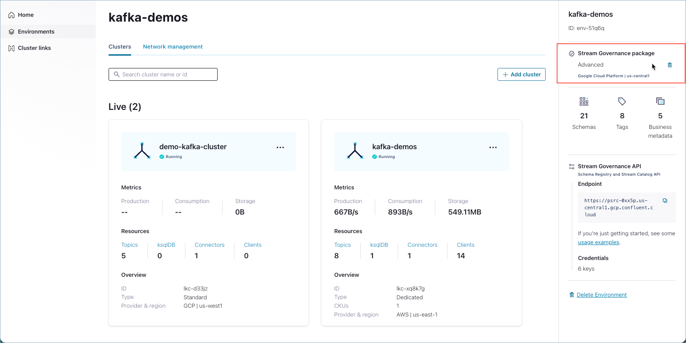
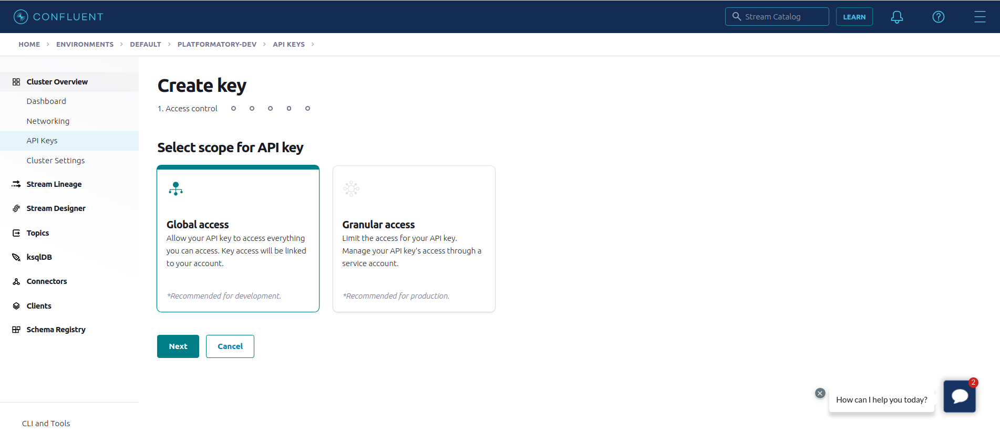
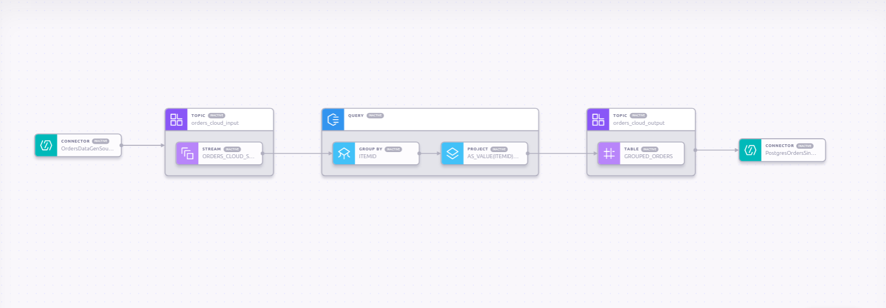
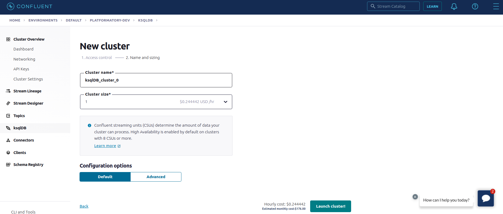
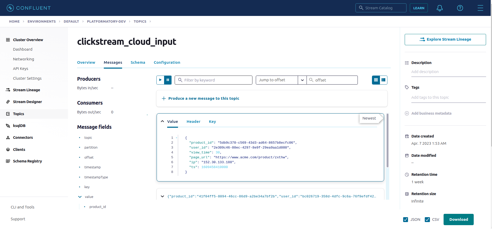
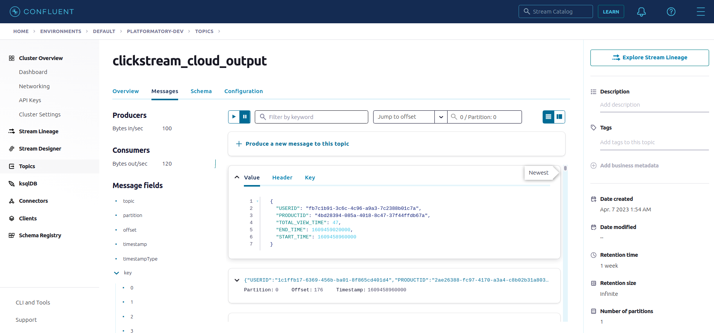
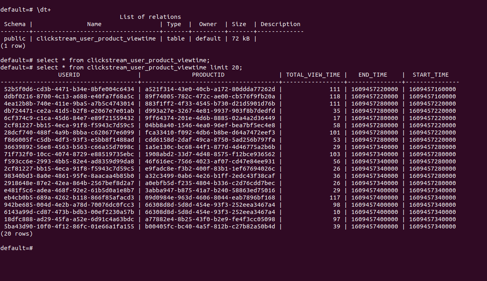
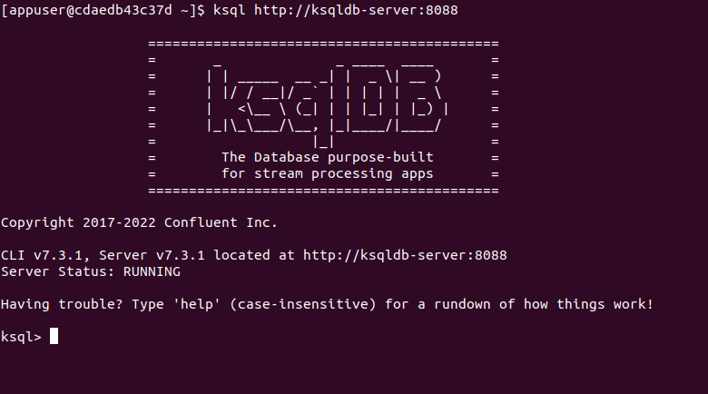

## Introduction

KSQLDB and Kafka Connect are two technologies that are commonly used together in the Apache Kafka ecosystem for stream processing and data integration.

Kafka Connect is a framework for building and running connectors between Kafka and other data systems, such as databases, file systems, and message queues. Connectors are plugins that are responsible for moving data between Kafka and external systems, either in a one-way or a two-way fashion. Kafka Connect provides a scalable and fault-tolerant way of integrating data between different systems.

KSQLDB, on the other hand, is a streaming SQL engine for Apache Kafka that allows developers to write SQL queries on top of Kafka streams. KSQLDB makes it easy to perform stream processing tasks, such as filtering, aggregating, and joining streams of data in real-time. KSQLDB also provides support for stream-table joins, which allows developers to join a Kafka stream with a Kafka table.

## KSQLDB and Kafka Connect in Confluent Architecture

Confluent Cloud is a fully managed cloud-native event streaming platform that provides a scalable and secure way to build real-time streaming applications in the cloud. It offers connectors that are pre-configured, fully managed, and can be deployed with just a few clicks in the Confluent Cloud Console or via the Confluent Cloud CLI. It also provides a user-friendly web interface for managing and executing queries in KSQLDB, as well as an API for programmatic access.

Confluent Platform, on the other hand, is a self-managed version of the Confluent stack that can be deployed on-premises or in the cloud. Confluent Platform provides additional features such as multi-datacenter replication, advanced security options, and enhanced monitoring and management capabilities. The Kafka Connect and KSQLDB servers are self managed and available through HTTP API for use. The required connectors need to be manually loaded into Kafka Connect server and configured.

In summary, both Confluent Cloud and Confluent Platform provide Kafka clusters, Kafka Connect, and KSQLDB, but Confluent Platform offers additional features and customization options for those who require more control over their Kafka infrastructure.

## Managed vs Self-hosted

### Operation Cost

Confluent Cloud requires a Kafka cluster for using Connectors and KSQLDB. It primarily offers three types of clusters, Basic, Standard and Dedicated. The pricing are as follows,

- Basic - $0 per hour
- Standard - $1.50 per hour
- Dedicated - Cost based on number of CKUs (Confluent Unit for Kafka)

The connector deployments are priced based on the connector task instance and the amount of data being transferred. Please look at this [link](https://www.confluent.io/confluent-cloud/connect-pricing/) for more details.

KSQLDB servers are priced as **$0.23 per CSU hour**. A CSU (Confluent Streaming Unit) is the compute unit for fully managed ksqlDB. Clusters can be configured with 1, 2, 4, 8, or 12 CSUs based upon the workload.

In Confluent Platform, both Kafka Connect cluster and KSQLDB server are available under Confluent Community license and does not have any licensing cost. The components have its own requirement on Memory and CPU based on the expected usage, so the cost of setting up the infrastructure locally or in cloud exists. The commercial connectors still needs to be licensed before use in Kafka Connect.  

### Deployment Options

Kafka Connect and KSQL clusters can be deployed in Confluent Cloud using any of the following methods,

- Confluent Cloud console
- [Confluent CLI](https://docs.confluent.io/confluent-cli/current/overview.html#confluent-cli-overview)
- [Confluent Terraform provider](https://registry.terraform.io/providers/confluentinc/confluent/latest)
- [Confluent Pulumi provider](https://www.pulumi.com/registry/packages/confluentcloud/)

Both Terraform and Pulumi providers automate deployments and offer version control when used in conjunction with Github, Gitlab etc. 

Kafka Connect and KSQL clusters can be deployed in Confluent Platform using any of the following methods,

- [Manual Confluent Package Installation](https://docs.confluent.io/platform/current/installation/overview.html#install-cp-on-premises)
- [Docker images](https://docs.confluent.io/platform/current/installation/docker/installation.html)
- [Ansible playbook for Confluent Platform](https://docs.confluent.io/ansible/current/overview.html)
- [Confluent for Kubernetes](https://docs.confluent.io/operator/current/overview.html)

Ansible playbooks offer a simple automated way to deploy Confluent Platform components in multiple machines. Confluent for Kubernetes (CFK) is a cloud-native control plane for deploying and managing Confluent in your private cloud environment. 

Based on this execution model and depending on how we want to run our queries, currently, ksqlDB provides two deployment options.

- ****Headless ksqlDB deployments -**** In the headless mode, you write all of your queries in a SQL file, and then start ksqlDB server instances with this file as an argument. Confluent Platform supports this type of KSQL deployment.
- ****Interactive ksqlDB deployments -**** In interactive mode, you interact with the ksqlDB servers through a REST API either directly via your favorite REST clients, through ksqlDB CLI or through Confluent Control Center. Both Confluent Cloud and Confluent Platform support this type of KSQL deployment.

### Multi-Tenancy

Kafka Connect and KSQLDB does not natively support multi-tenancy in both Confluent Cloud and Confluent Platform, but it is possible to implement a multi-tenancy model. 

Deploy multiple Kafka Connect and KSQLDB clusters, each dedicated to a specific tenant or application. Each Kafka Connect cluster can be configured with its own set of connectors and configurations, and can run on a separate set of hardware resources. This will lead to resource isolation in terms of connector tasks and scaling resources based on application requirements.

Similarly, each KSQLDB cluster can be used to host one application or use case with dedicated resources. Deploying multiple applications in a single KSQL cluster can lead to resource issues because of an application being greedy for resources. It also makes it easier to reason about scaling, failovers, replication and resource utilization.

### Future

KSQLDB provides the ability to define and use user-defined functions (UDFs) in SQL queries. UDFs allow developers to extend the functionality of KSQLDB by defining their own custom functions that can be used in SQL expressions. As of now, the support for KSQL UDF is only present in Confluent Platform (self-hosted) deployments. Support for KSQL UDF might be introduced for Confluent Cloud as well.

Recently, Confluent acquired Immerok which is a contributor to the open source stream processing application technology Apache Flink. So, there might be a support released for FlinkSQL in KSQLDB in the future. 

## End-To-End Streaming Pipeline

We will now build a sample end-to-end streaming pipeline using Kafka Connect and KSQLDB in both Confluent Cloud and Confluent Platform. Both the scenarios will be using Kafka Cluster deployed in Confluent Cloud for Kafka Topic storage. So, please create a Basic Kafka cluster in Confluent Cloud by registering in this [link](https://confluent.cloud/signup).


This demo will also require Schema registry cluster for storing Avro schema of the record values. You can create a Schema registry cluster in the Confluent Cloud by enabling the Streams Governance Essentials Package. You can follow this [link](https://docs.confluent.io/cloud/current/stream-governance/packages.html#stream-governance-packages-features-and-limits) for more information.



Create a Kafka cluster API Key in your Confluent cloud account from under the Cluster Overview section, so that the connectors and KSQLDB can access data from Kafka topics during stream processing.



Following are the details of the streaming pipeline,

1. Deploy a Datagen source connector to inject “Shoe Clickstream” data into the input topic
2. Create a KSQL Stream for the input topic
3. Create a aggregated KSQL table to calculate the total view time per product per user for every 1 minute time window and write it to a output topic.
4. Sink the data from output topic to a Postgres database using the JDBC Sink Connector. 

The connectors used in this demo will be deployed using SQL queries in KSQL in both Confluent Cloud and Confluent Platform deployments. 



### Confluent Cloud

We will use the Confluent Cloud console to create KSQL cluster but this can be achieved through any of the above mentioned deployment options for Confluent Cloud.

Create a KSQL cluster in your Confluent Cloud account with Global access (only for testing).



Once, the KSQL cluster is provisioned. we will create a Datagen source connector to push data into  the input topic `clickstream_cloud_input`. We will use the `SHOE_CLICKSTREAM` quick start data generator and set the data type as `AVRO` for the record values. The Kafka API key pair created above will be used to create the input topic and write data into it.

```sql
CREATE SOURCE CONNECTOR "ClickstreamDataGenSourceConnector" WITH (
  "connector.class"='DatagenSource',
  "kafka.api.key"='${KAFKA_API_KEY}',
  "kafka.api.secret"='${KAFKA_API_SECRET}',
  "kafka.topic"='clickstream_cloud_input',
  "output.data.format"='AVRO',
  "quickstart"='SHOE_CLICKSTREAM',
  "tasks.max"='1'
);
```

Once the Datagen source connector is successfully deployed, we should be able to see the generated records for the input topic in the Confluent Cloud UI. 



Let’s create a Kafka stream called `CLICKSTREAM_CLOUD_STREAM` from this input topic `clickstream_cloud_input` for further processing. We will mention the timestamp field in the message value to be used for windowing by using the `timestamp` variable under the `WITH` clause. 

```sql
CREATE OR REPLACE STREAM CLICKSTREAM_CLOUD_STREAM 
(PRODUCT_ID VARCHAR, USER_ID VARCHAR, VIEW_TIME INT, 
PAGE_URL VARCHAR, IP VARCHAR, TS BIGINT) 
WITH (kafka_topic='clickstream_cloud_input', partitions=1, 
value_format='AVRO', timestamp='TS');
```

Create a Kafka Table called `USER_PRODUCT_VIEWTIME` backed by a Kafka topic `clickstream_cloud_output` which aggregates the total view time per product per user for every 1 minute time window.  The aggregated sum of the view time is saved as `TOTAL_VIEW_TIME` field in the table.

```sql
CREATE OR REPLACE TABLE USER_PRODUCT_VIEWTIME 
WITH (kafka_topic='clickstream_cloud_output', partitions=1, 
key_format='AVRO', value_format='AVRO') 
AS SELECT USER_ID, PRODUCT_ID, AS_VALUE(USER_ID) AS USERID, 
AS_VALUE(PRODUCT_ID) AS PRODUCTID, SUM(VIEW_TIME) AS TOTAL_VIEW_TIME, 
WINDOWEND AS END_TIME, WINDOWSTART AS START_TIME 
FROM CLICKSTREAM_CLOUD_STREAM 
WINDOW TUMBLING (SIZE 1 MINUTES, RETENTION 7 DAYS) 
GROUP BY USER_ID, PRODUCT_ID;
```

Following, is a sample view of the records received by the ouput topic `clickstream_cloud_output`



Let’s create a Postgres JDBC Sink connector which writes the aggregated values from the output topic to a remote Postgres database. 

```sql
CREATE SINK CONNECTOR "PostgresClickstreamSinkConnector" WITH (
  'connector.class'          = 'PostgresSink',
  'kafka.api.key'            = '${KAFKA_API_KEY}',
  'kafka.api.secret'         = '${KAFKA_API_SECRET}',
  'connection.host'          = 'postgresql-119942-0.cloudclusters.net',
  'connection.port'          = '10091',
  'connection.user'          = '${POSTGRES_USER}',
  'connection.password'      = '${POSTGRES_PASSWORD}',
  'db.name'                  = 'default',
  'topics'                   = 'clickstream_cloud_output',
  'input.data.format'        = 'AVRO',
  'input.key.format'         = 'AVRO',
  'delete.enabled'           = 'false',
  'ssl.mode'                 = 'prefer',
  'insert.mode'              = 'UPSERT',
  'table.name.format'        = 'clickstream_user_product_viewtime',
  'db.timezone'              = 'UTC',
  'pk.mode'                  = 'record_value',
  'pk.fields'                = 'USERID,PRODUCTID',
  'auto.create'              = 'true',
  'auto.evolve'              = 'true',
  'quote.sql.identifiers'    = 'ALWAYS',
  'batch.sizes'              = '3000',
  'tasks.max'                = '1'
);
```

Here is the sample view of the `clickstream_user_product_viewtime` table in the Postgres database post the sink connector deployment.



### Confluent Platform

For Confluent Platform, we will use the Kafka Connect and KSQLDB docker images to deploy the respective clusters in a hybrid mode i.e. use the Kafka cluster in Confluent Cloud for Kafka topics.

We will be deploying the streaming pipeline using the KSQL interactive mode by using KSQLDB CLI image to connect to the KSQLDB cluster.

We will need to supply the credentials of the Schema Registry, which can be obtained from Confluent Cloud, in case of using Avro, JsonSchema or Protobuf formats for record key or value.

The Kafka Connect image needs to be baked with the required connector jars before deployment. We will build a custom Kafka connect docker image by using the below `Dockerfile`,

```docker
FROM confluentinc/cp-kafka-connect:7.3.1

RUN wget http://client.hub.confluent.io/confluent-hub-client-latest.tar.gz && tar -xzf confluent-hub-client-latest.tar.gz

RUN chmod +x ./bin/confluent-hub

ENV CONNECT_PLUGIN_PATH: "/usr/share/java,/usr/share/confluent-hub-components"

RUN ./bin/confluent-hub install --no-prompt confluentinc/kafka-connect-datagen:0.6.0
RUN ./bin/confluent-hub install --no-prompt confluentinc/kafka-connect-jdbc:10.7.0
```

Following is the docker compose file for deploying Kafka Connect, KSQLDB server, KSQLDB CLI and Postgres DB

`docker-compose.yml`

```yaml
version: '3.7'
services:
  connect:
    build: .
    hostname: connect
    container_name: sample-connect
    ports:
      - "8083:8083"
    environment:
      CONNECT_BOOTSTRAP_SERVERS: "${KAFKA_BOOTSTRAP_SERVER}"
      CONNECT_SECURITY_PROTOCOL: SASL_SSL
      CONNECT_SASL_MECHANISM: PLAIN
      CONNECT_SASL_JAAS_CONFIG: |
              org.apache.kafka.common.security.plain.PlainLoginModule required \
              username="${KAFKA_API_KEY}" \
              password="${KAFKA_API_SECRET}";
      CONNECT_REST_ADVERTISED_HOST_NAME: connect
      CONNECT_REST_PORT: 8083
      CONNECT_GROUP_ID: test-connect-group
      CONNECT_CONFIG_STORAGE_TOPIC: docker-connect-configs
      CONNECT_CONFIG_STORAGE_REPLICATION_FACTOR: 3
      CONNECT_OFFSET_FLUSH_INTERVAL_MS: 10000
      CONNECT_OFFSET_STORAGE_TOPIC: docker-connect-offsets
      CONNECT_OFFSET_STORAGE_REPLICATION_FACTOR: 3
      CONNECT_STATUS_STORAGE_TOPIC: docker-connect-status
      CONNECT_STATUS_STORAGE_REPLICATION_FACTOR: 3
      CONNECT_PLUGIN_PATH: "/usr/share/java,/usr/share/confluent-hub-components"
      CONNECT_TOPIC_CREATION_ENABLE: "true"
      CONNECT_LOG4J_ROOT_LOGLEVEL: "INFO"
      CONNECT_INTERNAL_KEY_CONVERTER: "org.apache.kafka.connect.json.JsonConverter"
      CONNECT_INTERNAL_VALUE_CONVERTER: "org.apache.kafka.connect.json.JsonConverter"
      CONNECT_KEY_CONVERTER: "io.confluent.connect.avro.AvroConverter"
      CONNECT_KEY_CONVERTER_SCHEMAS_ENABLE: "true"
      CONNECT_KEY_CONVERTER_SCHEMA_REGISTRY_URL: "${SCHEMA_REGISTRY_URL}"
      CONNECT_KEY_CONVERTER_BASIC_AUTH_CREDENTIALS_SOURCE: USER_INFO
      CONNECT_KEY_CONVERTER_SCHEMA_REGISTRY_BASIC_AUTH_USER_INFO: "${SCHEMA_REGISTRY_API_KEY}:${SCHEMA_REGISTRY_API_SECRET}"
      CONNECT_VALUE_CONVERTER: "io.confluent.connect.avro.AvroConverter"
      CONNECT_VALUE_CONVERTER_SCHEMAS_ENABLE: "true"
      CONNECT_VALUE_CONVERTER_SCHEMA_REGISTRY_URL: "${SCHEMA_REGISTRY_URL}"
      CONNECT_VALUE_CONVERTER_BASIC_AUTH_CREDENTIALS_SOURCE: USER_INFO
      CONNECT_VALUE_CONVERTER_SCHEMA_REGISTRY_BASIC_AUTH_USER_INFO: "${SCHEMA_REGISTRY_API_KEY}:${SCHEMA_REGISTRY_API_SECRET}"
      CONNECT_CONNECTOR_CLIENT_CONFIG_OVERRIDE_POLICY: "All"
      CONNECT_CONUSMER_SECURITY_PROTOCOL: SASL_SSL
      CONNECT_CONUSMER_SASL_MECHANISM: PLAIN
      CONNECT_CONUSMER_SASL_JAAS_CONFIG: |
              org.apache.kafka.common.security.plain.PlainLoginModule required \
              username="${KAFKA_API_KEY}" \
              password="${KAFKA_API_SECRET}";
      CONNECT_PRODUCER_SECURITY_PROTOCOL: SASL_SSL
      CONNECT_PRODUCER_SASL_MECHANISM: PLAIN
      CONNECT_PRODUCER_SASL_JAAS_CONFIG: |
              org.apache.kafka.common.security.plain.PlainLoginModule required \
              username="${KAFKA_API_KEY}" \
              password="${KAFKA_API_SECRET}";

  ksqldb-server:
    image: confluentinc/cp-ksqldb-server:7.3.1
    hostname: ksqldb-server
    container_name: ksqldb-server-container
    depends_on:
      - connect
    ports:
      - "8088:8088"
    # volumes:
    #   - ./ksql.sql:/opt/ksql/ksql.sql
    environment:
      KSQL_CONFIG_DIR: "/etc/ksql"
      KSQL_AUTO_OFFSET_RESET: "earliest"
      KSQL_BOOTSTRAP_SERVERS: "${KAFKA_BOOTSTRAP_SERVER}"
      KSQL_HOST_NAME: ksqldb-server
      KSQL_LISTENERS: "http://0.0.0.0:8088"
      KSQL_CACHE_MAX_BYTES_BUFFERING: 0
      KSQL_KSQL_SCHEMA_REGISTRY_URL: "${SCHEMA_REGISTRY_URL}"
      KSQL_KSQL_SCHEMA_REGISTRY_BASIC_AUTH_CREDENTIALS_SOURCE: USER_INFO
      KSQL_KSQL_SCHEMA_REGISTRY_BASIC_AUTH_USER_INFO: "${SCHEMA_REGISTRY_API_KEY}:${SCHEMA_REGISTRY_API_SECRET}"
      KSQL_KSQL_CONNECT_URL: "http://connect:8083"
      KSQL_KSQL_LOGGING_PROCESSING_TOPIC_REPLICATION_FACTOR: 3
      KSQL_KSQL_LOGGING_PROCESSING_TOPIC_AUTO_CREATE: 'true'
      KSQL_KSQL_LOGGING_PROCESSING_STREAM_AUTO_CREATE: 'true'
      KSQL_LOG4J_ROOT_LOGLEVEL: INFO
      KSQL_KSQL_SERVICE_ID: "test-ksql-cluster"
      KSQL_KSQL_STREAMS_REPLICATION_FACTOR: 3
      KSQL_KSQL_INTERNAL_TOPIC_REPLICAS: 3
      KSQL_SECURITY_PROTOCOL: SASL_SSL
      KSQL_SASL_MECHANISM: PLAIN
      KSQL_SASL_JAAS_CONFIG: |
              org.apache.kafka.common.security.plain.PlainLoginModule required \
              username="${KAFKA_API_KEY}" \
              password="${KAFKA_API_SECRET}";

  ksqldb-cli:
    image: confluentinc/cp-ksqldb-cli:7.3.1
    container_name: ksqldb-cli
    entrypoint: /bin/sh
    tty: true

  pg-database:
    image: "postgres:11"
    ports:
      - "5432:5432"
    environment:
      POSTGRES_USER: postgres
      POSTGRES_PASSWORD: password
      POSTGRES_DB: postgres
```

The Kafka Connect and KSQLDB services will connect to Kafka cluster in Confluent Cloud using the bootstrap server and the SASL credentials provided as environment variables for the respective services. The Schema registry URL and its credentials are also provided for both the services.

The config `CONNECT_TOPIC_CREATION_ENABLE: "true"` needs to be set up in Kafka Connect cluster to enable the input topic creation through Source connectors.

Start the docker services in `build` mode to build the custom Kafka Connect image using the `Dockerfile` we created,

```bash
docker-compose up -d --build
```

Once all the services are successfully up, attach to the KSQLDB CLI container’s bash,

```bash
docker exec -it ksqldb-cli bash
```

Connect to the KSQLDB server inside the KSQLDB CLI container,

```bash
ksql http://ksqldb-server:8088
```



Deploy the Datagen Source connector,

```sql
CREATE SOURCE CONNECTOR "ClickstreamDataGenSourceConnector" WITH (
  "connector.class"='io.confluent.kafka.connect.datagen.DatagenConnector',
  "kafka.api.key"='${KAFKA_API_KEY}',
  "kafka.api.secret"='${KAFKA_API_SECRET}',
  "kafka.topic"='clickstream_cloud_input',
  "output.data.format"='AVRO',
  "quickstart"='SHOE_CLICKSTREAM',
  "topic.creation.default.partitions"='1',
  "topic.creation.default.replication.factor"='3',
  "tasks.max"='1'
);
```

Create the Kafka stream from the input topic `clickstream_cloud_input`,

```sql
CREATE OR REPLACE STREAM CLICKSTREAM_CLOUD_STREAM 
(PRODUCT_ID VARCHAR, USER_ID VARCHAR, VIEW_TIME INT, 
PAGE_URL VARCHAR, IP VARCHAR, TS BIGINT) 
WITH (kafka_topic='clickstream_cloud_input', partitions=1, 
value_format='AVRO', timestamp='TS');
```

Create the aggregated table backed by a output topic `clickstream_cloud_output`,

```sql
CREATE OR REPLACE TABLE USER_PRODUCT_VIEWTIME 
WITH (kafka_topic='clickstream_cloud_output', partitions=1, 
key_format='AVRO', value_format='AVRO') 
AS SELECT USER_ID, PRODUCT_ID, AS_VALUE(USER_ID) AS USERID, 
AS_VALUE(PRODUCT_ID) AS PRODUCTID, SUM(VIEW_TIME) AS TOTAL_VIEW_TIME, 
WINDOWEND AS END_TIME, WINDOWSTART AS START_TIME 
FROM CLICKSTREAM_CLOUD_STREAM WINDOW TUMBLING (SIZE 1 MINUTES, RETENTION 7 DAYS) 
GROUP BY USER_ID, PRODUCT_ID;
```

Create the JDBC Postgres Sink Connector to sink data to the local Postgres database,

```sql
CREATE SINK CONNECTOR "PostgresClickstreamSinkConnector" WITH (
  'connector.class'                    = 'io.confluent.connect.jdbc.JdbcSinkConnector',
  'connection.url'                     = 'jdbc:postgresql://pg-database:5432/postgres?user=postgres&password=password&ssl=false',
  'topics'                             = 'clickstream_cloud_output',
  'input.data.format'                  = 'AVRO',
  'input.key.format'                   = 'AVRO',
  'delete.enabled'                     = 'false',
  'ssl.mode'                           = 'prefer',
  'insert.mode'                        = 'UPSERT',
  'table.name.format'                  = 'clickstream_user_product_viewtime',
  'db.timezone'                        = 'UTC',
  'pk.mode'                            = 'record_value',
  'pk.fields'                          = 'USERID,PRODUCTID',
  'auto.create'                        = 'true',
  'auto.evolve'                        = 'true',
  'quote.sql.identifiers'              = 'ALWAYS',
  'batch.sizes'                        = '3000',
  'tasks.max'                          = '1',
  'consumer.override.sasl.mechanism'   = 'PLAIN',
  'consumer.override.security.protocol'= 'SASL_SSL',
  'consumer.override.sasl.jaas.config' = 'org.apache.kafka.common.security.plain.PlainLoginModule required username=\"${KAFKA_API_KEY}\" password=\"${KAFKA_API_SECRET}\";'
```

## Conclusion

In conclusion, building an end-to-end streaming pipeline using Kafka Connect and KSQLDB can be a powerful way to enable real-time data processing and analytics. By leveraging Kafka Connect for data ingestion and KSQLDB for data processing and analysis, developers can build complex streaming applications that can scale horizontally as needed.

Deploying this architecture in a managed environment such as Confluent Cloud provides several benefits, including reduced infrastructure management overhead, automatic scaling, and built-in support for high availability and disaster recovery. However, this comes at the cost of higher pricing and potentially reduced flexibility in terms of configuration and customization.

On the other hand, self-hosted deployment mode provides greater control and flexibility over the deployment and configuration of Kafka Connect and KSQLDB. However, this approach requires more infrastructure management and may require more upfront investment in terms of hardware and software resources.
