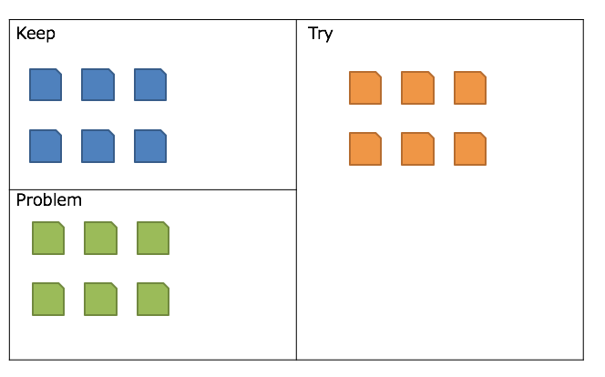

## 프로젝트 회고를 주제로 다룬 이유
 
프로젝트를 진행하면서 새로운 기술 도입이나 이전에 제대로 처리하지 못했던 부분을 개선하는 것은 물론 중요한 과정입니다. 하지만, 프로젝트를 성공적으로 마무리하고 더 나은 결과를 도출하기 위해서는 프로젝트의 내용을 정리하고 회고하는 과정 역시 매우 중요하다고 생각합니다. 이러한 회고 과정을 KPT 원칙을 적용하여 진행한다면 더욱 효과적인 개선과 성장을 이룰 수 있을 것입니다.  

KPT 원칙을 프로젝트 회고에 적용하는 방법에 대해 소개해보겠습니다. KPT 원칙은 'Keep', 'Problem', 'Try'의 세 가지 요소로 이루어져 있습니다. 이 요소들을 활용하여 프로젝트의 성과를 도출하고 문제점을 파악하며, 앞으로 개선해나갈 방법을 제시하는데 사용할 수 있습니다.  

## KPT 원칙을 사용하는 이유
프로젝트 회고를 Keep, Problem, Try로 정리하는 이유는 각각의 섹션을 통해 프로젝트를 전반적으로 돌아보고, 더 나은 방향으로 나아갈 수 있는 행동 계획을 세울 수 있기 때문입니다.  

Keep, Problem, Try로 회고를 정리함으로써 프로젝트 팀은 과거의 경험을 통해 배움과 성장을 이룰 수 있습니다. 긍정적인 측면을 유지하고, 발생한 문제를 인지하며, 이를 개선하기 위해 적극적으로 시도하는 태도를 가지게 됩니다. 이러한 회고 과정을 반복하면서 팀은 더 나은 협업과 개발 방법론을 적용하여 미래 프로젝트에 더 많은 가치를 창출하게 될 것입니다. 회고를 통해 팀원들의 의견을 모아 더 나은 방향을 찾고, 문제를 예방하고, 지속적으로 발전해 나가는 것이 중요합니다.

## KPT 원칙에 대하여
  
Keep:
프로젝트에서 성공적으로 진행되었던 부분과 긍정적인 경험들을 정리하는 단계입니다. 새로운 기술 도입이나 효과적인 협업 방법, 더 나은 개발 접근 방식 등과 같은 성공적인 측면들을 기록합니다. 이러한 성공적인 경험들은 앞으로의 프로젝트나 다른 프로젝트에서도 유지해야 할 중요한 지침이 됩니다.  

Problem:
프로젝트 진행 중 마주한 문제점들을 파악하는 단계입니다. 프로젝트에서 발생한 아쉬웠던 점이나 예상치 못한 문제들을 기록합니다. 문제점들을 파악하고 원인을 찾아내는 것은 프로젝트의 성장과 개선을 위해 매우 중요합니다.  

Try:
Problem 단계에서 도출한 문제들을 개선하기 위해 시도할 행동 계획을 세우는 단계입니다. 개선 방법이나 대응책을 구체적으로 제시하여 프로젝트를 발전시키고 더 나은 결과를 얻을 수 있도록 노력합니다.  

KPT 원칙을 프로젝트 회고에 적용한다면, 팀은 과거의 경험을 통해 배움과 성장을 이룰 수 있습니다. 긍정적인 측면을 유지하고, 발생한 문제를 인지하며, 이를 개선하기 위해 적극적으로 시도하는 태도를 가지게 될 것입니다. 이러한 회고 과정을 반복하면서 팀은 더 나은 협업과 개발 방법론을 적용하여 미래 프로젝트에 더 많은 가치를 창출하게 될 것입니다. 회고를 통해 팀원들의 의견을 모아 더 나은 방향을 찾고, 문제를 예방하고, 지속적으로 발전해 나가는 것이 중요합니다.  

## 예시
KPT 원칙을 적용한 프로젝트 회고에 대한 예시의 일부분입니다.  
해당 회고는 제가 프로젝트 매니저로 참여한 프로젝트에서 개발자분께서 정리해주신 부분이며 허락을 맡고 올립니다.  

프로젝트 회고 - [프로젝트명]

프로젝트 참여 인원:

Keep:  

새로운 기술스택 도전: 과거의 내가 사용해 보지 않은 기술스택을 도전함으로써 새로운 시도를 해보고 다양한 예외 사항에 직면해 볼 수 있는 경험 자체가 좋았습니다.  
우선순위 관리: 기능이 진척되지 않았을 때 다른 부분을 구현하면서 자신감을 얻고, 구현할 수 있는 부분을 먼저 진행하는 방식을 시도해봤는데, 이는 생각보다 더 좋은 결과를 만들 수 있게 도와주었습니다.  
적극적인 협업과 피드백 수용: 프로젝트를 진행하면서 협업을 통해 어떻게 원활하고 효율적으로 진행할 수 있는지를 고민하였고, 다양한 의견과 피드백을 수용하면서 협업에 대한 경험을 쌓을 수 있었습니다.  
우선순위 가이드: 데일리 일지에 작업 우선순위를 기록하고 이를 기반으로 작업을 진행하면서 더 발전된 방향으로 프로젝트를 이끌 수 있었습니다.  

Problem:  

시간 관리: 시간 약속을 정확히 계획하지 못해 시간 엄수를 하지 못한 점이 아쉬웠습니다. 온라인이라 부담을 덜 느끼는 것에 주의하고 약속을 메모하여 정확히 지켜내는 노력이 필요합니다.  
부족한 개념 이해: 인터넷에 있는 방법을 적용할 때, 처음 사용해보는 컴포넌트가 작동하지 않는 오류에 직면하면서 기본 개념을 충분히 이해하지 않은 채 문제를 해결하려고 한 점이 아쉬웠습니다. 문제에 집중하고 기본 개념에 대해 더 탐구하고 이해하는 노력이 필요합니다.  
습관과 생활패턴 유지: 한 가지 작업이 오래 걸려 기한 압박으로 인해 생활패턴이 어긋나고 의지가 저하되었습니다. 작업 전에 명확한 목표와 계획을 세우고 휴식을 취하며 진행하는 습관이 필요합니다.  
협업 룰 확인: 협업을 시작할 때 미리 확실하게 알고 있는 것으로 가정하고 룰을 확인하지 않았던 점이 문제가 되었습니다. 협업 룰을 확실히 확인하고 의사소통과 규칙을 지키는 노력이 필요합니다.  

Try:  

시간 관리 개선: 시간 약속을 정확히 지키기 위해 메모를 통해 세워두고 이를 엄수하도록 노력하겠습니다.  
개념 이해 강화: 작동하지 않는 컴포넌트 등의 문제가 발생하면 기본 개념에 대해 더 깊게 탐구하고 공식 문서를 참고하여 해결해보는 노력을 할 것입니다.  
습관과 생활패턴 유지: 작업에 문제가 생기면 왜 그런지 원인을 파악하고 해결하는 과정을 그려보며 개선해 나갈 것입니다. 또한 작업 전에 해야할 일을 명확히 정리하고 휴식을 취하는 시간을 확보하겠습니다.  
협업 룰 확인: 프로젝트를 시작할 때 미리 확실하게 알고 있는 것으로 가정하지 말고, 협업 룰을 정확히 확인하고 이를 지켜가며 프로젝트를 진행하도록 노력하겠습니다. 질문과 조언을 할 때는 명확하게 내가 원하는 도움을 구체적으로 언급하고, 문제가 발생할 때는 해당 문제를 설명하고 관련 정보를 제공하여 효율적으로 해결하도록 하겠습니다.  

## 블로그를 마치며..
여러분들도 글을 읽어 보며 어떻게 하면 프로젝트 회고를 잘 쓰고 남길 수 있을 지 고민해보시길 바랍니다.  
부족함이 많은 글이지만, 프로젝트 회고에 대한 자신의 생각을 정리해볼 수 있는 계기가 되는 글이 되었으면 좋겠습니다.  

KPT 원칙을 적용한 프로젝트 회고를 통해 문제점을 파악하고 개선안을 세워두면 앞으로 프로젝트를 더욱 효율적으로 진행할 수 있을 것입니다.  
더 나은 결과를 위해 지속적으로 노력하고 성장해나가면서 좋은 프로젝트를 완성해 보시기 바랍니다.

## 참고사항
추가적으로 프로젝트를 마치고 나서 제가 참고하는 체크리스트 또한 공유드리고자 합니다. 해당 리스트를 통해 여지껏 해오셨던 프로젝트에 대한 회고에 도움이 되셨으면 합니다.  

### Project CheckList
- [ ]  실제 서비스를 공개적으로 배포하고 운영해보는 경험을 해보았다.
- [ ]  유저의 피드백에 따라 성능/사용성을 개선하고 신규 기능을 추가해보았다.
- [ ]  발견되는 버그와 개선사항을 정리하고 쌓인 이슈들을 체계적으로 관리해보았다.
- [ ]  코드를 지속적으로 리팩토링하고 디자인 패턴을 적용해보았다.
    - [ ]  위의 시도에서 더 좋은 설계와 더 빠른 개발 사이의 트레이드오프를 고민을 해보았다.
- [ ]  반복되는 수정과 배포에 수반되는 작업들을 자동화해보았다.
- [ ]  언어나 프레임워크의 기능만으로 구현할 수 없는 것들을 직접 구현해보았다.
- [ ]  내가 사용한 라이브러리나 프레임워크의 문제점이나 한계를 느끼고 개선해보았다.
- [ ]  코드나 제품의 퀄리티를 유지하기 위한 분석툴이나 테스트툴을 도입해보았다.
- [ ]  타인과의 협업을 효율적으로 하기 위한 고민을 해보았다.
- [ ]  외부 오픈 소스에 기여해보거나 오픈 소스를 만들어본 적이 있다.