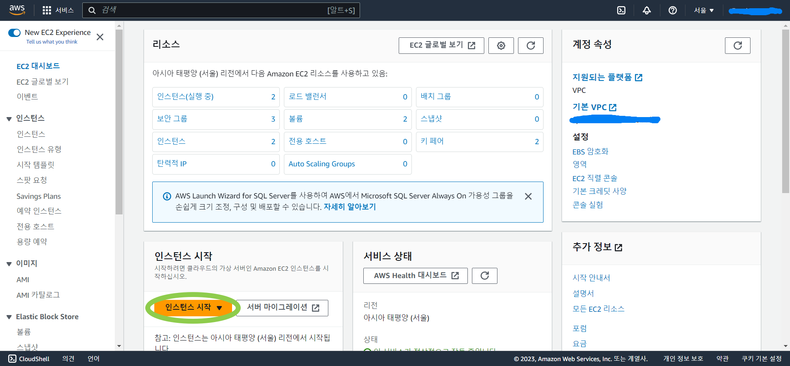
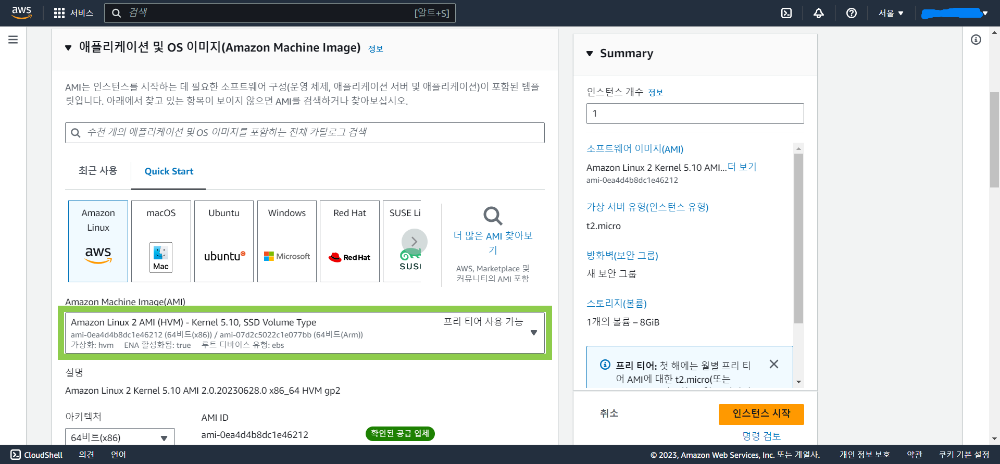
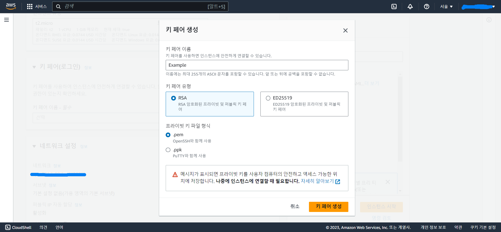
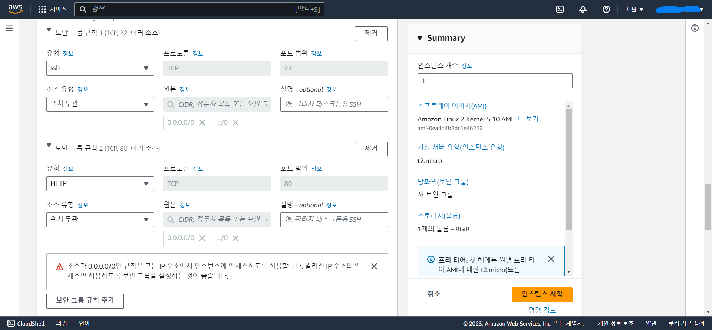
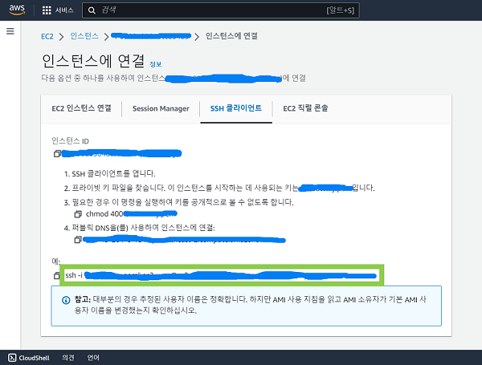
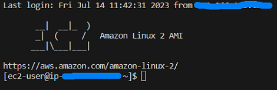
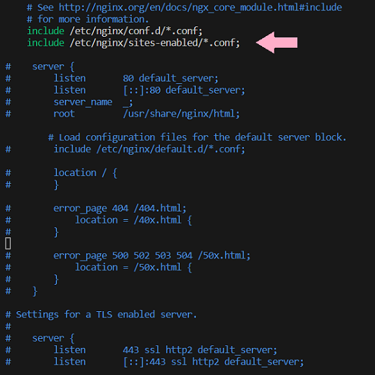

## 들어가기

로컬에서 개발한 React 앱을 AWS EC2에 Nginx를 이용해 배포하였다.

배포 후에 백엔드와 통신이 되지 않는 문제가 발생하여 해결하는 데 오랜 시간이 걸렸었다.

해당 포스팅에서 배포 과정을 정리하고, 앞서 말한 문제의 해결 방법을 공유하려 한다.

</br>

## 1. Nginx란?

Nginx는 비교적 적은 수의 스레드로 효율적인 일처리가 가능한 웹 서버 소프트웨어이다.

</br>

## 2. 배포 과정

### 2-1. 인스턴스 시작

</br>

AWS에 접속해 서비스에서 EC2를 검색한 후 '인스턴스 시작'을 누른다.

- Region을 '아시아 태평양(서울)' (ap-northeast-2)로 하는 것이 좋다. 다른 지역으로 할 경우 백과 통신할 때 네트워크 지연이 더 길어졌다.



</br>

### 2-2. 세부 정보 설정

</br>

필자의 경우 AMI는 Amazon Linux 2를 선택했다.



키 페어는 '새 키 페어 생성'을 선택해 새로 생성한다.



해당 키는 보안되는 위치에 저장하고, 추가로 권한을 설정해야 한다.

```
chmod 400 ~/Example.pem
```

</br>

네트워크 설정에서 HTTP를 추가한다. (Nginx로 React를 배포하기 때문)

- 만약 React + Node.js 앱을 배포하려 한다면 Node.js 개발에서 사용한 서버 포트 번호도 추가한다.



</br>

이름, 인스턴스 유형 등을 각자 설정하고 인스턴스를 시작한다.

</br>

### 2-3. 인스턴스 연결

</br>

인스턴스 생성이 완료되면 '인스턴스 ID > 연결 > SSH 클라이언트'로 들어간 후 아래 사진의 연두색 박스 안의 부분을 복사한다.



2-2 에서 키를 저장한 디렉토리로 이동해 복사한 부분을 실행한다.


</br>

다음과 같이 실행되면 성공한 것이다.



</br>

### 2-4. 배포 준비

</br>

우선 root 권한으로 전환한다.

```
sudo su
```

</br>

그 다음 yarn, Node.js, Nginx를 설치한다.

- Amazon Linux 2는 현재 Node.js 최신 LTS 릴리스 (버전 18.x) 를 지원하지 않으므로 버전 16을 설치해야 한다.

- 그 외의 경우 최신버전을 설치한다.

```
curl -o- -L https://yarnpkg.com/install.sh | bash
source ~/.bashrc
curl -o- https://raw.githubusercontent.com/nvm-sh/nvm/v0.34.0/install.sh | bash
. ~/.nvm/nvm.sh
nvm install 16
// nvm install --lts
sudo amazon-linux-extras install nginx1.12
```

</br>

git을 설치하고 배포하려는 React 앱을 clone한다.

```
sudo yum update
sudo yum install git
git clone [url]
```

</br>

### 2-5. Nginx 설정

</br>

nginx.conf의 설정들을 편리하고 깔끔하게 관리하기 위해 sites-enabled 디렉토리에 따로 설정을 만들려 한다.

```
sudo vi /etc/nginx/nginx.conf
```

우선 nginx.conf의 server 블럭 내 행들을 모두 주석 처리하고, server 블럭 바로 위에 다음의 코드를 추가하여 sites-enabled 내 설정 파일들을 포함하도록 한다.

```
include /etc/nginx/sites-enabled/*.conf;
```



</br>

sites-available 디렉토리에 필요한 파일들을 작성한 후 이들과 연결되는 symbolic link를 sites-enabled 디렉토리에 추가하려 한다.

sites-available 내에 새로운 설정 파일을 생성한다. 여기서는 해당 파일을 example.conf라 하겠다.

```
sudo mkdir /etc/nginx/sites-available
sudo mkdir /etc/nginx/sites-enabled
sudo vi /etc/nginx/sites-available/example.conf
```

example.conf에 우선 HTTP에 대한 기본 설정을 작성한다.

root 행에는 React 앱의 상위 디렉토리 경로를 입력한다.

```
server {
  listen 80;
  location / {
    root /home/ec2-user/######/######/build;
    index index.html index.htm;
    try_files $uri $uri/ /index.html;
  }
}
```

</br>

### 2-6. 배포

</br>

React 앱의 상위 디렉토리로 이동한 후 다음을 실행해 build한다.

```
yarn install
yarn run build
```

/home/ec2-user의 권한을 others의 실행 권한을 포함하도록 설정한 후 Nginx를 시작한다.

```
chmod 711 /home/ec2-user
sudo systemctl start nginx
```

</br>

인스턴스의 퍼블릭 IPv4 주소를 주소창에 입력하면 배포에 성공한 것을 확인할 수 있다!

</br>

## 3. 배포 후 백엔드와의 통신 문제

</br>

로컬에서 개발 당시 백엔드 API를 요청할 때 발생하는 CORS 에러를 방지하기 위해 다음과 같이 설정했다.

### 3-1. http-proxy-middleware 설치

```
npm install http-proxy-middleware
```

</br>

### 3-2. setupProxy.js 생성

src 디렉토리 아래에 다음과 같이 setupProxy.js를 생성한다.

```javascript
const { createProxyMiddleware } = require("http-proxy-middleware");

module.exports = function (app) {
  app.use(
    createProxyMiddleware("/endpoint", {
      target: "endpoint를 제외한 출처",
      changeOrigin: true,
    })
  );
};
```

</br>

하지만 이 설정이 Nginx로 배포를 하고 나서 적용이 되지 않는 문제가 발생했다.

</br>

### 3-3. 문제 해결

Nginx가 제공하는 reverse proxy 기능을 이용해 문제를 해결할 수 있었다.

reverse proxy는 외부에서 내부 서버가 제공하는 서비스에 접근할 경우, proxy server를 통해서 들어오는 방식이다. reverse proxy를 통해 배포 후에도 백엔드와 정상적으로 통신할 수 있었다.

</br>

example.conf를 열어 다음과 같이 수정한다.

```
server {
  listen 80;
  location /endpoint {
    proxy_pass endpoint를 제외한 출처;
  }
  location / {
    root /home/ec2-user/######/######/build;
    index index.html index.htm;
    try_files $uri $uri/ /index.html;
  }
}
```


</br>

Nginx를 재시작한다.

```
sudo systemctl restart nginx
```
