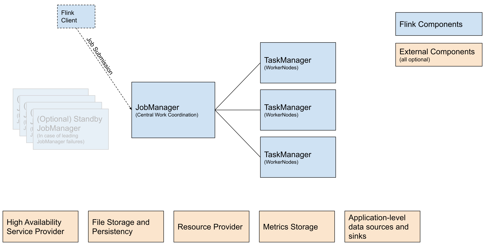

# Introduction

Apache Flink is an open-source, unified stream-processing and batch-processing framework designed for high-performance, scalability, and accuracy. Apache Flink has a very large and vibrant community with 450+ contributors and 15500+ commits, supported by companies like Apple and Alibaba, that helps to ensure continual innovation. It powers stream processing platforms at many companies, including digital natives like Uber, Netflix, and Linkedin, as well as successful enterprises like ING, Goldman Sachs, and Comcast.

Apache Flink supports high throughput and low event latency at the same time, fault-tolerance with *exactly-once* processing guarantees, event time and out of order processing etc. It has elegant and fluent APIs in Java, Scala and Python. It has libraries for Graph processing (batch), Machine Learning (batch), and Complex Event Processing (streaming). Flink is the de facto industry standard for stream processing

# Cluster Framework

- Apache Flink jobs run on clusters, which are composed of two types of nodes: `TaskManagers` and `JobManagers`.
- While clusters typically consists of multiple `TaskManagers`, only reason to run multiple JobManagers is high availability.
- The jobs are *submitted* to `JobManager` by `FlinkClient`, that compiles user application into dataflow graph which is understandable by `JobManager`.
- `JobManager` then coordinates job execution: it splits the parallel units of a job to `TaskManagers`, manages heartbeats, triggers checkpoints, reacts to failures and much more.
- JobManager supports multiple job submission modes such as,
    - Application mode
    - Session mode

### Application mode

This mode creates one cluster per submitted application. A dedicated JobManager is started for submitting the job. The JobManager will only execute this job, then exit. The Flink application runs on the JobManager. With this architecture, the *Application Mode* provides the resource isolation and load balancing guarantees at the granularity of a whole application.

### Session mode

*Session mode* assumes an already running cluster and uses the resources of that cluster to execute any submitted application. Applications executed in the same (session) cluster use, and consequently compete for, the same resources. This has the advantage that you do not pay the resource overhead of spinning up a full cluster for every submitted job.

# Deployment Patterns

Flink is a versatile framework, supporting many different deployment patterns in a mix and match fashion. The available deployment patterns include,

1. Standalone
2. YARN
3. Kubernetes
4. Cloud

## Standalone

The standalone mode is the most barebone way of deploying Flink. The Flink services such as JobManager and TaskManager are just launched as processes on the operating system. Flink runs on all UNIX like systems e.g. Linux, Mac OS X and Cygwin. Flink requires **Java 1.8.x** or higher installed.

In Production environments, the Flink clusters have to be deployed for High-availability(HA) to ensure smooth processing. To enable HA for a standalone cluster, you have to use the ZooKeeper HA services. Flink leverages **ZooKeeper** for *distributed coordination* between all running JobManager instances. 

For more details on the deployment steps, please refer to this [link](https://nightlies.apache.org/flink/flink-docs-release-1.18/docs/deployment/resource-providers/standalone/overview/#example-standalone-ha-cluster-with-2-jobmanagers).

Standalone deployment in Flink offers simplicity and flexibility, making it suitable for various use cases ranging from small-scale development and testing environments to large-scale production deployments. However, it also requires manual management of resources and may not provide the same level of resource isolation and multi-tenancy capabilities as other deployment options like YARN or Kubernetes.

## YARN

YARN is a popular resource manager for running Hadoop jobs and other data processing applications such as MapReduce, Spark, Storm and Flink, among others. YARN (Yet Another Resource Manager) was born out of the idea to separate the concerns of resource management and job scheduling/monitoring. YARN achieves this with two components - Resource Manager and Node Manager. The Resource Manager accepts jobs from the client and schedules them to be run on the Node Manager. The Node Manager runs the application by creating multiple containers. Apache Flink can be [deployed](https://nightlies.apache.org/flink/flink-docs-master/docs/deployment/resource-providers/yarn/) using YARN by creating Flink’s JobManager and TaskManager in such containers. This allows to dynamically allocate and de-allocate TaskManager resources based on the job running.

YARN allows deploying Flink applications in all deployment modes supported by Apache Flink including the deprecated Per-Job mode. Flink applications can be deployed in the Application Mode or in the Session Mode. YARN also allows submitting Flink jobs using the SQL client. This makes it an attractive choice for deploying Apache Flink if there are existing YARN clusters running or if there are plans to use other data processing systems in conjunction with Flink, allowing them to be deployed together. YARN can be scaled up or down depending on the load and provides token based security with Kerberos authentication.

YARN is not particularly a great choice if you are not already in the Apache Hadoop ecosystem since there is a steep learning curve and requires expertise managing the additional configurations and settings, which can be difficult for those who are not familiar with YARN.

## Kubernetes

Kubernetes has grown to be the de-facto orchestrator for deploying Cloud Native workloads. Apache Flink comes with a [native integration with Kubernetes](https://nightlies.apache.org/flink/flink-docs-master/docs/deployment/resource-providers/native_kubernetes/) to deploy Flink. Similar to YARN, the native Kubernetes integration allows to dynamically allocate and de-allocate TaskManager resources based on the job running. Apart from the native integration, there are multiple Kubernetes Operators that allow creation of Flink Jobs declaratively.

The native Kubernetes integration allows running Flink jobs without the hassle of writing YAML files and abstracting the Kubernetes complexity while providing the benefits of Kubernetes such as auto-healing and resource orchestration. This can be a good first step towards running Flink Jobs in Kubernetes while using the same clients for submitting Flink Jobs. Flink also offers [High Availability(HA)](https://nightlies.apache.org/flink/flink-docs-master/docs/deployment/ha/kubernetes_ha/) while deploying using the native Kubernetes integration.

There are multiple open source Kubernetes Operators for Flink such as the official [Apache Flink Operator](https://github.com/apache/flink-kubernetes-operator), [Flinkk8soperator by Lyft](https://github.com/lyft/flinkk8soperator) and the [Flink on Kubernetes operator by Spotify](https://github.com/spotify/flink-on-k8s-operator). These operators allow declaratively defining the Flink cluster and creating Flink Jobs using a Custom Resource in Kubernetes. This implies, Flink Jobs can be natively managed using Kubernetes clients and operational governance can be implemented with GitOps.

While there are several advantages to deploying Flink on Kubernetes such as high availability and scalability, it requires expertise in running and maintaining a Kubernetes cluster along with ensuring the Flink applications are fault tolerant with appropriate recovery mechanisms.

## Cloud

Fully-managed services are an alternative approach to getting started with Flink without worrying about the underlying infrastructure. If you seek a managed solution, then Apache Flink can be found as part of, 

- [Amazon Managed Service for Apache Flink](https://aws.amazon.com/managed-service-apache-flink/)
- [Google Cloud Dataproc](https://cloud.google.com/dataproc/docs/concepts/components/flink)
- [Microsoft Azure HDInsight](https://learn.microsoft.com/en-us/azure/hdinsight-aks/flink/flink-create-cluster-portal)
- [Confluent Cloud](https://www.confluent.io/product/flink/)

Managed services offer the underlying infrastructure for Flink and support for provisioning compute resources, parallel computation, automatic scaling, and application backups. Deploy highly available and durable applications with Multi-AZ deployments and APIs for application lifecycle management

### Amazon Managed Service for Apache Flink

With Amazon Managed Service for Apache Flink, you pay only for what you use. There are no resources to provision and no upfront costs. You are charged an hourly rate based on the number of Kinesis Processing Units (KPUs) used to run your applications. A single KPU comprises 1 vCPU compute and 4 GB of memory. In streaming mode, Amazon Managed Service for Apache Flink automatically scales the number of KPUs required by your stream processing application as the demands of memory and compute fluctuate. 

You are charged two additional KPUs per Studio application in interactive mode. One KPU is used for Apache Flink application orchestration and the other for the serverless interactive development environment. You will also be charged for running application storage used for stateful processing capabilities. Running application storage is charged per GB/month.

### Google Cloud Dataproc

Dataproc is a managed Spark and Hadoop service that lets you take advantage of open source data tools for batch processing, querying, streaming, and machine learning. It supports Flink deployments on YARN as an optional component. The Flink cluster needs to be setup by the User similar to the YARN deployment and it does not support flink high-availability mode.

### Microsoft Azure HDInsight

HDInsight on AKS is a modern, reliable, secure, and fully managed Platform as a Service (PaaS) that runs on Azure Kubernetes Service (AKS). Apache Flink is supported as a open-source analytics workload in HDInsight. The Flink cluster setup and management still need to be performed by the User. 

### Confluent Cloud

Confluent Cloud provides a cloud-native, serverless service for Flink that enables simple, scalable, and secure stream processing that integrates seamlessly with Apache Kafka. Your Kafka topics appear automatically as queryable Flink tables, with schemas and metadata attached by Confluent Cloud. Confluent Cloud for Apache Flink currently supports only Flink SQL

# Challenges in self-managed Flink cluster

While self managing a Flink cluster offers greater flexibility in terms of the APIs supported or the connectors, it comes with the operational hazard of maintaining a platform. As with any self managed system, self managing Flink would imply being responsible for the security of the system and scaling the system. While self managing the Flink clusters, the focus of the team would be more towards managing infrastructure than creating streaming applications. Using a managed service would allow to offload operational burdens to a provider. Certain managed services handle check-pointing as well, allowing the developer to purely focus on the streaming logic.

# How Confluent’s fully managed Flink service help developers?

Kafka has become the de facto standard for messaging system and similarly Flink is the de facto industry standard for stream processing. The Confluent offering for Apache Kafka and Apache Flink goes hand-in-hand to facilitate a rich-environment for real-time stream processing.

Confluent Cloud for Apache Flink is a cloud-native service in a truest sense. Confluent’s fully managed Flink service enables you to:

- Easily filter, join, and enrich your data streams with Flink
- Enable high-performance and efficient stream processing at any scale, without the complexities of managing infrastructure
- Experience Kafka and Flink as a unified platform, with fully integrated monitoring, security, and governance

Confluent Cloud for Apache Flink let you focus fully on your business logic, encapsulated in Flink SQL [statements](https://docs.confluent.io/cloud/current/flink/concepts/statements.html#flink-sql-statements), and Confluent Cloud takes care of what’s needed to run them in a secure, resource-efficient and fault-tolerant manner. 

### Fully Managed

Confluent Cloud always uses the latest Flink version. Any security patches to Flink runtime are applied seamlessly and automatically

### Auto-scaling

Flink SQL statements on Confluent Cloud are monitored continuously and [auto-scaled](https://docs.confluent.io/cloud/current/flink/concepts/autopilot.html#flink-sql-autopilot) to keep up with the throughput rate of their input topics.

### **Usage-based billing**

You pay only for what you use, not what you provision. Flink compute in Confluent Cloud is elastic: once you stop using the compute resources, they are deallocated, and you no longer pay for them.

### Metadata Sync

Kafka topics and schemas are always in sync with Flink, simplifying how you can process your data. Any topic created in Kafka is visible directly as a table in Flink, and any table created in Flink is visible as a topic in Kafka

### Observability

Confluent Cloud provides you with a curated set of metrics, exposing them through Confluent’s existing [metrics API](https://docs.confluent.io/cloud/current/monitoring/metrics-api.html#metrics-api). Confluent Cloud provides first-class integrations with New Relic, Datadog, Grafana Cloud, and Dynatrace

### Security

Confluent Cloud for Apache Flink has a deep integration with [Role-Based Access Control (RBAC)](https://docs.confluent.io/cloud/current/access-management/access-control/rbac/overview.html#cloud-rbac), ensuring that you can easily access and process the data that you have access to, and no other data.

### Cloud Availability

Confluent Cloud for Apache Flink is available on AWS, Azure, and GCP. Refer to this [link](https://docs.confluent.io/cloud/current/flink/index.html#af-long-is-everywhere) for the supported region wise list.

Learn more about Confluent’s [cloud-native,serverless Apache Flink® service](https://www.confluent.io/product/flink/)—now
generally available on AWS, Azure, and Google Cloud.

# Conclusion

Apache Flink stands as a robust and versatile framework for real-time stream processing and batch processing with its fault tolerance, high throughput, low-latency processing capabilities, and seamless integration with various data sources. Managing Flink clusters involves dealing with infrastructure concerns such as deployment, scaling, and maintenance. By outsourcing this responsibility to managed services or cloud providers, businesses can redirect their focus towards their core competencies, such as developing innovative data processing pipelines tailored to their specific business needs.

Confluent Cloud for Apache Flink enables businesses to build efficient and tailored data processing workflows without any infrastructure management hassles. It also seamlessly integrates with Confluent Kafka and Schema Registry.

# References

- [https://nightlies.apache.org/flink/flink-docs-release-1.18/docs/deployment/overview/](https://nightlies.apache.org/flink/flink-docs-release-1.18/docs/deployment/overview/)
- [https://docs.confluent.io/cloud/current/flink/index.html#stream-processing-with-af-long](https://docs.confluent.io/cloud/current/flink/index.html#stream-processing-with-af-long)
